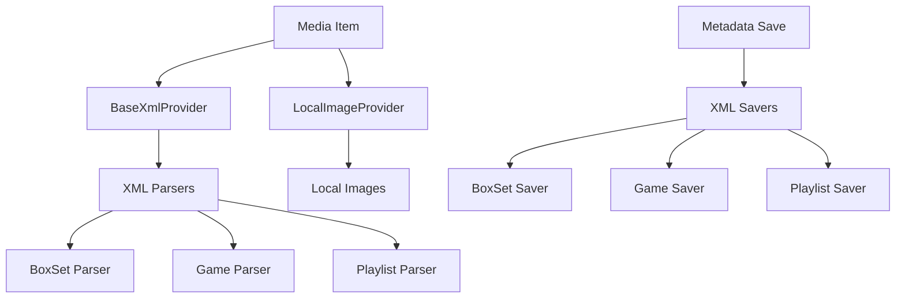

# Component: MediaBrowser.LocalMetadata

**Path:** `MediaBrowser.LocalMetadata/`
**Type:** Directory | Module
**Language:** C#
**Maps to:** `.discovery/255-mediabrowser-localmetadata.md`

## Description

Local metadata providers and savers. Reads and writes metadata from/to local XML and image files within media directories.

## Directory Structure

```
MediaBrowser.LocalMetadata/
├── Images/          # Local image providers
├── Parsers/         # XML metadata parsers
├── Providers/       # Metadata providers
├── Savers/          # Metadata savers
├── BaseXmlProvider.cs
└── Properties/
```

## Files

| File | Description |
|------|-------------|
| `BaseXmlProvider.cs` | Base class for XML providers |
| **Images/** | |
| `Images/InternalMetadataFolderImageProvider.cs` | Internal metadata folder image provider |
| **Parsers/** | |
| `Parsers/GameXmlParser.cs` | Game XML parser |
| `Parsers/PlaylistXmlParser.cs` | Playlist XML parser |
| `Parsers/GameSystemXmlParser.cs` | Game system XML parser |
| **Providers/** | |
| `Providers/BoxSetXmlProvider.cs` | Box set XML provider |
| `Providers/GameSystemXmlProvider.cs` | Game system XML provider |
| `Providers/GameXmlProvider.cs` | Game XML provider |
| `Providers/PlaylistXmlProvider.cs` | Playlist XML provider |
| **Savers/** | |
| `Savers/BaseXmlSaver.cs` | Base XML saver |
| `Savers/BoxSetXmlSaver.cs` | Box set XML saver |
| `Savers/GameSystemXmlSaver.cs` | Game system XML saver |
| `Savers/GameXmlSaver.cs` | Game XML saver |
| `Savers/PlaylistXmlSaver.cs` | Playlist XML saver |
| `Savers/PersonXmlSaver.cs` | Person XML saver |

## Decomposition

### BaseXmlProvider.cs (Base XML Provider)

#### Imports
```csharp
using MediaBrowser.Controller.Entities;
using MediaBrowser.Controller.Library;
using MediaBrowser.Controller.LiveTv;
using MediaBrowser.Controller.Persistence;
using MediaBrowser.Model.Configuration;
using MediaBrowser.Model.Entities;
using MediaBrowser.Model.IO;
using System;
using System.Collections.Generic;
using System.IO;
using System.Threading.Tasks;
```

#### Classes
`BaseXmlProvider` (abstract public class : IMetadataProvider)

#### Key Methods
| Method | Return | Description |
|--------|--------|-------------|
| `Fetch(MetadataSearchOptions, CancellationToken)` | `Task<bool>` | Fetch metadata |
| `GetXmlPath(BaseItem, DirectoryInfo)` | `string` | Get XML file path |

### Images/LocalImageProvider.cs (Local Image Provider)

#### Classes
`LocalImageProvider` (public class : ILocalImageProvider)

#### Key Methods
| Method | Return | Description |
|--------|--------|-------------|
| `Fetch(BaseItem, DirectoryInfo, CancellationToken)` | `Task<LocalImageResult>` | Find local images |
| `HasChanged(BaseItem, DirectoryInfo)` | `Task<bool>` | Check for changes |

### Images/EpisodeLocalImageProvider.cs (Episode Local Image Provider)

#### Classes
`EpisodeLocalImageProvider` (public class : ILocalImageProvider)

#### Key Methods
| Method | Return | Description |
|--------|--------|-------------|
| `Fetch(Episode, DirectoryInfo, CancellationToken)` | `Task<LocalImageResult>` | Episode images |

### Parsers/BaseItemXmlParser.cs (Base XML Parser)

#### Classes
`BaseItemXmlParser` (public class : IXmlDeserializer)

#### Key Methods
| Method | Return | Description |
|--------|--------|-------------|
| `FetchFromFilePath(string, IEnableDisposal)` | `Task<T>` | Parse XML file |
| `DeserializedItem(T)` | `void` | Handle deserialized item |

### Parsers/BoxSetXmlParser.cs (Box Set XML Parser)

#### Classes
`BoxSetXmlParser` (public class : IXmlDeserializer)

#### Key Methods
| Method | Return | Description |
|--------|--------|-------------|
| `DeserializedItem(BoxSet)` | `void` | Parse box set metadata |

### Savers/BaseXmlSaver.cs (Base XML Saver)

#### Classes
`BaseXmlSaver` (public abstract class : IMetadataSaver)

#### Key Properties
| Property | Type | Description |
|----------|------|-------------|
| `MetadataFileName` | `string` | XML filename |

#### Key Methods
| Method | Return | Description |
|--------|--------|-------------|
| `Save(BaseItem, CancellationToken)` | `Task` | Save metadata |
| `GetSavePath(BaseItem)` | `FileSystemMetadata` | Get save path |

## Architecture



## Dependencies

- `MediaBrowser.Controller.Entities` — Entity types
- `MediaBrowser.Controller.Library` — Library interfaces
- `MediaBrowser.Model.IO` — File I/O models
- `MediaBrowser.Model.Entities` — Entity models

## Statistics

| Metric | Value |
|--------|-------|
| C# Files | 21 |
| Directories | 4 |
| Providers | 5 |
| Parsers | 6 |
| Savers | 6 |

## Mermaid Diagram


