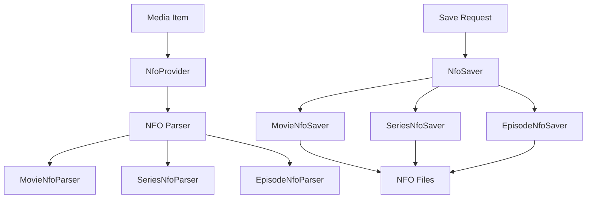
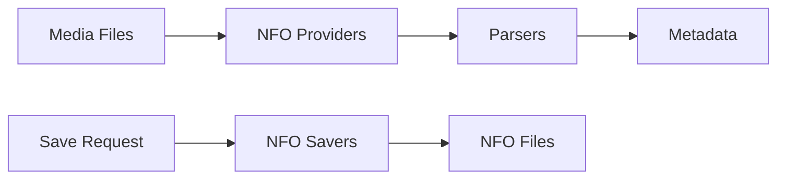

# Component: MediaBrowser.XbmcMetadata

**Path:** `MediaBrowser.XbmcMetadata/`
**Type:** Directory | Module
**Language:** C#
**Maps to:** `.discovery/256-mediabrowser-xbmcmetadata.md`

## Description

XBMC/Kodi NFO metadata provider. Reads and writes metadata in XBMC/Kodi compatible NFO format for movies, TV shows, music, and other media types.

## Directory Structure

```
MediaBrowser.XbmcMetadata/
├── Configuration/      # NFO configuration
├── EntryPoint.cs      # Module entry point
├── Parsers/          # NFO file parsers
├── Providers/        # Metadata providers
├── Savers/           # NFO file savers
└── Properties/
```

## Files

| File | Description |
|------|-------------|
| `EntryPoint.cs` | Module initialization |
| `Configuration/NfoOptions.cs` | NFO options |
| `Parsers/*.cs` | NFO parsers |
| `Providers/*.cs` | Metadata providers |
| `Savers/*.cs` | Metadata savers |

## Decomposition

### EntryPoint.cs (Module Entry Point)

#### Imports
```csharp
using MediaBrowser.Common.Plugins;
using MediaBrowser.Controller.Plugins;
using System;
using System.Collections.Generic;
```

#### Classes
`XbmcMetadataEntryPoint` (public class : IPluginEntryPoint)

#### Key Methods
| Method | Return | Description |
|--------|--------|-------------|
| `Configure(IPlugin)` | `void` | Plugin configuration |

### Configuration/NfoOptions.cs (NFO Options)

#### Imports
```csharp
using MediaBrowser.Model.Configuration;
using MediaBrowser.Model.Entities;
using System;
```

#### Classes
`NfoOptions` (public class : IConfigurationFactory)

#### Key Properties
| Property | Type | Description |
|----------|------|-------------|
| `EnableMovieNfo` | `bool` | Enable movie NFO |
| `EnableSeriesNfo` | `bool` | Enable series NFO |
| `MovieNfoName` | `string` | Movie NFO filename |
| `SeriesNfoName` | `string` | Series NFO filename |

### Parsers/BaseNfoParser.cs (Base NFO Parser)

#### Imports
```csharp
using MediaBrowser.Model.Providers;
using MediaBrowser.Model.Serialization;
using System;
using System.IO;
using System.Threading;
using System.Threading.Tasks;
using System.Xml;
```

#### Classes
`BaseNfoParser` (abstract public class : IXmlDeserializer)

#### Key Methods
| Method | Return | Description |
|--------|--------|-------------|
| `FetchFromFilePath(string, CancellationToken)` | `Task<T>` | Parse NFO file |
| `DeserializedItem(T)` | `void` | Handle deserialized item |

### Parsers/MovieNfoParser.cs (Movie NFO Parser)

#### Classes
`MovieNfoParser` (public class : BaseNfoParser<Video>)

#### Key Methods
| Method | Return | Description |
|--------|--------|-------------|
| `DeserializedItem(Video)` | `void` | Parse movie metadata |

### Parsers/SeriesNfoParser.cs (Series NFO Parser)

#### Classes
`SeriesNfoParser` (public class : BaseNfoParser<Series>)

#### Key Methods
| Method | Return | Description |
|--------|--------|-------------|
| `DeserializedItem(Series)` | `void` | Parse series metadata |

### Parsers/EpisodeNfoParser.cs (Episode NFO Parser)

#### Classes
`EpisodeNfoParser` (public class : BaseNfoParser<Episode>)

#### Key Methods
| Method | Return | Description |
|--------|--------|-------------|
| `DeserializedItem(Episode)` | `void` | Parse episode metadata |

### Providers/BaseNfoProvider.cs (Base NFO Provider)

#### Classes
`BaseNfoProvider` (abstract public class : IMetadataProvider)

#### Key Methods
| Method | Return | Description |
|--------|--------|-------------|
| `Fetch(MetadataSearchOptions, CancellationToken)` | `Task<bool>` | Fetch metadata |
| `GetXmlPath(string)` | `string` | Get NFO path |

### Providers/MovieNfoProvider.cs (Movie NFO Provider)

#### Classes
`MovieNfoProvider` (public class : BaseNfoProvider)

#### Key Methods
| Method | Return | Description |
|--------|--------|-------------|
| `Fetch(Movie, MetadataSearchOptions, CancellationToken)` | `Task<bool>` | Fetch movie NFO |

### Providers/SeriesNfoProvider.cs (Series NFO Provider)

#### Classes
`SeriesNfoProvider` (public class : BaseNfoProvider)

#### Key Methods
| Method | Return | Description |
|--------|--------|-------------|
| `Fetch(Series, MetadataSearchOptions, CancellationToken)` | `Task<bool>` | Fetch series NFO |

### Providers/EpisodeNfoProvider.cs (Episode NFO Provider)

#### Classes
`EpisodeNfoProvider` (public class : BaseVideoNfoProvider<Episode>)

#### Key Methods
| Method | Return | Description |
|--------|--------|-------------|
| `Fetch(Episode, MetadataSearchOptions, CancellationToken)` | `Task<bool>` | Fetch episode NFO |

### Savers/BaseNfoSaver.cs (Base NFO Saver)

#### Imports
```csharp
using MediaBrowser.Controller.Entities;
using MediaBrowser.Model.IO;
using System;
using System.IO;
using System.Threading.Tasks;
```

#### Classes
`BaseNfoSaver` (public abstract class : IMetadataSaver)

#### Key Properties
| Property | Type | Description |
|----------|------|-------------|
| `NfoName` | `string` | NFO filename |

#### Key Methods
| Method | Return | Description |
|--------|--------|-------------|
| `Save(BaseItem, CancellationToken)` | `Task` | Save NFO file |
| `GetSavePath(BaseItem)` | `FileSystemMetadata` | Get save path |

### Savers/MovieNfoSaver.cs (Movie NFO Saver)

#### Classes
`MovieNfoSaver` (public class : BaseNfoSaver)

#### Key Methods
| Method | Return | Description |
|--------|--------|-------------|
| `Save(Movie, CancellationToken)` | `Task` | Save movie NFO |

### Savers/SeriesNfoSaver.cs (Series NFO Saver)

#### Classes
`SeriesNfoSaver` (public class : BaseNfoSaver)

#### Key Methods
| Method | Return | Description |
|--------|--------|-------------|
| `Save(Series, CancellationToken)` | `Task` | Save series NFO |

## Architecture



## Dependencies

- `MediaBrowser.Controller.Entities` — Entity types
- `MediaBrowser.Model.Serialization` — XML serialization
- `MediaBrowser.Model.Providers` — Provider models

## Statistics

| Metric | Value |
|--------|-------|
| C# Files | 23 |
| Parsers | 5 |
| Providers | 8 |
| Savers | 7 |

## Mermaid Diagram


