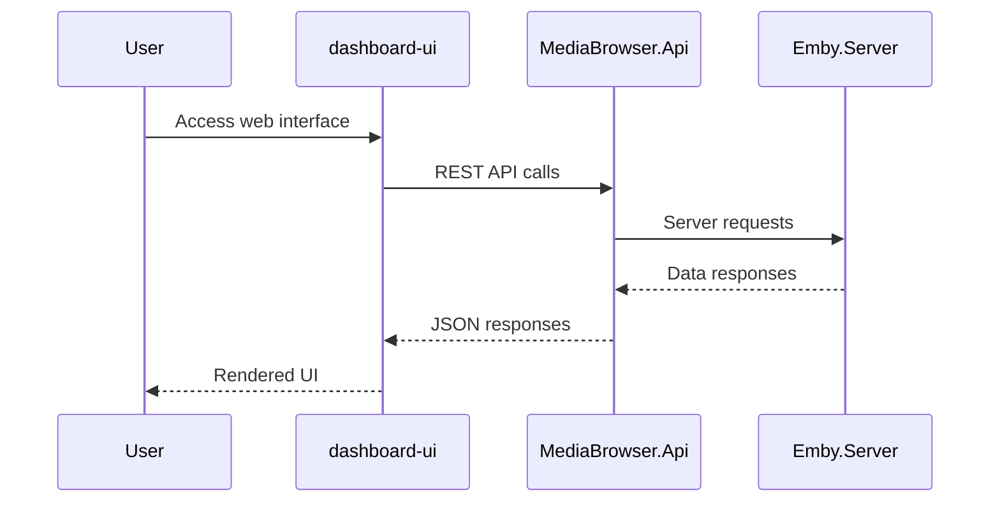

# Component: MediaBrowser.WebDashboard — UI Structure

**Path:** `MediaBrowser.WebDashboard/dashboard-ui/`
**Type:** Directory | Web UI
**Language:** HTML, CSS, JavaScript
**Maps to:** `.discovery/262-mediabrowser-webdashboard-ui.md`

## Description

Web dashboard frontend structure. Contains HTML pages, CSS stylesheets, and JavaScript modules for the Emby management interface. This is the primary user interface for administering and using the Emby Server.

## Statistics

- **HTML Files:** 85 (excluding bower_components)
- **JavaScript Files:** 139 (excluding bower_components)
- **Language Files:** 47
- **Total Assets:** 271+ files

## Root HTML Pages

| File | Description |
|------|-------------|
| `index.html` | Main entry point |
| `login.html` | User login page |
| `dashboard.html` | Main dashboard page |
| `home.html` | Home view |
| `search.html` | Search interface |
| `movies.html` | Movies browsing |
| `music.html` | Music browsing |
| `tv.html` | TV shows browsing |
| `nowplaying.html` | Media playback |
| `videoosd.html` | Video controls overlay |
| `selectserver.html` | Server selection |
| `connectlogin.html` | Emby Connect login |
| `forgotpassword.html` | Password recovery |
| `forgotpasswordpin.html` | PIN recovery |

## Settings Pages

| File | Description |
|------|-------------|
| `dashboardgeneral.html` | General settings |
| `dashboardhosting.html` | Server hosting settings |
| `library.html` | Library management |
| `librarydisplay.html` | Library display options |
| `librarysettings.html` | Library configuration |
| `encodingsettings.html` | Encoding/streaming settings |
| `streamingsettings.html` | Streaming configuration |
| `playbackconfiguration.html` | Playback settings |
| `metadataimages.html` | Metadata image settings |
| `metadatanfo.html` | NFO metadata settings |
| `notificationsettings.html` | Notification configuration |
| `notificationsetting.html` | Individual notification setting |
| `serversecurity.html` | Security settings |
| `useredit.html` | User management |
| `usernew.html` | Create new user |
| `userprofiles.html` | User profiles |
| `userpassword.html` | Password management |
| `userparentalcontrol.html` | Parental controls |
| `userlibraryaccess.html` | Library access control |
| `myprofile.html` | User profile page |
| `mypreferencesmenu.html` | Preferences menu |
| `mypreferencesdisplay.html` | Display preferences |
| `mypreferenceshome.html` | Home preferences |
| `mypreferenceslanguages.html` | Language preferences |
| `mypreferencessubtitles.html` | Subtitle preferences |

## Live TV Pages

| File | Description |
|------|-------------|
| `livetv.html` | Live TV guide |
| `livetvsettings.html` | Live TV configuration |
| `livetvstatus.html` | TV tuner status |
| `livetvtuner.html` | Tuner management |
| `livetvguideprovider.html` | Guide data provider |

## Plugin Pages

| File | Description |
|------|-------------|
| `plugins.html` | Installed plugins |
| `plugincatalog.html` | Plugin marketplace |
| `addplugin.html` | Add new plugin |

## Sync Pages

| File | Description |
|------|-------------|
| `mysync.html` | Sync home |
| `mysyncjob.html` | Sync job management |
| `mysyncsettings.html` | Sync settings |
| `syncactivity.html` | Sync activity log |
| `managedownloads.html` | Download management |

## DLNA Pages

| File | Description |
|------|-------------|
| `dlnasettings.html` | DLNA configuration |
| `dlnaprofile.html` | Device profile editor |
| `dlnaprofiles.html` | Profile list |

## Device Pages

| File | Description |
|------|-------------|
| `devicesupload.html` | Device upload settings |
| `camerauploadsettings.html` | Camera upload config |
| `appservices.html` | App services settings |

## Wizard Pages

| File | Description |
|------|-------------|
| `wizardstart.html` | Setup wizard start |
| `wizardagreement.html` | License agreement |
| `wizarduser.html` | Initial user creation |
| `wizardlibrary.html` | Library setup |
| `wizardremoteaccess.html` | Remote access config |
| `wizardsettings.html` | Basic settings |
| `wizardfinish.html` | Wizard completion |

## Scheduled Tasks Pages

| File | Description |
|------|-------------|
| `scheduledtasks.html` | Task list |
| `scheduledtask.html` | Task editor |
| `log.html` | Server log viewer |

## Server Activity

| File | Description |
|------|-------------|
| `serveractivity.html` | Activity dashboard |

## Supporter Pages

| File | Description |
|------|-------------|
| `supporterkey.html` | Supporter key activation |

## Item Detail Pages

| File | Description |
|------|-------------|
| `itemdetails.html` | Media item details |
| `edititemmetadata.html` | Metadata editor |

## Components (templates)

### accessschedule/
- `accessschedule.template.html` - Access schedule editor

### filterdialog/
- `filterdialog.template.html` - Filter dialog

### guestinviter/
- `connectlink.template.html` - Connect link
- `guestinviter.template.html` - Guest invitation

### imageoptionseditor/
- `imageoptionseditor.template.html` - Image options

### libraryoptionseditor/
- `libraryoptionseditor.template.html` - Library options

### medialibrarycreator/
- `medialibrarycreator.template.html` - Library creator

### medialibraryeditor/
- `medialibraryeditor.template.html` - Library editor

### tvproviders/
- `schedulesdirect.template.html` - SchedulesDirect config
- `xmltv.template.html` - XMLTV config

### list/
- `list.html` - Generic list view
- `list.js` - List functionality

## Scripts Directory (`scripts/`)

### Authentication
- `loginpage.js` - Login page logic
- `forgotpassword.js` - Password recovery
- `forgotpasswordpin.js` - PIN recovery
- `connectlogin.js` - Emby Connect login
- `selectserver.js` - Server selection

### Dashboard
- `dashboardpage.js` - Main dashboard logic
- `site.js` - Global site logic
- `dashboardgeneral.js` - General settings
- `dashboardhosting.js` - Hosting settings
- `serversecurity.js` - Security settings

### Library Management
- `librarybrowser.js` - Library browser
- `medialibrarypage.js` - Library page
- `librarymenu.js` - Library navigation

### Media Browsing
- `movies.js` - Movies view
- `moviegenres.js` - Movie genres
- `moviecollections.js` - Collections
- `movietrailers.js` - Trailers
- `moviesrecommended.js` - Recommendations
- `tvshows.js` - TV shows
- `tvgenres.js` - TV genres
- `tvlatest.js` - Latest episodes
- `tvrecommended.js` - TV recommendations
- `tvstudios.js` - Studios
- `tvupcoming.js` - Upcoming shows
- `songs.js` - Songs
- `musicalbums.js` - Albums
- `musicartists.js` - Artists
- `musicgenres.js` - Music genres
- `musicplaylists.js` - Playlists
- `musicrecommended.js` - Music recommendations

### Live TV
- `livetvchannels.js` - TV channels
- `livetvrecordings.js` - Recordings
- `livetvschedule.js` - Schedule
- `livetvseriestimers.js` - Series timers
- `livetvsettings.js` - Settings
- `livetvstatus.js` - Status
- `livetvsuggested.js` - Suggestions
- `livetvguide.js` - Guide
- `livetvguideprovider.js` - Guide provider
- `livetvcomponents.js` - UI components

### User Management
- `useredit.js` - User editor
- `usernew.js` - New user
- `userprofilespage.js` - Profiles
- `userpasswordpage.js` - Password change
- `userparentalcontrol.js` - Parental controls
- `userlibraryaccess.js` - Library access
- `myprofile.js` - Profile page
- `mypreferencescommon.js` - Common preferences
- `mypreferencesdisplay.js` - Display preferences
- `mypreferenceshome.js` - Home preferences
- `mypreferenceslanguages.js` - Languages
- `mypreferencessubtitles.js` - Subtitles

### Plugin Management
- `pluginspage.js` - Installed plugins
- `plugincatalogpage.js` - Plugin catalog
- `addpluginpage.js` - Add plugin

### Sync
- `mysync.js` - Sync home
- `mysyncsettings.js` - Sync settings
- `syncactivity.js` - Activity
- `managedownloads.js` - Downloads

### DLNA
- `dlnasettings.js` - DLNA settings
- `dlnaprofile.js` - Profile editor
- `dlnaprofiles.js` - Profile list

### Encoding/Settings
- `encodingsettings.js` - Encoding settings
- `streamingsettings.js` - Streaming settings
- `playbackconfiguration.js` - Playback config
- `metadataimagespage.js` - Metadata images
- `metadatanfo.js` - NFO settings

### Notifications
- `notificationsettings.js` - Notification settings
- `notificationsetting.js` - Individual notification

### Scheduled Tasks
- `scheduledtaskspage.js` - Task list
- `scheduledtaskpage.js` - Task editor
- `taskbutton.js` - Task button component
- `logpage.js` - Log viewer

### Supporter
- `supporterkeypage.js` - Supporter key activation

### Device Management
- `devicesupload.js` - Device uploads
- `camerauploadsettings.js` - Camera upload

### App Services
- `appservices.js` - App services

### Video Player
- `videoosd.js` - Video controls

### Playlists
- `playlists.js` - Playlist management
- `playlistedit.js` - Playlist editor

### Item Details
- `itemdetailpage.js` - Item details
- `itembynamedetailpage.js` - Item by name
- `episodes.js` - Episode listing

### Wizard
- `wizardagreement.js` - License agreement
- `wizarduserpage.js` - User creation

### Utility
- `searchpage.js` - Search
- `searchtab.js` - Search tab
- `themeloader.js` - Theme loader
- `editorsidebar.js` - Editor sidebar
- `autobackdrops.js` - Auto backdrops
- `apploader.js` - App loader

### User Activity
- `serveractivity.js` - Server activity

## CSS Directory (`css/`)

- `site.css` - Global styles
- `dashboard.css` - Dashboard styles
- `librarybrowser.css` - Library styles
- `livetv.css` - Live TV styles
- `metadataeditor.css` - Metadata editor styles
- `nowplaying.css` - Now playing styles
- `videoosd.css` - Video controls styles
- `detailtable.css` - Table styles

### Images
- `images/ani_equalizer_white.gif` - Equalizer animation
- `images/iossplash.png` - iOS splash
- `images/logindefault.png` - Login background
- `images/logoblack.png` - Black logo
- `images/supporter/premiumflag.png` - Premium flag
- `images/supporter/supporterbadge.png` - Supporter badge
- `images/supporter/supporterflag.png` - Supporter flag

## Strings Directory (`strings/`)

Localized UI strings for 47 languages:
- Arabic (ar)
- Belarusian (be-BY)
- Bulgarian (bg-BG)
- Catalan (ca)
- Czech (cs)
- Danish (da)
- German (de)
- Greek (el)
- English (en-US, en-GB)
- Spanish (es, es-AR, es-MX)
- Persian (fa)
- Finnish (fi)
- French (fr, fr-CA)
- Swiss German (gsw)
- Hebrew (he)
- Hindi (hi-IN)
- Croatian (hr)
- Hungarian (hu)
- Indonesian (id)
- Icelandic (is-IS)
- Italian (it)
- Kazakh (kk)
- Korean (ko)
- Lithuanian (lt-LT)
- Malay (ms)
- Norwegian (nb, no)
- Dutch (nl)
- Polish (pl)
- Portuguese (pt-BR, pt-PT)
- Romanian (ro)
- Russian (ru)
- Slovak (sk)
- Slovenian (sl-SI)
- Swedish (sv)
- Turkish (tr)
- Ukrainian (uk)
- Vietnamese (vi)
- Chinese (zh-CN, zh-HK, zh-TW)

## ThirdParty Directory (`thirdparty/`)

Third-party integrations.

## Legacy Directory (`legacy/`)

Backward compatibility modules:
- `buttonenabled.js`
- `dashboard.js`
- `fnchecked.js`
- `selectmenu.js`

## Home Directory (`home/`)

Home screen modules:
- `home.js`
- `favorites.js`
- `hometab.js`

## Devices Directory (`devices/`)

- `devices.html`
- `devices.js`
- `device.html`
- `device.js`
- `ios/ios.css`

## Architecture

```mermaid
graph TB
    DashboardUI["dashboard-ui/"]
    
    DashboardUI --> Pages["Root HTML Pages"]
    DashboardUI --> Scripts["scripts/"]
    DashboardUI --> Components["components/"]
    DashboardUI --> CSS["css/"]
    DashboardUI --> Strings["strings/"]
    DashboardUI --> ThirdParty["thirdparty/"]
    DashboardUI --> Legacy["legacy/"]
    DashboardUI --> Home["home/"]
    DashboardUI --> Devices["devices/"]
    
    Pages --> Settings["Settings Pages"]
    Pages --> LiveTV["Live TV Pages"]
    Pages --> Plugins["Plugin Pages"]
    Pages --> Sync["Sync Pages"]
    Pages --> DLNA["DLNA Pages"]
    Pages --> Users["User Pages"]
    Pages --> Wizard["Setup Wizard"]
    Pages --> Tasks["Scheduled Tasks"]
    
    Scripts --> Auth["Authentication"]
    Scripts --> Media["Media Browsing"]
    Scripts --> Config["Configuration"]
    Scripts --> SyncJS["Sync Logic"]
```

## Dependencies

- **emby-webcomponents** - Core web components library
- **Sortable** - Drag-and-drop sorting
- **document-register-element** - Web component polyfill

## Module Relationship

