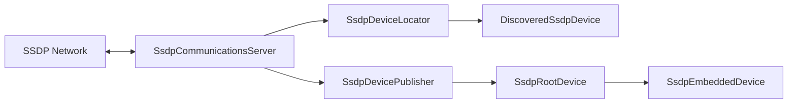

# Component: RSSDP

**Path:** \`RSSDP/\`
**Type:** Directory | Library
**Language:** C#
**Maps to:** \`.discovery/300-rssdp.md\`

## Description

Really Simple Service Discovery Protocol (SSDP) implementation for .NET.

## Files

### Root Files (22 files)

- `DeviceAvailableEventArgs.cs` — RSSDP/DeviceAvailableEventArgs.cs
- `DeviceEventArgs.cs` — RSSDP/DeviceEventArgs.cs
- `DeviceUnavailableEventArgs.cs` — RSSDP/DeviceUnavailableEventArgs.cs
- `DiscoveredSsdpDevice.cs` — RSSDP/DiscoveredSsdpDevice.cs
- `DisposableManagedObjectBase.cs` — RSSDP/DisposableManagedObjectBase.cs
- `HttpParserBase.cs` — RSSDP/HttpParserBase.cs
- `HttpRequestParser.cs` — RSSDP/HttpRequestParser.cs
- `HttpResponseParser.cs` — RSSDP/HttpResponseParser.cs
- `IEnumerableExtensions.cs` — RSSDP/IEnumerableExtensions.cs
- `ISsdpCommunicationsServer.cs` — RSSDP/ISsdpCommunicationsServer.cs
- `ISsdpDeviceLocator.cs` — RSSDP/ISsdpDeviceLocator.cs
- `ISsdpDevicePublisher.cs` — RSSDP/ISsdpDevicePublisher.cs
- `Properties/AssemblyInfo.cs` — RSSDP/Properties/AssemblyInfo.cs
- `RequestReceivedEventArgs.cs` — RSSDP/RequestReceivedEventArgs.cs
- `ResponseReceivedEventArgs.cs` — RSSDP/ResponseReceivedEventArgs.cs
- `SsdpCommunicationsServer.cs` — RSSDP/SsdpCommunicationsServer.cs
- `SsdpConstants.cs` — RSSDP/SsdpConstants.cs
- `SsdpDevice.cs` — RSSDP/SsdpDevice.cs
- `SsdpDeviceLocator.cs` — RSSDP/SsdpDeviceLocator.cs
- `SsdpDevicePublisher.cs` — RSSDP/SsdpDevicePublisher.cs
- `SsdpEmbeddedDevice.cs` — RSSDP/SsdpEmbeddedDevice.cs
- `SsdpRootDevice.cs` — RSSDP/SsdpRootDevice.cs

## Architecture



## Key Interfaces

| Interface | Responsibility |
|-----------|----------------|
| `ISsdpCommunicationsServer` | Network communication |
| `ISsdpDeviceLocator` | Device discovery |
| `ISsdpDevicePublisher` | Device advertisement |

## Key Classes

| Class | Responsibility |
|-------|----------------|
| `SsdpDeviceLocator` | Locates devices on network |
| `SsdpDevicePublisher` | Advertises this device |
| `SsdpRootDevice` | Root device representation |
| `SsdpEmbeddedDevice` | Embedded device (services) |
| `SsdpCommunicationsServer` | UDP/TCP socket management |

## SSDP Protocol

- Uses UDP port 1900
- Multicast address: 239.255.255.250
- M-SEARCH for discovery
- NOTIFY for advertisement

## Decomposition

### SsdpDeviceLocator.cs (Device Discovery)

#### Imports
```csharp
using System;
using System.Collections.Generic;
using System.Net;
using System.Threading.Tasks;
```

#### Classes
`SsdpDeviceLocator` (public class : ISsdpDeviceLocator, IDisposable)

#### Key Properties
| Property | Type | Description |
|----------|------|-------------|
| `CommunicationsServer` | `ISsdpCommunicationsServer` | Network server |
| `SearchEnabled` | `bool` | Active search flag |

#### Key Methods
| Method | Return | Description |
|--------|--------|-------------|
| `Search()` | `Task<IEnumerable<DiscoveredSsdpDevice>>` | Search for devices |
| `Search(string)` | `Task<IEnumerable<DiscoveredSsdpDevice>>` | Search by type |
| `BeginBegin() / BeginSearch()` | `void` | Start search |
| `StopSearch()` | `void` | Stop search |

### SsdpDevicePublisher.cs (Device Advertisement)

#### Classes
`SsdpDevicePublisher` (public class : ISsdpDevicePublisher, IDisposable)

#### Key Properties
| Property | Type | Description |
|----------|------|-------------|
| `RootDevice` | `SsdpRootDevice` | Device to advertise |
| `AliveInterval` | `TimeSpan` | Advertisement interval |

#### Key Methods
| Method | Return | Description |
|--------|--------|-------------|
| `BeginAdvertise()` | `void` | Start advertising |
| `EndAdvertise()` | `void` | Stop advertising |

### SsdpCommunicationsServer.cs (Network Layer)

#### Classes
`SsdpCommunicationsServer` (public class : ISsdpCommunicationsServer, IDisposable)

#### Key Properties
| Property | Type | Description |
|----------|------|-------------|
| `EndPoint` | `IPEndPoint` | Multicast endpoint |
| `Port` | `int` | UDP port 1900 |

#### Key Events
| Event | Description |
|-------|-------------|
| `ResponseReceived` | SSDP response received |
| `RequestReceived` | SSDP request received |

### DiscoveredSsdpDevice.cs (Device Representation)

#### Classes
`DiscoveredSsdpDevice` (public class)

#### Key Properties
| Property | Type | Description |
|----------|------|-------------|
| `DescriptionLocation` | `Uri` | Device XML URL |
| `DeviceType` | `string` | UPnP device type |
| `Headers` | `HttpResponseHeaders` | SSDP headers |
| `Location` | `Uri` | Description location |

## Dependencies

- Standard .NET libraries
