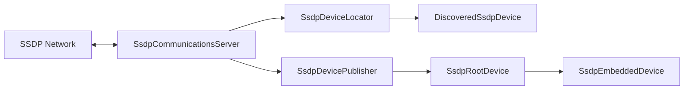

# Component: RSSDP

**Path:** \`RSSDP/\`
**Type:** Directory | Library
**Language:** C#
**Maps to:** \`.discovery/300-rssdp.md\`

## Description

Really Simple Service Discovery Protocol (SSDP) implementation for .NET.

## Files

### Root Files (22 files)

- `DeviceAvailableEventArgs.cs` — RSSDP/DeviceAvailableEventArgs.cs
- `DeviceEventArgs.cs` — RSSDP/DeviceEventArgs.cs
- `DeviceUnavailableEventArgs.cs` — RSSDP/DeviceUnavailableEventArgs.cs
- `DiscoveredSsdpDevice.cs` — RSSDP/DiscoveredSsdpDevice.cs
- `DisposableManagedObjectBase.cs` — RSSDP/DisposableManagedObjectBase.cs
- `HttpParserBase.cs` — RSSDP/HttpParserBase.cs
- `HttpRequestParser.cs` — RSSDP/HttpRequestParser.cs
- `HttpResponseParser.cs` — RSSDP/HttpResponseParser.cs
- `IEnumerableExtensions.cs` — RSSDP/IEnumerableExtensions.cs
- `ISsdpCommunicationsServer.cs` — RSSDP/ISsdpCommunicationsServer.cs
- `ISsdpDeviceLocator.cs` — RSSDP/ISsdpDeviceLocator.cs
- `ISsdpDevicePublisher.cs` — RSSDP/ISsdpDevicePublisher.cs
- `Properties/AssemblyInfo.cs` — RSSDP/Properties/AssemblyInfo.cs
- `RequestReceivedEventArgs.cs` — RSSDP/RequestReceivedEventArgs.cs
- `ResponseReceivedEventArgs.cs` — RSSDP/ResponseReceivedEventArgs.cs
- `SsdpCommunicationsServer.cs` — RSSDP/SsdpCommunicationsServer.cs
- `SsdpConstants.cs` — RSSDP/SsdpConstants.cs
- `SsdpDevice.cs` — RSSDP/SsdpDevice.cs
- `SsdpDeviceLocator.cs` — RSSDP/SsdpDeviceLocator.cs
- `SsdpDevicePublisher.cs` — RSSDP/SsdpDevicePublisher.cs
- `SsdpEmbeddedDevice.cs` — RSSDP/SsdpEmbeddedDevice.cs
- `SsdpRootDevice.cs` — RSSDP/SsdpRootDevice.cs

## Architecture

## Key Interfaces

| Interface | Responsibility |
|-----------|----------------|
| `ISsdpCommunicationsServer` | Network communication |
| `ISsdpDeviceLocator` | Device discovery |
| `ISsdpDevicePublisher` | Device advertisement |

## Key Classes

| Class | Responsibility |
|-------|----------------|
| `SsdpDeviceLocator` | Locates devices on network |
| `SsdpDevicePublisher` | Advertises this device |
| `SsdpRootDevice` | Root device representation |
| `SsdpEmbeddedDevice` | Embedded device (services) |
| `SsdpCommunicationsServer` | UDP/TCP socket management |

## SSDP Protocol

- Uses UDP port 1900
- Multicast address: 239.255.255.250
- M-SEARCH for discovery
- NOTIFY for advertisement

## Dependencies

- Standard .NET libraries
