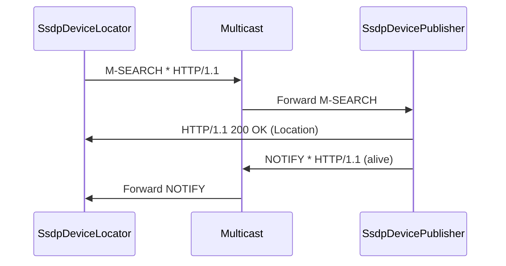

# Component: RSSDP — Internals

**Path:** `RSSDP/`
**Type:** Module
**Language:** C#
**Maps to:** `.discovery/301-rssdp-internals.md`
**Parent:** `.discovery/300-rssdp.md`

## Description

Really Simple Service Discovery Protocol (RSSDP) implementation.
Provides SSDP (Simple Service Discovery Protocol) functionality for UPnP device discovery.

## Structure

```
RSSDP/
├── SsdpDeviceLocator.cs          # [class] SsdpDeviceLocator
│   ├── Discovers UPnP devices on network
│   ├── Sends M-SEARCH requests
│   └── Listens for device announcements
├── SsdpDevicePublisher.cs        # [class] SsdpDevicePublisher
│   ├── Publishes device presence
│   ├── Sends NOTIFY announcements
│   └── Responds to M-SEARCH
├── SsdpRootDevice.cs             # [class] SsdpRootDevice
│   └── Represents root device
├── SsdpEmbeddedDevice.cs         # [class] SsdpEmbeddedDevice
│   └── Represents embedded device
├── SsdpDevice.cs                 # [class] SsdpDevice
│   └── Base device class
├── SsdpDeviceBase.cs             # [class] SsdpDeviceBase
│   └── Common device functionality
├── SsdpConstants.cs              # [class] SsdpConstants
│   └── SSDP protocol constants
├── ISsdpDeviceLocator.cs         # [interface] ISsdpDeviceLocator
├── ISsdpDevicePublisher.cs       # [interface] ISsdpDevicePublisher
└── *Ssdp*.cs                     # Supporting classes
```

## Key Classes

| Class | File | Purpose |
|-------|------|---------|
| `SsdpDeviceLocator` | `SsdpDeviceLocator.cs` | Device discovery |
| `SsdpDevicePublisher` | `SsdpDevicePublisher.cs` | Device publishing |
| `SsdpRootDevice` | `SsdpRootDevice.cs` | Root device |
| `SsdpDevice` | `SsdpDevice.cs` | Base device |

## SSDP Flow


