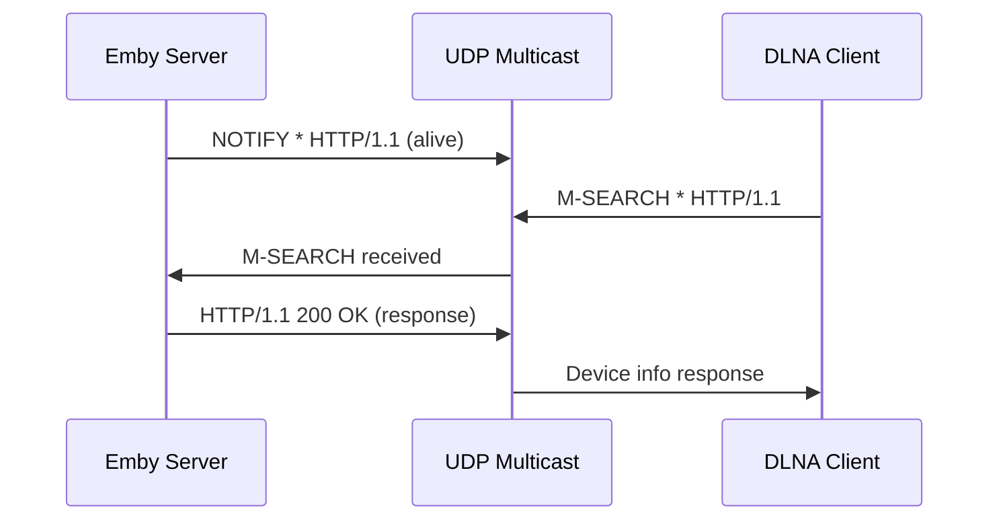

# Component: RSSDP

**Path:** `RSSDP/`
**Type:** Directory | Library
**Language:** C#
**Maps to:** `.discovery/310-rssdp.md`

## Description

RSSDP implements the SSDP (Simple Service Discovery Protocol) for UPnP device discovery. It enables Emby to advertise itself as a UPnP media server and discover other UPnP devices on the network. Used by the DLNA module for device discovery and announcement.

## Structure

```
RSSDP/
├── RSSDP.csproj                 # Project file
├── Infrastructure/              # SSDP protocol infrastructure
│   ├── SsdpDevicePublisher.cs   # Publishes device announcements
│   ├── SsdpDeviceLocator.cs     # Discovers remote devices
│   └── ...                      # UDP socket handling
├── SsdpDevice.cs                # SSDP device representation
├── SsdpRootDevice.cs            # Root device (top-level)
├── SsdpEmbeddedDevice.cs        # Embedded sub-devices
└── Properties/                  # Assembly info
```

## Key Classes

| Class | File | Purpose |
|-------|------|---------|
| `SsdpDevicePublisher` | `Infrastructure/` | Broadcasts device presence |
| `SsdpDeviceLocator` | `Infrastructure/` | Searches for devices |
| `SsdpDevice` | `SsdpDevice.cs` | Base device class |
| `SsdpRootDevice` | `SsdpRootDevice.cs` | Root device container |

## Data Flow



## Dependencies

- `System.Net` — UDP sockets
- `Emby.Dlna` — Device profile integration → `.discovery/120-emby-dlna.md`

## Side Effects

- Sends UDP multicast packets (239.255.255.250:1900)
- Listens on UDP port 1900
- Maintains device announcement timers

## Reference

- SSDP/UPnP Device Architecture
