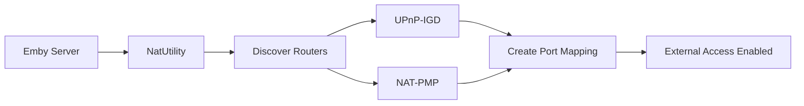

# Component: Mono.Nat

**Path:** `Mono.Nat/`
**Type:** Directory | Library
**Language:** C#
**Maps to:** `.discovery/320-mono-nat.md`

## Description

Mono.Nat implements NAT traversal protocols (UPnP-IGD and NAT-PMP) for automatic port forwarding. It enables Emby to configure routers to forward external ports to the server, improving remote access without manual router configuration.

## Structure

```
Mono.Nat/
├── Mono.Nat.csproj              # Project file
├── AbstractNatUtility.cs        # Base NAT utility
├── NatUtility.cs                # Main entry point → [class] NatUtility
├── Upnp/                        # UPnP-IGD implementation
│   ├── UpnpNatDevice.cs         # UPnP NAT device
│   └── ...                      # Discovery and mapping
├── Pmp/                         # NAT-PMP implementation
│   ├── PmpNatDevice.cs          # NAT-PMP device
│   └── ...                      
└── Properties/                  # Assembly info
```

## Key Classes

| Class | File | Purpose |
|-------|------|---------|
| `NatUtility` | `NatUtility.cs` | Main API for port mapping |
| `UpnpNatDevice` | `Upnp/` | UPnP-IGD device control |
| `PmpNatDevice` | `Pmp/` | NAT-PMP device control |

## Data Flow



## Dependencies

- `System.Net` — Network communication

## Side Effects

- Sends discovery packets to router
- Modifies router port forwarding rules
- Maintains port mapping leases

## Reference

- UPnP-IGD specification
- NAT-PMP specification (RFC 6886)
