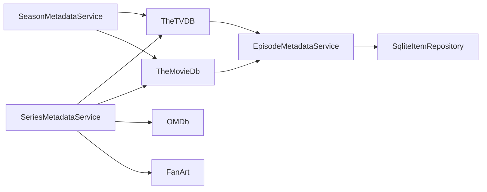

# Component: MediaBrowser.Providers — TV Providers

**Path:** `MediaBrowser.Providers/TV/`
**Type:** Directory | Provider Group
**Language:** C#
**Maps to:** `.discovery/327-mediabrowser-providers-tv.md`

## Description

TV metadata providers that fetch and manage episode, season, and series information from external sources including TheTVDB, TheMovieDb, FanArt, and OMDb. Supports multiple external ID systems and image providers.

## Files

### Root TV Files

- `DummySeasonProvider.cs` — MediaBrowser.Providers/TV/DummySeasonProvider.cs
- `EpisodeMetadataService.cs` — MediaBrowser.Providers/TV/EpisodeMetadataService.cs
- `MissingEpisodeProvider.cs` — MediaBrowser.Providers/TV/MissingEpisodeProvider.cs
- `SeasonMetadataService.cs` — MediaBrowser.Providers/TV/SeasonMetadataService.cs
- `SeriesMetadataService.cs` — MediaBrowser.Providers/TV/SeriesMetadataService.cs
- `TvExternalIds.cs` — MediaBrowser.Providers/TV/TvExternalIds.cs

### FanArt/ (2 files)

- `FanArtSeasonProvider.cs` — MediaBrowser.Providers/TV/FanArt/FanArtSeasonProvider.cs
- `FanartSeriesProvider.cs` — MediaBrowser.Providers/TV/FanArt/FanartSeriesProvider.cs

### Omdb/ (1 file)

- `OmdbEpisodeProvider.cs` — MediaBrowser.Providers/TV/Omdb/OmdbEpisodeProvider.cs

### TheMovieDb/ (7 files)

- `MovieDbEpisodeImageProvider.cs` — MediaBrowser.Providers/TV/TheMovieDb/MovieDbEpisodeImageProvider.cs
- `MovieDbEpisodeProvider.cs` — MediaBrowser.Providers/TV/TheMovieDb/MovieDbEpisodeProvider.cs
- `MovieDbProviderBase.cs` — MediaBrowser.Providers/TV/TheMovieDb/MovieDbProviderBase.cs
- `MovieDbSeasonProvider.cs` — MediaBrowser.Providers/TV/TheMovieDb/MovieDbSeasonProvider.cs
- `MovieDbSeriesImageProvider.cs` — MediaBrowser.Providers/TV/TheMovieDb/MovieDbSeriesImageProvider.cs
- `MovieDbSeriesProvider.cs` — MediaBrowser.Providers/TV/TheMovieDb/MovieDbSeriesProvider.cs

### TheTVDB/ (7 files)

- `TvdbEpisodeImageProvider.cs` — MediaBrowser.Providers/TV/TheTVDB/TvdbEpisodeImageProvider.cs
- `TvdbEpisodeProvider.cs` — MediaBrowser.Providers/TV/TheTVDB/TvdbEpisodeProvider.cs
- `TvdbPrescanTask.cs` — MediaBrowser.Providers/TV/TheTVDB/TvdbPrescanTask.cs
- `TvdbSeasonImageProvider.cs` — MediaBrowser.Providers/TV/TheTVDB/TvdbSeasonImageProvider.cs
- `TvdbSeriesImageProvider.cs` — MediaBrowser.Providers/TV/TheTVDB/TvdbSeriesImageProvider.cs
- `TvdbSeriesProvider.cs` — MediaBrowser.Providers/TV/TheTVDB/TvdbSeriesProvider.cs

## Data Flow

## External APIs

| Provider | API | Description |
|----------|-----|-------------|
| TheTVDB | thetvdb.com | Primary TV series database |
| TheMovieDb | tmdb.org | Movie/TV database with images |
| OMDb | omdbapi.com | Open Movie Database |
| FanArt | fanart.tv | High-quality artwork |

## Key Classes

| Class | Responsibility |
|-------|----------------|
| `SeriesMetadataService` | Fetches series metadata |
| `SeasonMetadataService` | Manages season information |
| `EpisodeMetadataService` | Processes episode data |
| `TvdbSeriesProvider` | TheTVDB API integration |
| `MovieDbSeriesProvider` | TMDB API integration |
| `TvExternalIds` | External ID management |

## Dependencies

- `MediaBrowser.Controller` — Base entity types
- `MediaBrowser.Model` — API models
- `HttpClient` — External API calls
