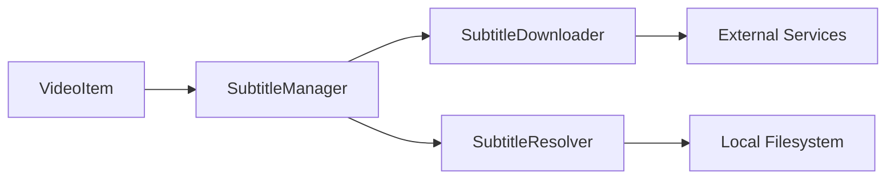

# Component: MediaBrowser.Providers — Subtitles

**Path:** `MediaBrowser.Providers/Subtitles/`
**Type:** Directory | Provider Group
**Language:** C#
**Maps to:** `.discovery/328-mediabrowser-providers-subtitles.md`

## Description

Subtitle provider management system. Handles subtitle file discovery, downloading, and caching for media items. Integrates with external subtitle services.

## Files

- `SubtitleManager.cs` — MediaBrowser.Providers/Subtitles/SubtitleManager.cs

## Architecture

## Dependencies

- `MediaBrowser.Controller` — Base entity types
- `MediaBrowser.Model` — API models
