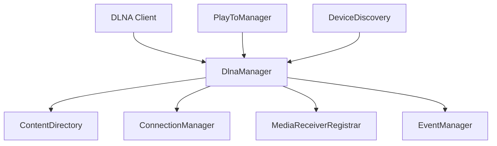

# Component: Emby.Dlna

**Path:** `Emby.Dlna/`
**Type:** Directory | Module
**Language:** C#
**Maps to:** `.discovery/330-emby-dlna.md`

## Decomposition

### DlnaManager.cs (Main Entry Point)

#### Imports
```csharp
using MediaBrowser.Controller.Configuration;
using MediaBrowser.Controller.Dlna;
using MediaBrowser.Model.Configuration;
using System;
using System.Collections.Generic;
using System.Threading.Tasks;
```

#### Classes
\`DlnaManager\` (public class : IDlnaManager)

#### Key Methods
```csharp
IDeviceDiscovery CreateDeviceDiscovery(DlnaOptions options)
IContentDirectory GetContentDirectory(string serverUuid)
IConnectionManager GetConnectionManager(string serverUuid)
Task<DeviceProfile> GetProfile(DeviceInfo deviceInfo)
```

### DidlBuilder.cs (DIDL-Lite Builder)

#### Imports
```csharp
using MediaBrowser.Controller.Entities;
using MediaBrowser.Model.Dlna;
using System.Collections.Generic;
using System.Xml;
```

#### Classes
\`DidlBuilder\` (public class)

#### Key Methods
```csharp
string GetDidl(IEnumerable<BaseItem> items, string filter, string sort)
string GetSingleItem(BaseItem item, string filter)
```

### ContentDirectory.cs (Browse/Search)

#### Classes
\`ContentDirectory\` (public class : BaseService, IContentDirectory)

#### Key Methods
```csharp
Task<ControlResponse> Browse(ControlRequest request)
Task<ControlResponse> Search(ControlRequest request)
Task<ControlResponse> GetSearchCapabilities(ControlRequest request)
```

### PlayToController.cs (PlayTo Remote Control)

#### Classes
\`PlayToController\` (public class)

#### Key Methods
```csharp
void Play(string url, string title)
void Stop()
void Pause()
void Seek(TimeSpan position)
```

### DeviceDiscovery.cs (SSDP Discovery)

#### Classes
\`DeviceDiscovery\` (public class)

#### Key Events
```csharp
event EventHandler<DeviceInfo> DeviceAdded
event EventHandler<DeviceInfo> DeviceRemoved
```

## Description

Emby.Dlna implements DLNA/UPnP media server functionality. It provides device discovery, content directory services, connection management, media receiver registration, and PlayTo remote control. Contains 90 C# files.

## Architecture



## Files

### Root Files (11 files)

- `ConfigurationExtension.cs` — Emby.Dlna/ConfigurationExtension.cs
- `ControlRequest.cs` — Emby.Dlna/ControlRequest.cs
- `ControlResponse.cs` — Emby.Dlna/ControlResponse.cs
- `DlnaManager.cs` — Emby.Dlna/DlnaManager.cs
- `EventSubscriptionResponse.cs` — Emby.Dlna/EventSubscriptionResponse.cs
- `IConnectionManager.cs` — Emby.Dlna/IConnectionManager.cs
- `IContentDirectory.cs` — Emby.Dlna/IContentDirectory.cs
- `IEventManager.cs` — Emby.Dlna/IEventManager.cs
- `IMediaReceiverRegistrar.cs` — Emby.Dlna/IMediaReceiverRegistrar.cs
- `IUpnpService.cs` — Emby.Dlna/IUpnpService.cs

### Api/ (2 files)

- `DlnaServerService.cs` — Emby.Dlna/Api/DlnaServerService.cs
- `DlnaService.cs` — Emby.Dlna/Api/DlnaService.cs

### Common/ (5 files)

- `Argument.cs` — Emby.Dlna/Common/Argument.cs
- `DeviceIcon.cs` — Emby.Dlna/Common/DeviceIcon.cs
- `DeviceService.cs` — Emby.Dlna/Common/DeviceService.cs
- `ServiceAction.cs` — Emby.Dlna/Common/ServiceAction.cs
- `StateVariable.cs` — Emby.Dlna/Common/StateVariable.cs

### Configuration/ (1 file)

- `DlnaOptions.cs` — Emby.Dlna/Configuration/DlnaOptions.cs

### ConnectionManager/ (4 files)

- `ConnectionManager.cs` — Emby.Dlna/ConnectionManager/ConnectionManager.cs
- `ConnectionManagerXmlBuilder.cs` — Emby.Dlna/ConnectionManager/ConnectionManagerXmlBuilder.cs
- `ControlHandler.cs` — Emby.Dlna/ConnectionManager/ControlHandler.cs
- `ServiceActionListBuilder.cs` — Emby.Dlna/ConnectionManager/ServiceActionListBuilder.cs

### ContentDirectory/ (4 files)

- `ContentDirectory.cs` — Emby.Dlna/ContentDirectory/ContentDirectory.cs
- `ContentDirectoryXmlBuilder.cs` — Emby.Dlna/ContentDirectory/ContentDirectoryXmlBuilder.cs
- `ControlHandler.cs` — Emby.Dlna/ContentDirectory/ControlHandler.cs
- `ServiceActionListBuilder.cs` — Emby.Dlna/ContentDirectory/ServiceActionListBuilder.cs

### Didl/ (3 files)

- `DidlBuilder.cs` — Emby.Dlna/Didl/DidlBuilder.cs
- `Filter.cs` — Emby.Dlna/Didl/Filter.cs
- `StringWriterWithEncoding.cs` — Emby.Dlna/Didl/StringWriterWithEncoding.cs

### Eventing/ (2 files)

- `EventManager.cs` — Emby.Dlna/Eventing/EventManager.cs
- `EventSubscription.cs` — Emby.Dlna/Eventing/EventSubscription.cs

### Main/ (1 file)

- `DlnaEntryPoint.cs` — Emby.Dlna/Main/DlnaEntryPoint.cs

### MediaReceiverRegistrar/ (4 files)

- `ControlHandler.cs` — Emby.Dlna/MediaReceiverRegistrar/ControlHandler.cs
- `MediaReceiverRegistrar.cs` — Emby.Dlna/MediaReceiverRegistrar/MediaReceiverRegistrar.cs
- `MediaReceiverRegistrarXmlBuilder.cs` — Emby.Dlna/MediaReceiverRegistrar/MediaReceiverRegistrarXmlBuilder.cs
- `ServiceActionListBuilder.cs` — Emby.Dlna/MediaReceiverRegistrar/ServiceActionListBuilder.cs

### PlayTo/ (19 files)

- `CurrentIdEventArgs.cs` — Emby.Dlna/PlayTo/CurrentIdEventArgs.cs
- `Device.cs` — Emby.Dlna/PlayTo/Device.cs
- `DeviceInfo.cs` — Emby.Dlna/PlayTo/DeviceInfo.cs
- `PlayToController.cs` — Emby.Dlna/PlayTo/PlayToController.cs
- `PlayToManager.cs` — Emby.Dlna/PlayTo/PlayToManager.cs
- `PlaybackProgressEventArgs.cs` — Emby.Dlna/PlayTo/PlaybackProgressEventArgs.cs
- `PlaybackStartEventArgs.cs` — Emby.Dlna/PlayTo/PlaybackStartEventArgs.cs
- `PlaybackStoppedEventArgs.cs` — Emby.Dlna/PlayTo/PlaybackStoppedEventArgs.cs
- `PlaylistItem.cs` — Emby.Dlna/PlayTo/PlaylistItem.cs
- `PlaylistItemFactory.cs` — Emby.Dlna/PlayTo/PlaylistItemFactory.cs
- `SsdpHttpClient.cs` — Emby.Dlna/PlayTo/SsdpHttpClient.cs
- `TRANSPORTSTATE.cs` — Emby.Dlna/PlayTo/TRANSPORTSTATE.cs
- `TransportCommands.cs` — Emby.Dlna/PlayTo/TransportCommands.cs
- `TransportStateEventArgs.cs` — Emby.Dlna/PlayTo/TransportStateEventArgs.cs
- `UpnpContainer.cs` — Emby.Dlna/PlayTo/UpnpContainer.cs
- `uBaseObject.cs` — Emby.Dlna/PlayTo/uBaseObject.cs
- `uParser.cs` — Emby.Dlna/PlayTo/uParser.cs
- `uParserObject.cs` — Emby.Dlna/PlayTo/uParserObject.cs
- `uPnpNamespaces.cs` — Emby.Dlna/PlayTo/uPnpNamespaces.cs

### Profiles/ (27 files)

- `DefaultProfile.cs` — Emby.Dlna/Profiles/DefaultProfile.cs
- `DenonAvrProfile.cs` — Emby.Dlna/Profiles/DenonAvrProfile.cs
- `DirectTvProfile.cs` — Emby.Dlna/Profiles/DirectTvProfile.cs
- `DishHopperJoeyProfile.cs` — Emby.Dlna/Profiles/DishHopperJoeyProfile.cs
- `Foobar2000Profile.cs` — Emby.Dlna/Profiles/Foobar2000Profile.cs
- `LgTvProfile.cs` — Emby.Dlna/Profiles/LgTvProfile.cs
- `LinksysDMA2100Profile.cs` — Emby.Dlna/Profiles/LinksysDMA2100Profile.cs
- `MarantzProfile.cs` — Emby.Dlna/Profiles/MarantzProfile.cs
- `MediaMonkeyProfile.cs` — Emby.Dlna/Profiles/MediaMonkeyProfile.cs
- `PanasonicVieraProfile.cs` — Emby.Dlna/Profiles/PanasonicVieraProfile.cs
- `PopcornHourProfile.cs` — Emby.Dlna/Profiles/PopcornHourProfile.cs
- `SamsungSmartTvProfile.cs` — Emby.Dlna/Profiles/SamsungSmartTvProfile.cs
- `SharpSmartTvProfile.cs` — Emby.Dlna/Profiles/SharpSmartTvProfile.cs
- `SonyBlurayPlayer2013.cs` — Emby.Dlna/Profiles/SonyBlurayPlayer2013.cs
- `SonyBlurayPlayer2014.cs` — Emby.Dlna/Profiles/SonyBlurayPlayer2014.cs
- `SonyBlurayPlayer2015.cs` — Emby.Dlna/Profiles/SonyBlurayPlayer2015.cs
- `SonyBlurayPlayer2016.cs` — Emby.Dlna/Profiles/SonyBlurayPlayer2016.cs
- `SonyBlurayPlayerProfile.cs` — Emby.Dlna/Profiles/SonyBlurayPlayerProfile.cs
- `SonyBravia2010Profile.cs` — Emby.Dlna/Profiles/SonyBravia2010Profile.cs
- `SonyBravia2011Profile.cs` — Emby.Dlna/Profiles/SonyBravia2011Profile.cs
- `SonyBravia2012Profile.cs` — Emby.Dlna/Profiles/SonyBravia2012Profile.cs
- `SonyBravia2013Profile.cs` — Emby.Dlna/Profiles/SonyBravia2013Profile.cs
- `SonyBravia2014Profile.cs` — Emby.Dlna/Profiles/SonyBravia2014Profile.cs
- `SonyPs3Profile.cs` — Emby.Dlna/Profiles/SonyPs3Profile.cs
- `SonyPs4Profile.cs` — Emby.Dlna/Profiles/SonyPs4Profile.cs
- `WdtvLiveProfile.cs` — Emby.Dlna/Profiles/WdtvLiveProfile.cs
- `XboxOneProfile.cs` — Emby.Dlna/Profiles/XboxOneProfile.cs

### Properties/ (1 file)

- `AssemblyInfo.cs` — Emby.Dlna/Properties/AssemblyInfo.cs

### Server/ (1 file)

- `DescriptionXmlBuilder.cs` — Emby.Dlna/Server/DescriptionXmlBuilder.cs

### Service/ (4 files)

- `BaseControlHandler.cs` — Emby.Dlna/Service/BaseControlHandler.cs
- `BaseService.cs` — Emby.Dlna/Service/BaseService.cs
- `ControlErrorHandler.cs` — Emby.Dlna/Service/ControlErrorHandler.cs
- `ServiceXmlBuilder.cs` — Emby.Dlna/Service/ServiceXmlBuilder.cs

### Ssdp/ (2 files)

- `DeviceDiscovery.cs` — Emby.Dlna/Ssdp/DeviceDiscovery.cs
- `Extensions.cs` — Emby.Dlna/Ssdp/Extensions.cs

## Device Profiles

The DLNA module includes 27 device-specific profiles for optimal compatibility:

| Category | Profiles |
|----------|----------|
| Sony Bravia TVs | 2010-2014 |
| Sony Blu-ray Players | 2013-2016 |
| Sony PlayStation | PS3, PS4 |
| Samsung TVs | Smart TV |
| LG TVs | Standard Profile |
| Xbox | Xbox One |
| Others | Denon AVR, DirectTV, Dish, Foobar2000, etc. |

## Key Interfaces

| Interface | Purpose |
|-----------|---------|
| `IContentDirectory` | Browse/search media |
| `IConnectionManager` | Playback control |
| `IEventManager` | Event subscriptions |
| `IMediaReceiverRegistrar` | Device registration |
