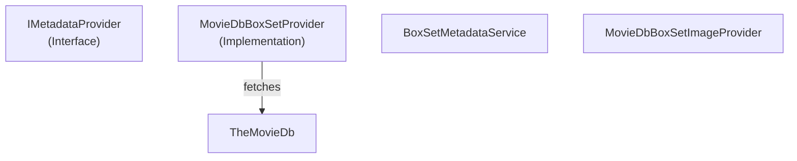

# MediaBrowser.Providers - BoxSets Module

**Module:** MediaBrowser.Providers/BoxSets
**Language:** C#
**Maps to:** `.discovery/330-mediabrowser-providers-boxsets.md`

## Decomposition

### MovieDbBoxSetProvider.cs (MovieDB Box Set Provider)

#### Imports
```csharp
using MediaBrowser.Controller.Entities.Movies;
using MediaBrowser.Controller.Providers;
using MediaBrowser.Model.Entities;
using MediaBrowser.Model.Providers;
using System.Threading.Tasks;
```

#### Classes
`MovieDbBoxSetProvider` (public class : IMetadataProvider<BoxSet>)

### BoxSetMetadataService.cs (Box Set Metadata Service)

#### Classes
`BoxSetMetadataService` (public class : IMetadataService)

### MovieDbBoxSetImageProvider.cs (Box Set Image Provider)

#### Classes
`MovieDbBoxSetImageProvider` (public class : IRemoteImageProvider<BoxSet>)

## Architecture



## File Listing

```
BoxSets/
├── BoxSetMetadataService.cs       - Box set metadata service
├── MovieDbBoxSetImageProvider.cs  - Box set image provider
└── MovieDbBoxSetProvider.cs       - Box set metadata from MovieDB
```

## Description

BoxSets module provides metadata providers for box set (collection) items. MovieDbBoxSetProvider fetches collection information from TheMovieDb.

## Dependencies

- **MediaBrowser.Controller.Entities.Movies** - BoxSet entity
- **MediaBrowser.Model.Providers** - Provider interfaces

## Statistics

- **Files:** 3
- **Lines:** ~300
- **Classes:** 3
