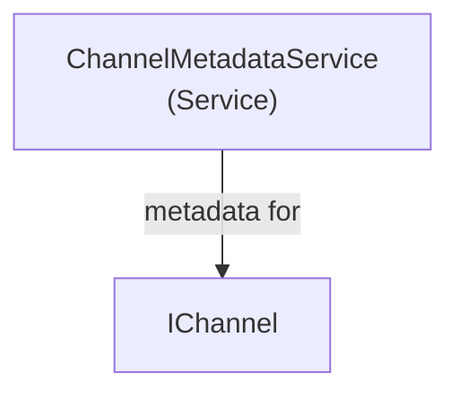

# MediaBrowser.Providers - Channels Module

**Module:** MediaBrowser.Providers/Channels
**Language:** C#
**Maps to:** `.discovery/331-mediabrowser-providers-channels.md`

## Decomposition

### ChannelMetadataService.cs (Channel Metadata Service)

#### Imports
```csharp
using MediaBrowser.Controller.Channels;
using MediaBrowser.Controller.Providers;
using MediaBrowser.Model.Serialization;
using System;
using System.Threading.Tasks;
```

#### Classes
`ChannelMetadataService` (public class : IMetadataService)

## Architecture



## File Listing

```
Channels/
└── ChannelMetadataService.cs - Channel metadata service
```

## Description

Channels module provides metadata services for channel items.

## Dependencies

- **MediaBrowser.Controller.Channels** - Channel interfaces
- **MediaBrowser.Controller.Providers** - Provider interfaces

## Statistics

- **Files:** 1
- **Lines:** ~50
- **Classes:** 1
