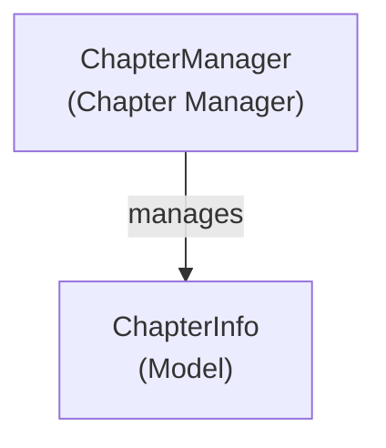

# MediaBrowser.Providers - Chapters Module

**Module:** MediaBrowser.Providers/Chapters
**Language:** C#
**Maps to:** `.discovery/332-mediabrowser-providers-chapters.md`

## Decomposition

### ChapterManager.cs (Chapter Manager)

#### Imports
```csharp
using MediaBrowser.Controller.Entities;
using MediaBrowser.Controller.Library;
using MediaBrowser.Model.Entities;
using MediaBrowser.Model.Logging;
using MediaBrowser.Model.Serialization;
using System;
using System.Collections.Generic;
using System.IO;
using System.Linq;
using System.Threading;
using System.Threading.Tasks;
```

#### Classes
`ChapterManager` (public class : IServerEntryPoint)

#### Key Properties
```csharp
string ChaptersPath { get; }
```

#### Key Methods
```csharp
Task<List<ChapterInfo>> GetChapters(BaseItem item)
Task<string> GetChapterPath(BaseItem item, int index)
```

## Architecture



## File Listing

```
Chapters/
└── ChapterManager.cs - Chapter detection and management
```

## Description

Chapters module manages video chapters. ChapterManager detects and retrieves chapter information from video files.

## Dependencies

- **MediaBrowser.Controller.Entities** - BaseItem entity
- **MediaBrowser.Controller.Library** - Library management
- **MediaBrowser.Model.Entities** - Chapter models

## Statistics

- **Files:** 1
- **Lines:** ~200
- **Classes:** 1
