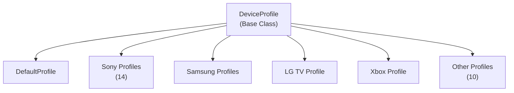

# Emby.Dlna - Profiles Module

**Module:** Emby.Dlna/Profiles
**Language:** C#
**Maps to:** `.discovery/334-emby-dlna-profiles.md`

## Description

Device profiles define device-specific capabilities for DLNA playback. Each profile specifies supported codecs, containers, resolutions, and streaming protocols. Emby uses these profiles to transcode media appropriately for each device type.

## Files

### Root Profile Files (28 files)

- `DefaultProfile.cs` — Emby.Dlna/Profiles/DefaultProfile.cs
- `DenonAvrProfile.cs` — Emby.Dlna/Profiles/DenonAvrProfile.cs
- `DirectTvProfile.cs` — Emby.Dlna/Profiles/DirectTvProfile.cs
- `DishHopperJoeyProfile.cs` — Emby.Dlna/Profiles/DishHopperJoeyProfile.cs
- `Foobar2000Profile.cs` — Emby.Dlna/Profiles/Foobar2000Profile.cs
- `LgTvProfile.cs` — Emby.Dlna/Profiles/LgTvProfile.cs
- `LinksysDMA2100Profile.cs` — Emby.Dlna/Profiles/LinksysDMA2100Profile.cs
- `MarantzProfile.cs` — Emby.Dlna/Profiles/MarantzProfile.cs
- `MediaMonkeyProfile.cs` — Emby.Dlna/Profiles/MediaMonkeyProfile.cs
- `PanasonicVieraProfile.cs` — Emby.Dlna/Profiles/PanasonicVieraProfile.cs
- `PopcornHourProfile.cs` — Emby.Dlna/Profiles/PopcornHourProfile.cs
- `SamsungSmartTvProfile.cs` — Emby.Dlna/Profiles/SamsungSmartTvProfile.cs
- `SharpSmartTvProfile.cs` — Emby.Dlna/Profiles/SharpSmartTvProfile.cs
- `SonyBlurayPlayer2013.cs` — Emby.Dlna/Profiles/SonyBlurayPlayer2013.cs
- `SonyBlurayPlayer2014.cs` — Emby.Dlna/Profiles/SonyBlurayPlayer2014.cs
- `SonyBlurayPlayer2015.cs` — Emby.Dlna/Profiles/SonyBlurayPlayer2015.cs
- `SonyBlurayPlayer2016.cs` — Emby.Dlna/Profiles/SonyBlurayPlayer2016.cs
- `SonyBlurayPlayerProfile.cs` — Emby.Dlna/Profiles/SonyBlurayPlayerProfile.cs
- `SonyBravia2010Profile.cs` — Emby.Dlna/Profiles/SonyBravia2010Profile.cs
- `SonyBravia2011Profile.cs` — Emby.Dlna/Profiles/SonyBravia2011Profile.cs
- `SonyBravia2012Profile.cs` — Emby.Dlna/Profiles/SonyBravia2012Profile.cs
- `SonyBravia2013Profile.cs` — Emby.Dlna/Profiles/SonyBravia2013Profile.cs
- `SonyBravia2014Profile.cs` — Emby.Dlna/Profiles/SonyBravia2014Profile.cs
- `SonyPs3Profile.cs` — Emby.Dlna/Profiles/SonyPs3Profile.cs
- `SonyPs4Profile.cs` — Emby.Dlna/Profiles/SonyPs4Profile.cs
- `WdtvLiveProfile.cs` — Emby.Dlna/Profiles/WdtvLiveProfile.cs
- `XboxOneProfile.cs` — Emby.Dlna/Profiles/XboxOneProfile.cs

## Decomposition

### Profile Classes

All profiles inherit from `DeviceProfile` and override specific capabilities.

#### Sony Profiles (14 files)
`SonyBlurayPlayerProfile` / `SonyBlurayPlayer2013` / `SonyBlurayPlayer2014` / `SonyBlurayPlayer2015` / `SonyBlurayPlayer2016` — Bluray player profiles
`SonyBravia2010Profile` / `SonyBravia2011Profile` / `SonyBravia2012Profile` / `SonyBravia2013Profile` / `SonyBravia2014Profile` — Bravia TV profiles
`SonyPs3Profile` / `SonyPs4Profile` — PlayStation profiles

#### Samsung Profiles (2 files)
`SamsungSmartTvProfile` — Smart TV profile
`SharpSmartTvProfile` — Sharp Smart TV profile

#### LG Profiles (1 file)
`LgTvProfile` — LG TV profile

#### Xbox Profiles (1 file)
`XboxOneProfile` — Xbox One profile

#### Other Profiles (10 files)
`DefaultProfile` — Base/default profile
`DenonAvrProfile` / `MarantzProfile` — AV Receiver profiles
`DirectTvProfile` / `DishHopperJoeyProfile` — Satellite/Cable profiles
`Foobar2000Profile` / `MediaMonkeyProfile` — Media player profiles
`PanasonicVieraProfile` — Panasonic TV profile
`PopcornHourProfile` — Popcorn Hour profile
`LinksysDMA2100Profile` — Media extender profile
`WdtvLiveProfile` — WDTV profile

## Architecture

## Statistics

- **Total Profiles:** 28
- **Sony Profiles:** 14 (Bluray, Bravia, PlayStation)
- **Samsung/Sharp:** 2
- **LG:** 1
- **Xbox:** 1
- **Other:** 10
