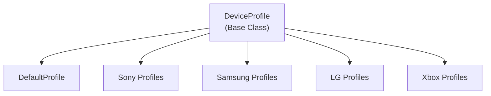

# Emby.Dlna - Profiles Subdirectories

**Module:** Emby.Dlna/Profiles
**Language:** C#
**Maps to:** `.discovery/334-emby-dlna-profiles.md`

## Decomposition

### Profile Classes

All profiles inherit from `DeviceProfile` and override specific capabilities.

### Sony Profiles

#### Classes
`SonyBraviaProfile` (public class : DefaultProfile)
`SonyBlurayProfile` (public class : DefaultProfile)
`SonyPs3Profile` (public class : DefaultProfile)
`SonyPs4Profile` (public class : DefaultProfile)

### Samsung Profiles

#### Classes
`SamsungSmartTvProfile` (public class : DefaultProfile)
`SamsungH SeriesProfile` (public class : DefaultProfile)
`SamsungCSeriesProfile` (public class : DefaultProfile)

### LG Profiles

#### Classes
`LgTvProfile` (public class : DefaultProfile)
`LgTv2013Profile` (public class : DefaultProfile)

### Xbox Profiles

#### Classes
`XboxOneProfile` (public class : DefaultProfile)
`Xbox360Profile` (public class : DefaultProfile)

### Generic Profiles

#### Classes
`DefaultProfile` (public class : DeviceProfile)
`SamsungSeriesJProfile` (public class : DefaultProfile)
`SharpAquosProfile` (public class : DefaultProfile)
`PanasonicVieraProfile` (public class : DefaultProfile)

### PMS Profiles

#### Classes
`PmsSubscriptionProfile` (public class : DefaultProfile)

## Architecture



## File Listing

```
Emby.Dlna/Profiles/
├── Sony/
│   ├── SonyBraviaProfile.cs
│   ├── SonyBlurayProfile.cs
│   ├── SonyPs3Profile.cs
│   └── SonyPs4Profile.cs
├── Samsung/
│   ├── SamsungSmartTvProfile.cs
│   ├── SamsungHSeriesProfile.cs
│   ├── SamsungCSeriesProfile.cs
│   └── SamsungSeriesJProfile.cs
├── LG/
│   ├── LgTvProfile.cs
│   └── LgTv2013Profile.cs
├── Xbox/
│   ├── XboxOneProfile.cs
│   └── Xbox360Profile.cs
├── DefaultProfile.cs
├── SharpAquosProfile.cs
├── PanasonicVieraProfile.cs
└── PmsSubscriptionProfile.cs
```

## Description

Profiles define device-specific capabilities for DLNA playback. Each profile specifies supported codecs, containers, resolutions, and streaming protocols. Emby uses these profiles to transcode media appropriately for each device type.

## Statistics

- **Total Profiles:** ~27
- **Manufacturers:** Sony, Samsung, LG, Xbox, Sharp, Panasonic, and more
