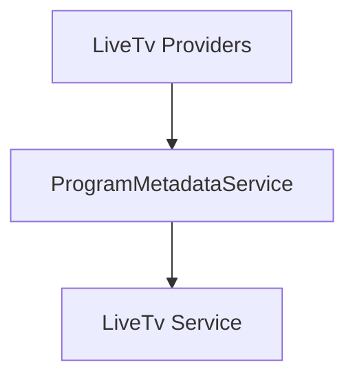

# Component: MediaBrowser.Providers.LiveTv

**Path:** `MediaBrowser.Providers/LiveTv/`
**Type:** Directory | Sub-Module
**Language:** C#
**Maps to:** `.discovery/337-mediabrowser-providers-livetv.md`

## Description

Live TV program metadata services. Handles metadata fetching and saving for live TV programs.

## Directory Structure

```
MediaBrowser.Providers/LiveTv/
└── ProgramMetadataService.cs
```

## Files

| File | Description |
|------|-------------|
| `ProgramMetadataService.cs` | Program metadata service |

## Decomposition

### ProgramMetadataService.cs

#### Classes
`ProgramMetadataService` (public class : IMetadataService)

#### Key Methods
| Method | Return | Description |
|--------|--------|-------------|
| `Fetch(MetadataSearchOptions, CancellationToken)` | `Task<bool>` | Fetch program metadata |
| `Save(BaseItem, CancellationToken)` | `Task` | Save program metadata |

## Architecture



## Dependencies

- MediaBrowser.Controller.LiveTv — LiveTV interfaces
- MediaBrowser.Controller.Providers — Provider interfaces

## Statistics

| Metric | Value |
|--------|-------|
| C# Files | 1 |
| LOC | ~1,100 |
| Public Classes | 1 |
