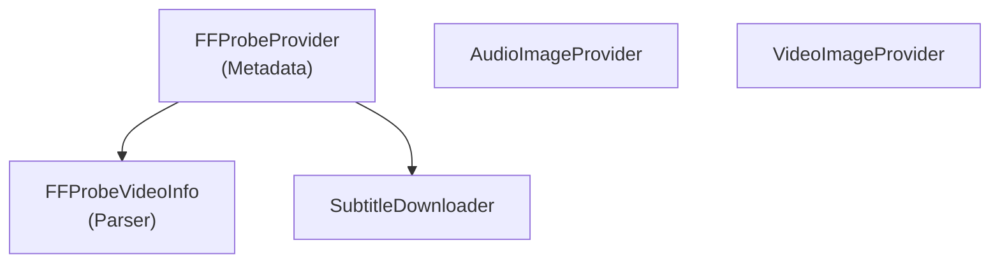

# MediaBrowser.Providers - MediaInfo Module

**Module:** MediaBrowser.Providers/MediaInfo
**Language:** C#
**Maps to:** `.discovery/339-mediabrowser-providers-mediainfo.md`

## Decomposition

### FFProbeProvider.cs (FFProbe Metadata Provider)

#### Imports
```csharp
using MediaBrowser.Controller.Entities;
using MediaBrowser.Controller.MediaInfo;
using MediaBrowser.Controller.Providers;
using MediaBrowser.Model.Entities;
using MediaBrowser.Model.IO;
using MediaBrowser.Model.Logging;
using MediaBrowser.Model.MediaInfo;
using System;
using System.Threading;
using System.Threading.Tasks;
```

#### Classes
`FFProbeProvider` (public class : IMetadataProvider<Video>)

### FFProbeVideoInfo.cs / FFProbeAudioInfo.cs (Media Info Parsers)

#### Classes
`FFProbeVideoInfo` / `FFProbeAudioInfo`

### AudioImageProvider.cs / VideoImageProvider.cs (Image Providers)

#### Classes
`AudioImageProvider` / `VideoImageProvider`

### SubtitleDownloader.cs / SubtitleResolver.cs (Subtitle Handling)

#### Classes
`SubtitleDownloader` / `SubtitleResolver`

### SubtitleScheduledTask.cs (Scheduled Task)

#### Classes
`SubtitleScheduledTask` (public class : IScheduledTask)

## Architecture



## File Listing

```
MediaInfo/
├── FFProbeProvider.cs       - FFProbe metadata provider
├── FFProbeVideoInfo.cs     - Video info parser
├── FFProbeAudioInfo.cs     - Audio info parser
├── AudioImageProvider.cs   - Audio image provider
├── VideoImageProvider.cs   - Video image provider
├── SubtitleDownloader.cs   - Subtitle downloader
├── SubtitleResolver.cs     - Subtitle resolver
└── SubtitleScheduledTask.cs - Subtitle scheduled task
```

## Description

MediaInfo module handles media file analysis using FFProbe. FFProbeProvider extracts video/audio metadata from media files. SubtitleDownloader fetches subtitles from external sources.

## Dependencies

- **MediaBrowser.Controller.MediaInfo** - Media info interfaces
- **MediaBrowser.Controller.Providers** - Provider interfaces
- **FFProbe** - External media analysis tool

## Statistics

- **Files:** 8
- **Lines:** ~1,500
- **Classes:** 8
