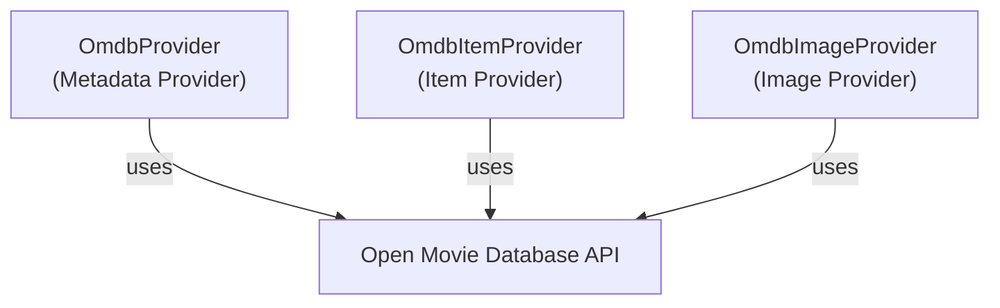

# MediaBrowser.Providers - Omdb Module

**Module:** MediaBrowser.Providers/Omdb
**Language:** C#
**Maps to:** `.discovery/341-mediabrowser-providers-omdb.md`

## Decomposition

### OmdbProvider.cs (OMDB Metadata Provider)

#### Imports
```csharp
using MediaBrowser.Controller.Entities;
using MediaBrowser.Controller.Providers;
using MediaBrowser.Model.Configuration;
using MediaBrowser.Model.Logging;
using MediaBrowser.Model.Net;
using MediaBrowser.Model.Providers;
using System;
using System.Threading;
using System.Threading.Tasks;
```

#### Classes
`OmdbProvider` (public class : IMetadataProvider<Video>)

### OmdbItemProvider.cs (OMDB Item Provider)

#### Classes
`OmdbItemProvider` (public class : IRemoteMetadataProvider<Video, ItemLookupInfo>)

### OmdbImageProvider.cs (OMDB Image Provider)

#### Classes
`OmdbImageProvider` (public class : IRemoteImageProvider<Video>)

## Architecture



## File Listing

```
Omdb/
├── OmdbProvider.cs       - OMDB metadata provider
├── OmdbItemProvider.cs  - OMDB item provider
└── OmdbImageProvider.cs  - OMDB image provider
```

## Description

Omdb module provides metadata and images from the Open Movie Database (OMDB) API. OmdbProvider fetches movie/TV show information including ratings, plot, and poster images.

## Dependencies

- **MediaBrowser.Controller.Providers** - Provider interfaces
- **MediaBrowser.Model.Net** - Network access
- **OMDB API** - External metadata service

## Statistics

- **Files:** 3
- **Lines:** ~300
- **Classes:** 3
