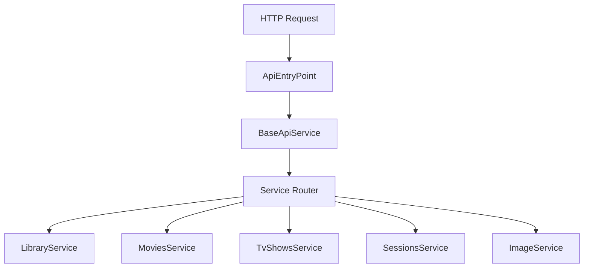

# Component: MediaBrowser.Api — Services (Full)

**Path:** `MediaBrowser.Api/`
**Type:** Directory | Module
**Language:** C#
**Maps to:** `.discovery/343-mediabrowser-api-services.md`

## Description

REST API endpoints organized by service. Provides all public API endpoints for Emby clients.

## Files

### Root Files (25 files)

- `ApiEntryPoint.cs` — MediaBrowser.Api/ApiEntryPoint.cs
- `BaseApiService.cs` — MediaBrowser.Api/BaseApiService.cs
- `BrandingService.cs` — MediaBrowser.Api/BrandingService.cs
- `ChannelService.cs` — MediaBrowser.Api/ChannelService.cs
- `ConfigurationService.cs` — MediaBrowser.Api/ConfigurationService.cs
- `DisplayPreferencesService.cs` — MediaBrowser.Api/DisplayPreferencesService.cs
- `EnvironmentService.cs` — MediaBrowser.Api/EnvironmentService.cs
- `FilterService.cs` — MediaBrowser.Api/FilterService.cs
- `GamesService.cs` — MediaBrowser.Api/GamesService.cs
- `IHasDtoOptions.cs` — MediaBrowser.Api/IHasDtoOptions.cs
- `IHasItemFields.cs` — MediaBrowser.Api/IHasItemFields.cs
- `LocalizationService.cs` — MediaBrowser.Api/LocalizationService.cs
- `NewsService.cs` — MediaBrowser.Api/NewsService.cs
- `PackageService.cs` — MediaBrowser.Api/PackageService.cs
- `PlaylistService.cs` — MediaBrowser.Api/PlaylistService.cs
- `PluginService.cs` — MediaBrowser.Api/PluginService.cs
- `Properties/AssemblyInfo.cs` — MediaBrowser.Api/Properties/AssemblyInfo.cs
- `SearchService.cs` — MediaBrowser.Api/SearchService.cs
- `SimilarItemsHelper.cs` — MediaBrowser.Api/SimilarItemsHelper.cs
- `StartupWizardService.cs` — MediaBrowser.Api/StartupWizardService.cs
- `Subtitles/SubtitleService.cs` — MediaBrowser.Api/Subtitles/SubtitleService.cs
- `SuggestionsService.cs` — MediaBrowser.Api/SuggestionsService.cs
- `ItemLookupService.cs` — MediaBrowser.Api/ItemLookupService.cs
- `ItemRefreshService.cs` — MediaBrowser.Api/ItemRefreshService.cs
- `ItemUpdateService.cs` — MediaBrowser.Api/ItemUpdateService.cs

### Devices/ (1 file)

- `DeviceService.cs` — MediaBrowser.Api/Devices/DeviceService.cs

### Images/ (4 files)

- `ImageByNameService.cs` — MediaBrowser.Api/Images/ImageByNameService.cs
- `ImageRequest.cs` — MediaBrowser.Api/Images/ImageRequest.cs
- `ImageService.cs` — MediaBrowser.Api/Images/ImageService.cs
- `RemoteImageService.cs` — MediaBrowser.Api/Images/RemoteImageService.cs

### Library/ (2 files)

- `LibraryService.cs` — MediaBrowser.Api/Library/LibraryService.cs
- `LibraryStructureService.cs` — MediaBrowser.Api/Library/LibraryStructureService.cs

### LiveTv/ (2 files)

- `LiveTvService.cs` — MediaBrowser.Api/LiveTv/LiveTvService.cs
- `ProgressiveFileCopier.cs` — MediaBrowser.Api/LiveTv/ProgressiveFileCopier.cs

### Movies/ (3 files)

- `CollectionService.cs` — MediaBrowser.Api/Movies/CollectionService.cs
- `MoviesService.cs` — MediaBrowser.Api/Movies/MoviesService.cs
- `TrailersService.cs` — MediaBrowser.Api/Movies/TrailersService.cs

### Music/ (3 files)

- `AlbumsService.cs` — MediaBrowser.Api/Music/AlbumsService.cs
- `InstantMixService.cs` — MediaBrowser.Api/Music/InstantMixService.cs

### ScheduledTasks/ (2 files)

- `ScheduledTaskService.cs` — MediaBrowser.Api/ScheduledTasks/ScheduledTaskService.cs
- `ScheduledTasksWebSocketListener.cs` — MediaBrowser.Api/ScheduledTasks/ScheduledTasksWebSocketListener.cs

### Session/ (2 files)

- `SessionInfoWebSocketListener.cs` — MediaBrowser.Api/Session/SessionInfoWebSocketListener.cs
- `SessionsService.cs` — MediaBrowser.Api/Session/SessionsService.cs

### System/ (4 files)

- `ActivityLogService.cs` — MediaBrowser.Api/System/ActivityLogService.cs
- `ActivityLogWebSocketListener.cs` — MediaBrowser.Api/System/ActivityLogWebSocketListener.cs
- `SystemService.cs` — MediaBrowser.Api/System/SystemService.cs

### TvShows/ (1 file)

- `TvShowsService.cs` — MediaBrowser.Api/TvShowsService.cs

### UserLibrary/ (3 files)

- `ArtistsService.cs` — MediaBrowser.Api/UserLibrary/ArtistsService.cs
- `BaseItemsByNameService.cs` — MediaBrowser.Api/UserLibrary/BaseItemsByNameService.cs
- `BaseItemsRequest.cs` — MediaBrowser.Api/UserLibrary/BaseItemsRequest.cs

## Architecture

## API Categories

| Category | Services |
|----------|----------|
| Media | Library, Movies, TvShows, Music, Albums |
| Users | Sessions, UserLibrary |
| System | System, Configuration, ScheduledTasks |
| Images | Image, RemoteImage, ImageByName |
| LiveTV | LiveTvService |

## Dependencies

- `MediaBrowser.Controller` — Service interfaces
- `MediaBrowser.Model` — API models
