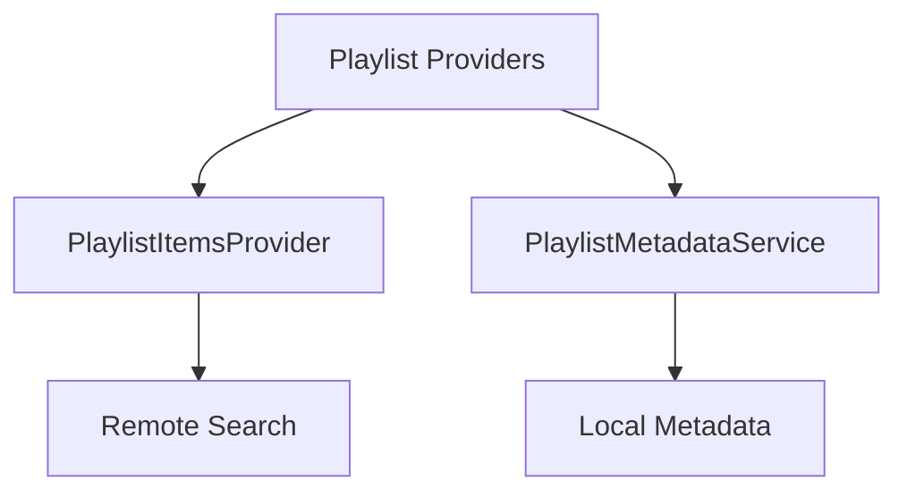

# Component: MediaBrowser.Providers.Playlists

**Path:** `MediaBrowser.Providers/Playlists/`
**Type:** Directory | Sub-Module
**Language:** C#
**Maps to:** `.discovery/343-mediabrowser-providers-playlists.md`

## Description

Playlist metadata and item providers. Handles metadata fetching and item resolution for playlists.

## Directory Structure

```
MediaBrowser.Providers/Playlists/
├── PlaylistItemsProvider.cs
└── PlaylistMetadataService.cs
```

## Files

| File | Description |
|------|-------------|
| `PlaylistItemsProvider.cs` | Playlist items provider |
| `PlaylistMetadataService.cs` | Playlist metadata service |

## Decomposition

### PlaylistItemsProvider.cs

#### Classes
`PlaylistItemsProvider` (public class : IRemoteMetadataProvider<Playlist, ItemLookupInfo>)

#### Key Methods
| Method | Return | Description |
|--------|--------|-------------|
| `GetMetadata(ItemLookupInfo, CancellationToken)` | `Task<MetadataResult<Playlist>>` | Get playlist metadata |
| `GetSearchResults(ItemLookupInfo, CancellationToken)` | `Task<IEnumerable<RemoteSearchResult>>` | Search playlists |

### PlaylistMetadataService.cs

#### Classes
`PlaylistMetadataService` (public class : IMetadataService)

#### Key Methods
| Method | Return | Description |
|--------|--------|-------------|
| `Fetch(MetadataSearchOptions, CancellationToken)` | `Task<bool>` | Fetch metadata |
| `Save(BaseItem, CancellationToken)` | `Task` | Save metadata |

## Architecture



## Dependencies

- MediaBrowser.Controller.Entities — Entity types
- MediaBrowser.Controller.Providers — Provider interfaces

## Statistics

| Metric | Value |
|--------|-------|
| C# Files | 2 |
| LOC | ~8,000 |
| Public Classes | 2 |
