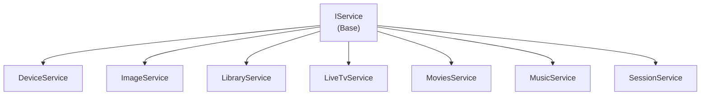

# MediaBrowser.Api - Controllers Subdirectories

**Module:** MediaBrowser.Api
**Language:** C#
**Maps to:** `.discovery/344-mediabrowser-api-controllers.md`

## Decomposition

### Devices/ (Device Management)

#### Key Classes
`DeviceService` (public class : IService)
`DeviceInfoService` (public class : IService)

#### Key Methods
```csharp
Task<object> GetDeviceInfo(DeviceInfo request)
Task<object> GetDevices(Device request)
Task<object> UpdateDevice(DeviceInfoDto request)
```

### Images/ (Image Endpoints)

#### Key Classes
`ImageService` (public class : IService)
`ImageByNameService` (public class : IService)

#### Key Methods
```csharp
Task<object> GetImage(Image request)
Task<object> GetImagesByName(ImageRequest request)
Task<object> UploadImage(UploadImageRequest request)
```

### Library/ (Library Management)

#### Key Classes
`LibraryService` (public class : IService)
`LibraryMediaService` (public class : IService)

#### Key Methods
```csharp
Task<object> GetLibrary(LibraryRequest request)
Task<object> GetMediaFolders(LibraryFoldersRequest request)
Task<object> RefreshLibrary(RefreshLibraryRequest request)
```

### LiveTv/ (Live TV)

#### Key Classes
`LiveTvService` (public class : IService)

#### Key Methods
```csharp
Task<object> GetChannels(ChannelRequest request)
Task<object> GetPrograms(ProgramsRequest request)
Task<object> GetRecording(RecordingRequest request)
```

### Movies/ (Movie Library)

#### Key Classes
`MoviesService` (public class : IService)

#### Key Methods
```csharp
Task<object> GetMovies(MoviesRequest request)
Task<object> GetLatestMovies(LatestRequest request)
```

### Music/ (Music Library)

#### Key Classes
`MusicService` (public class : IService)

#### Key Methods
```csharp
Task<object> GetArtists(ArtistsRequest request)
Task<object> GetAlbums(AlbumsRequest request)
Task<object> GetSongs(SongsRequest request)
```

### Session/ (Session Management)

#### Key Classes
`SessionService` (public class : IService)

#### Key Methods
```csharp
Task<object> GetSessions(SessionRequest request)
Task<object> ReportSessionActivity(ActivityRequest request)
Task<object> SendMessage(SessionMessageRequest request)
```

### Subtitles/ (Subtitle Endpoints)

#### Key Classes
`SubtitleService` (public class : IService)

#### Key Methods
```csharp
Task<object> GetSubtitle(SubtitleRequest request)
Task<object> UploadSubtitle(UploadSubtitleRequest request)
```

### System/ (System Management)

#### Key Classes
`SystemService` (public class : IService)

#### Key Methods
```csharp
Task<object> GetSystemInfo(SystemInfoRequest request)
Task<object> RestartServer(RestartRequest request)
Task<object> ShutdownServer(ShutdownRequest request)
```

### UserLibrary/ (User Library)

#### Key Classes
`UserLibraryService` (public class : IService)

#### Key Methods
```csharp
Task<object> GetUserItems(UserItemsRequest request)
Task<object> GetItemByName(ItemNameRequest request)
```

## Architecture



## File Listing

```
MediaBrowser.Api/
├── Devices/       - Device endpoints
├── Images/       - Image endpoints
├── Library/      - Library management
├── LiveTv/       - Live TV
├── Movies/       - Movies
├── Music/        - Music
├── ScheduledTasks/ - Tasks
├── Session/      - Sessions
├── Subtitles/    - Subtitles
├── System/        - System management
└── UserLibrary/   - User library
```

## Statistics

- **Subdirectories:** 11
- **Files per subdir:** 1-5
- **Total Controllers:** ~30+
