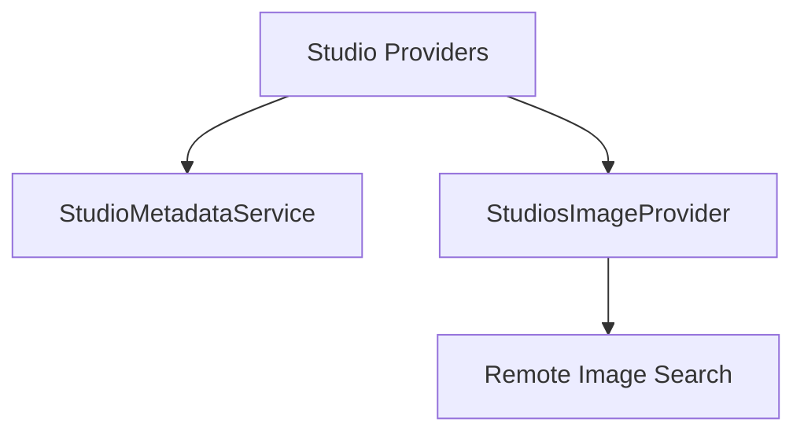

# Component: MediaBrowser.Providers.Studios

**Path:** `MediaBrowser.Providers/Studios/`
**Type:** Directory | Sub-Module
**Language:** C#
**Maps to:** `.discovery/344-mediabrowser-providers-studios.md`

## Description

Studio metadata services and image providers. Handles metadata and artwork for studio entities.

## Directory Structure

```
MediaBrowser.Providers/Studios/
├── StudioMetadataService.cs
└── StudiosImageProvider.cs
```

## Files

| File | Description |
|------|-------------|
| `StudioMetadataService.cs` | Studio metadata service |
| `StudiosImageProvider.cs` | Studio image provider |

## Decomposition

### StudioMetadataService.cs

#### Classes
`StudioMetadataService` (public class : IMetadataService)

#### Key Methods
| Method | Return | Description |
|--------|--------|-------------|
| `Fetch(MetadataSearchOptions, CancellationToken)` | `Task<bool>` | Fetch studio metadata |
| `Save(BaseItem, CancellationToken)` | `Task` | Save studio metadata |

### StudiosImageProvider.cs

#### Classes
`StudiosImageProvider` (public class : IRemoteImageProvider)

#### Key Methods
| Method | Return | Description |
|--------|--------|-------------|
| `GetImages(Studio, CancellationToken)` | `Task<IEnumerable<RemoteImageInfo>>` | Get studio images |
| `GetImageUrl(RemoteImageInfo)` | `string` | Get image URL |

## Architecture



## Dependencies

- MediaBrowser.Controller.Entities — Entity types
- MediaBrowser.Controller.Providers — Provider interfaces

## Statistics

| Metric | Value |
|--------|-------|
| C# Files | 2 |
| LOC | ~8,500 |
| Public Classes | 2 |
