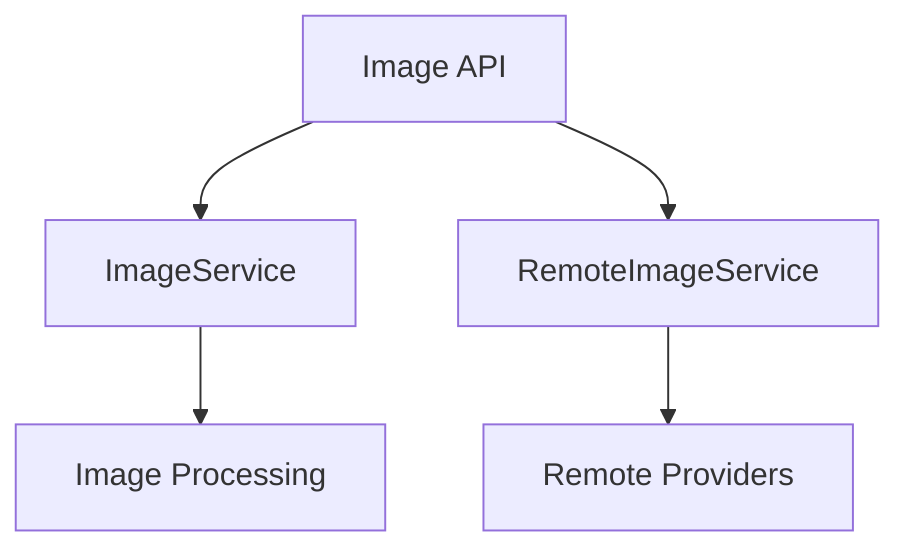

# Component: MediaBrowser.Api.Images

**Path:** `MediaBrowser.Api/Images/`
**Type:** Directory | Sub-Module
**Language:** C#
**Maps to:** `.discovery/346-mediabrowser-api-images.md`

## Description

Image API services. Handles image requests, serving, remote image fetching, and image manipulation.

## Directory Structure

```
MediaBrowser.Api/Images/
├── ImageByNameService.cs
├── ImageRequest.cs
├── ImageService.cs
└── RemoteImageService.cs
```

## Files

| File | Description |
|------|-------------|
| `ImageService.cs` | Main image serving service |
| `ImageByNameService.cs` | Named image retrieval |
| `ImageRequest.cs` | Image request model |
| `RemoteImageService.cs` | Remote image fetching |

## Decomposition

### ImageService.cs

#### Classes
`ImageService` (public class : IService)

#### Key Methods
| Method | Return | Description |
|--------|--------|-------------|
| `Get(GetImageRequest)` | `Task<object>` | Get image |
| `Delete(DeleteImageRequest)` | `Task` | Delete image |
| `Post(UploadImageRequest)` | `Task` | Upload image |

### RemoteImageService.cs

#### Classes
`RemoteImageService` (public class : IService)

#### Key Methods
| Method | Return | Description |
|--------|--------|-------------|
| `GetIndex(RemoteImageQuery)` | `Task<QueryResult<RemoteImageInfo>>` | List remote images |
| `Download(RemoteImageDownloadRequest)` | `Task` | Download remote image |

## Architecture



## Dependencies

- MediaBrowser.Controller.Drawing — Image interfaces
- MediaBrowser.Model.Drawing — Image models
- Emby.Drawing — Image processing

## Statistics

| Metric | Value |
|--------|-------|
| C# Files | 4 |
| LOC | ~55,000 |
| Public Classes | 4 |
