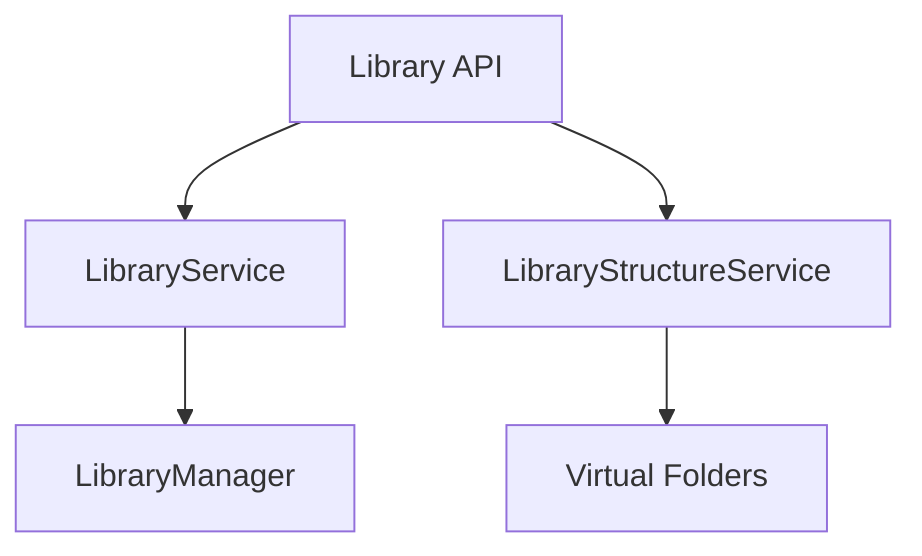

# Component: MediaBrowser.Api.Library

**Path:** `MediaBrowser.Api/Library/`
**Type:** Directory | Sub-Module
**Language:** C#
**Maps to:** `.discovery/347-mediabrowser-api-library.md`

## Description

Library management API services. Handles library structure, media folders, and library refresh operations.

## Directory Structure

```
MediaBrowser.Api/Library/
├── LibraryService.cs
└── LibraryStructureService.cs
```

## Files

| File | Description |
|------|-------------|
| `LibraryService.cs` | Main library management |
| `LibraryStructureService.cs` | Library structure operations |

## Decomposition

### LibraryService.cs

#### Classes
`LibraryService` (public class : IService)

#### Key Methods
| Method | Return | Description |
|--------|--------|-------------|
| `GetLibraryPhysicalFolders()` | `Task<IEnumerable<FileSystemEntry>>` | Get physical folders |
| `RefreshLibrary(Guid[])` | `Task` | Refresh library |
| `GetInstalledPlugins()` | `Task<PluginInfo[]>` | Get installed plugins |

### LibraryStructureService.cs

#### Classes
`LibraryStructureService` (public class : IService)

#### Key Methods
| Method | Return | Description |
|--------|--------|-------------|
| `GetVirtualFolders()` | `Task<IEnumerable<VirtualFolderInfo>>` | Get virtual folders |
| `AddVirtualFolder(string, string, bool)` | `Task` | Add virtual folder |
| `RemoveVirtualFolder(string, bool)` | `Task` | Remove virtual folder |

## Architecture



## Dependencies

- MediaBrowser.Controller.Library — Library interfaces
- MediaBrowser.Controller.Entities — Entity types

## Statistics

| Metric | Value |
|--------|-------|
| C# Files | 2 |
| LOC | ~60,000 |
| Public Classes | 2 |
