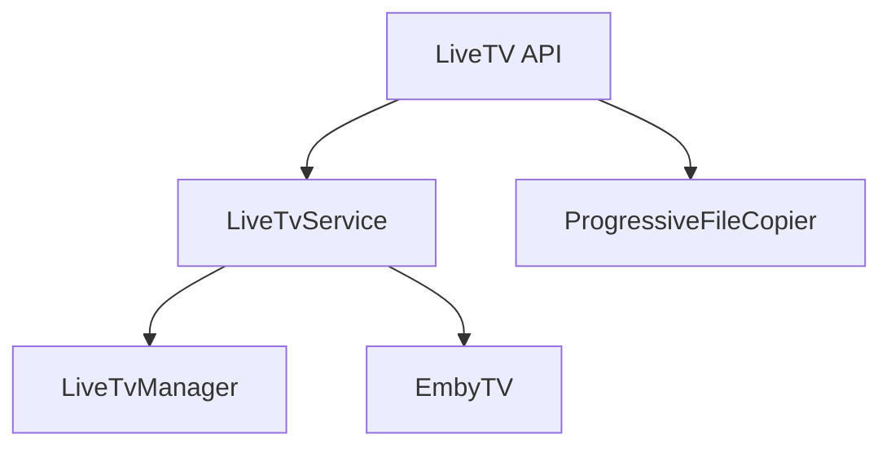

# Component: MediaBrowser.Api.LiveTv

**Path:** `MediaBrowser.Api/LiveTv/`
**Type:** Directory | Sub-Module
**Language:** C#
**Maps to:** `.discovery/348-mediabrowser-api-livetv.md`

## Description

Live TV API services. Handles live TV guide, channels, recordings, and tuner management.

## Directory Structure

```
MediaBrowser.Api/LiveTv/
├── LiveTvService.cs
└── ProgressiveFileCopier.cs
```

## Files

| File | Description |
|------|-------------|
| `LiveTvService.cs` | Main LiveTV API service |
| `ProgressiveFileCopier.cs` | Progressive file streaming |

## Decomposition

### LiveTvService.cs

#### Classes
`LiveTvService` (public class : IService)

#### Key Methods
| Method | Return | Description |
|--------|--------|-------------|
| `GetChannels(ChannelQuery)` | `Task<QueryResult<BaseItemDto>>` | Get channels |
| `GetPrograms(ProgramQuery)` | `Task<QueryResult<BaseItemDto>>` | Get programs |
| `GetRecordings(RecordingQuery)` | `Task<QueryResult<RecordingDto>>` | Get recordings |
| `GetTimers()` | `Task<TimerInfo[]>` | Get scheduled timers |
| `GetGuideInfo()` | `Task<GuideInfo>` | Get guide info |

### ProgressiveFileCopier.cs

#### Classes
`ProgressiveFileCopier` (public class)

#### Key Methods
| Method | Return | Description |
|--------|--------|-------------|
| `CopyTo(Stream)` | `Task` | Progressive copy |

## Architecture



## Dependencies

- MediaBrowser.Controller.LiveTv — LiveTV interfaces
- MediaBrowser.Model.LiveTv — LiveTV models

## Statistics

| Metric | Value |
|--------|-------|
| C# Files | 2 |
| LOC | ~63,000 |
| Public Classes | 2 |
