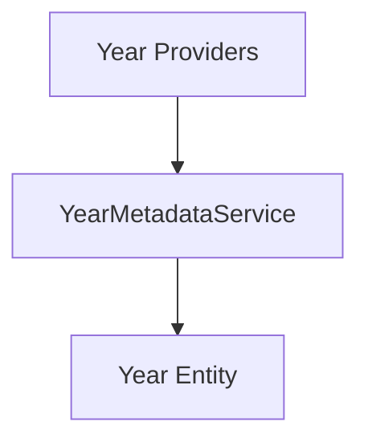

# Component: MediaBrowser.Providers.Years

**Path:** `MediaBrowser.Providers/Years/`
**Type:** Directory | Sub-Module
**Language:** C#
**Maps to:** `.discovery/348-mediabrowser-providers-years.md`

## Description

Year metadata services. Handles metadata for year (decade/century) virtual folders.

## Directory Structure

```
MediaBrowser.Providers/Years/
└── YearMetadataService.cs
```

## Files

| File | Description |
|------|-------------|
| `YearMetadataService.cs` | Year metadata service |

## Decomposition

### YearMetadataService.cs

#### Classes
`YearMetadataService` (public class : IMetadataService)

#### Key Methods
| Method | Return | Description |
|--------|--------|-------------|
| `Fetch(MetadataSearchOptions, CancellationToken)` | `Task<bool>` | Fetch year metadata |
| `Save(BaseItem, CancellationToken)` | `Task` | Save year metadata |

## Architecture



## Dependencies

- MediaBrowser.Controller.Entities — Entity types
- MediaBrowser.Controller.Providers — Provider interfaces

## Statistics

| Metric | Value |
|--------|-------|
| C# Files | 1 |
| LOC | ~1,100 |
| Public Classes | 1 |
