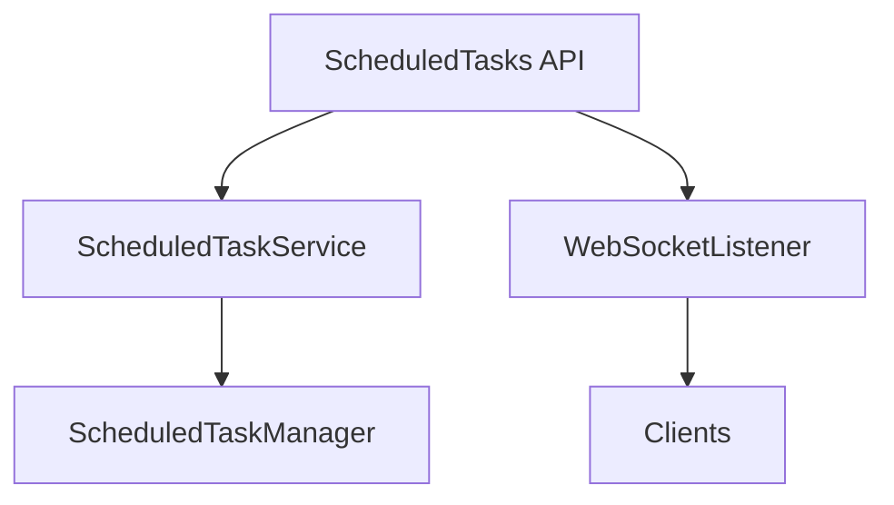

# Component: MediaBrowser.Api.ScheduledTasks

**Path:** `MediaBrowser.Api/ScheduledTasks/`
**Type:** Directory | Sub-Module
**Language:** C#
**Maps to:** `.discovery/349-mediabrowser-api-scheduledtasks.md`

## Description

Scheduled tasks API services. Handles management of background tasks, triggers, and task execution.

## Directory Structure

```
MediaBrowser.Api/ScheduledTasks/
├── ScheduledTaskService.cs
└── ScheduledTasksWebSocketListener.cs
```

## Files

| File | Description |
|------|-------------|
| `ScheduledTaskService.cs` | Task management service |
| `ScheduledTasksWebSocketListener.cs` | WebSocket updates |

## Decomposition

### ScheduledTaskService.cs

#### Classes
`ScheduledTaskService` (public class : IService)

#### Key Methods
| Method | Return | Description |
|--------|--------|-------------|
| `GetTasks()` | `Task<TaskInfo[]>` | Get all tasks |
| `GetTask(string)` | `Task<TaskInfo>` | Get specific task |
| `StartTask(string)` | `Task` | Start task |
| `StopTask(string)` | `Task` | Stop task |

### ScheduledTasksWebSocketListener.cs

#### Classes
`ScheduledTasksWebSocketListener` (public class : IWebSocketListener)

#### Key Methods
| Method | Return | Description |
|--------|--------|-------------|
| `OnMessageReceived(string)` | `Task` | Handle task updates |

## Architecture



## Dependencies

- MediaBrowser.Controller.Net — Network interfaces
- MediaBrowser.Model.Net — Network models

## Statistics

| Metric | Value |
|--------|-------|
| C# Files | 2 |
| LOC | ~12,000 |
| Public Classes | 2 |
