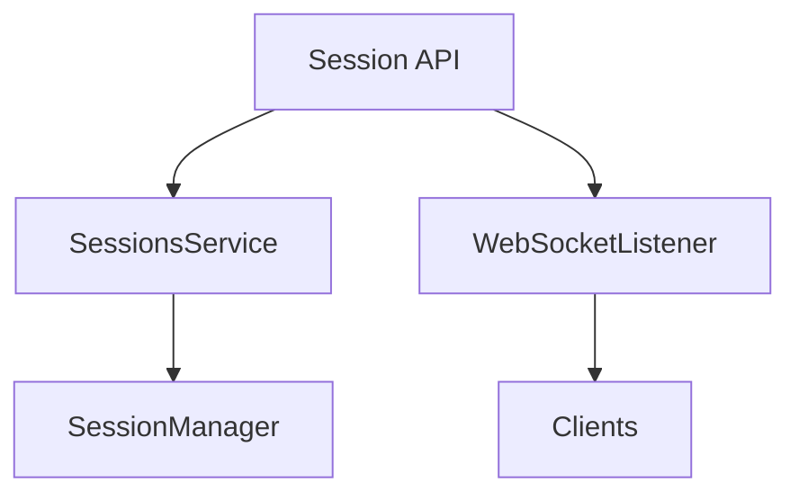

# Component: MediaBrowser.Api.Session

**Path:** `MediaBrowser.Api/Session/`
**Type:** Directory | Sub-Module
**Language:** C#
**Maps to:** `.discovery/351-mediabrowser-api-session.md`

## Description

Session management API services. Handles client sessions, authentication, and session-related events.

## Directory Structure

```
MediaBrowser.Api/Session/
├── SessionInfoWebSocketListener.cs
└── SessionsService.cs
```

## Files

| File | Description |
|------|-------------|
| `SessionsService.cs` | Session management service |
| `SessionInfoWebSocketListener.cs` | Session WebSocket updates |

## Decomposition

### SessionsService.cs

#### Classes
`SessionsService` (public class : IService)

#### Key Methods
| Method | Return | Description |
|--------|--------|-------------|
| `GetSessions(SessionQuery)` | `Task<SessionInfo[]>` | Get active sessions |
| `GetCurrentSession()` | `Task<SessionInfo>` | Get current session |
| `Logout()` | `Task` | End session |

### SessionInfoWebSocketListener.cs

#### Classes
`SessionInfoWebSocketListener` (public class : IWebSocketListener)

#### Key Methods
| Method | Return | Description |
|--------|--------|-------------|
| `OnMessageReceived(string)` | `Task` | Handle session updates |

## Architecture



## Dependencies

- MediaBrowser.Controller.Session — Session interfaces
- MediaBrowser.Model.Session — Session models

## Statistics

| Metric | Value |
|--------|-------|
| C# Files | 2 |
| LOC | ~25,000 |
| Public Classes | 2 |
