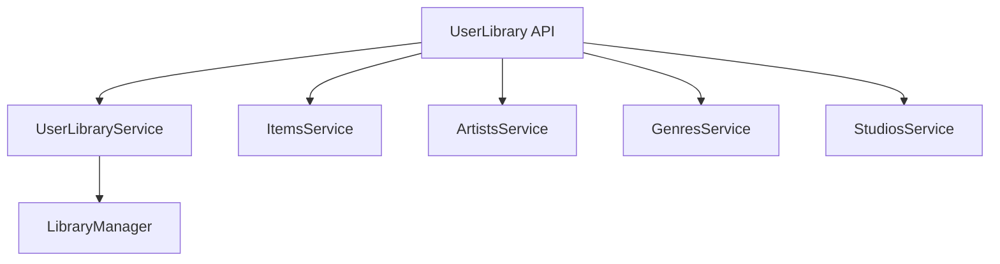

# Component: MediaBrowser.Api.UserLibrary

**Path:** `MediaBrowser.Api/UserLibrary/`
**Type:** Directory | Sub-Module
**Language:** C#
**Maps to:** `.discovery/354-mediabrowser-api-userlibrary.md`

## Description

User library API services. Handles item queries, artists, genres, studios, and user-specific library views.

## Directory Structure

```
MediaBrowser.Api/UserLibrary/
├── ArtistsService.cs
├── BaseItemsByNameService.cs
├── BaseItemsRequest.cs
├── GameGenresService.cs
├── GenresService.cs
├── ItemsService.cs
├── MusicGenresService.cs
├── PersonsService.cs
├── StudiosService.cs
├── UserLibraryService.cs
├── UserViewsService.cs
└── YearsService.cs
```

## Files

| File | Description |
|------|-------------|
| `UserLibraryService.cs` | Main user library service |
| `ItemsService.cs` | Item query service |
| `ArtistsService.cs` | Artists service |
| `GenresService.cs` | Genres service |
| `StudiosService.cs` | Studios service |
| `UserViewsService.cs` | User views service |
| `BaseItemsByNameService.cs` | Base items by name |
| `BaseItemsRequest.cs` | Request model |

## Decomposition

### UserLibraryService.cs

#### Classes
`UserLibraryService` (public class : IService)

#### Key Methods
| Method | Return | Description |
|--------|--------|-------------|
| `GetItem(BaseItemRequest)` | `Task<BaseItemDto>` | Get single item |
| `GetItems(GetItemsRequest)` | `Task<QueryResult<BaseItemDto>>` | Get items query |
| `DeleteItem(BaseItemRequest)` | `Task` | Delete item |

### ArtistsService.cs

#### Classes
`ArtistsService` (public class : IService)

#### Key Methods
| Method | Return | Description |
|--------|--------|-------------|
| `GetArtists(ArtistRequest)` | `Task<QueryResult<BaseItemDto>>` | Get artists |
| `GetArtistImages(BaseItemRequest)` | `Task<IEnumerable<ImageDownloadInfo>>` | Get artist images |

## Architecture



## Dependencies

- MediaBrowser.Controller.Library — Library interfaces
- MediaBrowser.Controller.Entities — Entity types

## Statistics

| Metric | Value |
|--------|-------|
| C# Files | 12 |
| LOC | ~130,000 |
| Public Classes | 10+ |
