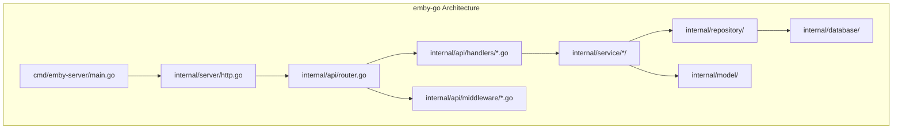

# Component: emby-go

**Path:** `emby-go/`
**Type:** Directory | Module
**Language:** Go
**Maps to:** Migration target from C# to Go

## Overview

emby-go is the Go (Golang) implementation of Emby Server functionality, migrated from the original C# codebase. This module provides HTTP API server, services, and data management in Go.

## Architecture



## Go Module Structure

```
emby-go/
├── cmd/emby-server/          # Entry point
│   └── main.go               # Server initialization
├── internal/
│   ├── api/                  # API layer
│   │   ├── router.go        # Route registration (chi/v5)
│   │   ├── handlers/         # 28 HTTP handlers
│   │   │   ├── activity.go, branding.go, channel.go
│   │   │   ├── config.go, displayprefs.go, environment.go
│   │   │   ├── filter.go, games.go, image.go
│   │   │   ├── library.go, localization.go, livetv.go
│   │   │   ├── media.go, movies.go, notification.go
│   │   │   ├── package.go, playback.go, playlist.go
│   │   │   ├── scheduledtask.go, search.go
│   │   │   ├── session.go, startup.go, system.go
│   │   │   ├── transcoding.go, tvshows.go, user.go
│   │   └── middleware/       # Auth, CORS middleware
│   ├── config/               # Configuration management
│   ├── database/             # SQLite connection
│   ├── logging/              # Zap logger setup
│   ├── model/                # Data models (User, Item, Session, etc.)
│   ├── plugin/               # Plugin system
│   ├── repository/           # Data access layer
│   ├── server/               # HTTP server with chi
│   │   └── ws/              # WebSocket support
│   └── service/              # Business logic
│       ├── auth/             # Authentication
│       ├── device/           # Device management
│       ├── image/            # Image processing
│       ├── library/          # Library scanning
│       ├── media/            # Media playback
│       ├── metadata/          # Metadata management
│       ├── notification/      # Notifications
│       ├── scheduled/         # Scheduled tasks
│       ├── session/          # Session management
│       ├── transcoding/       # Transcoding
│       └── user/             # User management
├── configs/                  # Config files
├── docs/                     # Documentation
├── migrations/                # DB migrations
└── packaging/                 # Build scripts
```

## Key Components

### HTTP Server (internal/server/http.go)
```go
type HTTPServer struct {
    config *config.Config
    logger *zap.Logger
    router *chi.Mux
    server *http.Server
}

func NewHTTPServer(cfg *config.Config, logger *zap.Logger) *HTTPServer
func (s *HTTPServer) Router() *chi.Mux
func (s *HTTPServer) Start() error
func (s *HTTPServer) Shutdown(ctx context.Context) error
```

### API Router (internal/api/router.go)
```go
type Router struct {
    config      *config.Config
    logger      *zap.Logger
    dbManager   *database.Manager
    userSvc     *user.Manager
    librarySvc  *library.Manager
    mediaSvc    *media.Manager
    sessionSvc  *session.Manager
    deviceSvc   *device.Manager
    imageSvc    *image.Manager
    notificationSvc *notification.Manager
    scheduledSvc    *scheduled.Manager
    transcodingSvc   *transcoding.Manager
}

func NewRouter(cfg *config.Config, logger *zap.Logger, dbManager *database.Manager) *Router
func (r *Router) RegisterRoutes(router *chi.Mux)
```

### Main Entry (cmd/emby-server/main.go)
```go
func main() {
    // Load configuration
    cfg, err := config.LoadConfig("")
    
    // Initialize logger
    logger, _ := logging.NewLogger(cfg.Logging.Level, cfg.Logging.Format)
    
    // Initialize database
    dbManager, _ := database.NewManager(&cfg.Database)
    
    // Initialize HTTP server with chi router
    httpServer := server.NewHTTPServer(cfg, logger)
    
    // Add middleware
    httpServer.Router().Use(cmid.RequestID)
    httpServer.Router().Use(cmid.Recoverer)
    httpServer.Router().Use(middleware.CORSMiddleware())
    
    // Register API routes on HTTP server's router
    apiRouter := api.NewRouter(cfg, logger, dbManager)
    apiRouter.RegisterRoutes(httpServer.Router())
    
    // Start server
    httpServer.Start()
}
```

## Dependencies

```go
module github.com/emby/emby-go

go 1.22.0

require (
    github.com/disintegration/imaging v1.6.2
    github.com/go-chi/chi/v5 v5.2.5
    github.com/gorilla/websocket v1.5.3
    go.uber.org/zap v1.28.0
    gopkg.in/yaml.v3 v3.0.1
    modernc.org/sqlite v1.34.0
)
```

## Statistics

| Metric | Count |
|--------|-------|
| Total Go Files | ~95 |
| API Handlers | 28 |
| Services | 11 |
| Models | 5+ |
| Routes | ~100+ |

## Status

- **HTTP Server**: Complete (chi/v5)
- **API Router**: Complete (routes register on HTTP server)
- **Services**: Partial (core services implemented)
- **Database**: Complete (SQLite with migrations)
- **DLNA/UPnP**: REMOVED (per architecture decision)
- **WebSocket**: Partial (stub implementation)

## Mapped C# Components

| C# Module | Go Equivalent | Status |
|-----------|--------------|--------|
| SocketHttpListener | internal/server/ | ✓ |
| MediaBrowser.Api | internal/api/ | ✓ |
| Emby.Server.Implementations | internal/service/ | Partial |
| MediaBrowser.Providers | internal/service/metadata/ | Partial |
| Emby.Dlna | N/A | REMOVED |
| Mono.Nat | N/A | Not Started |
| RSSDP | N/A | Not Started |
