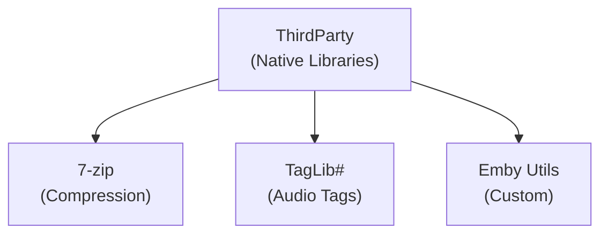

# ThirdParty - Embedded Libraries

**Module:** ThirdParty
**Language:** C/C++, Various
**Maps to:** `.discovery/371-thirdparty-internals.md`

## Decomposition

### 7zip/ (Compression Library)

#### Description
Embedded 7-zip library for handling compressed archives (ZIP, 7z, RAR).

#### Key Files
- 7zDec.* - 7-zip decoder
- Types.h - Type definitions
- Compiler.h - Compiler compatibility

#### Key Classes/Functions
```cpp
class CMyComObject : public IUnknown
class CInFileStream : public IInStream
class COutFileStream : public IOutStream
```

### emby/ (Emby Utilities)

#### Description
Emby-specific utilities compiled as native libraries.

#### Key Files
- [Emby-specific native code]

### taglib/ (Audio Metadata)

#### Description
TagLib# library for reading/writing audio metadata (ID3, Vorbis, FLAC, etc.)

#### Key Classes
```csharp
class TagLib.File
class TagLib.AudioFile
class TagLib.Tag
class TagLib.Id3v2.Tag
class TagLib.Ogg.XiphComment
```

#### Key Methods
```csharp
File GetFile(string path)
Tag GetTag(string path, ReadStyle style)
void Save()
```

## Architecture



## File Listing

```
ThirdParty/
├── 7zip/
│   ├── 7zAlloc.h
│   ├── 7zAlloc.c
│   ├── 7zArcIn.h
│   ├── 7zArcIn.c
│   ├── 7zBuf.h
│   ├── 7zBuf.c
│   ├── 7zCrc.h
│   ├── 7zCrc.c
│   ├── 7zDec.h
│   ├── 7zDec.c
│   ├── 7zFile.h
│   ├── 7zFile.c
│   ├── 7zStream.h
│   ├── 7zVersion.h
│   ├── Alloc.h
│   ├── BranchCrc.h
│   ├── Compiler.h
│   ├──CpuArch.h
│   ├── Delta.h
│   ├── Delta.c
│   ├── LzFind.h
│   ├── LzFind.c
│   ├── LzHash.h
│   ├── LzIn.h
│   ├── LzIn.c
│   ├── LzmaDec.h
│   ├── LzmaDec.c
│   ├── LzmaEnc.h
│   ├── LzmaEnc.c
│   ├── LzmaLib.h
│   ├── LzmaLib.c
│   ├── Precomp.h
│   ├── Threads.h
│   └── Types.h
│
├── emby/
│   └── [Native Emby utilities]
│
└── taglib/
    ├── [TagLib# bindings]
    └── [Native taglib]
```

## Description

ThirdParty contains embedded native/C libraries used by Emby:
- **7zip**: LZMA compression/decompression for archive handling
- **TagLib#**: Audio metadata reading/writing
- **Emby**: Custom native utilities

## Dependencies

- **Native interop** - P/Invoke bindings

## Statistics

- **7zip files:** ~35
- **TagLib files:** ~20
- **Total:** ~60 files
