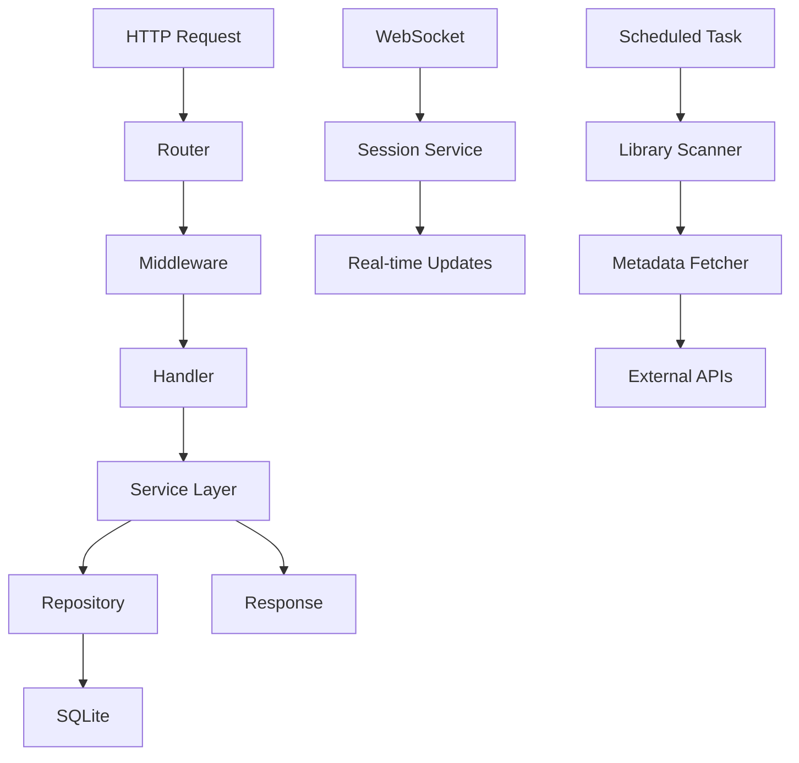

# Component: emby-go

**Path:** `emby-go/`
**Type:** Directory | Module
**Language:** Go
**Maps to:** `.discovery/500-emby-go.md`

## Description

emby-go is a Go rewrite of the Emby Server in progress. It reimplements core server functionality using Go's standard library and modern patterns. The module includes an HTTP API server, WebSocket support, service layer, database layer, plugin system, and DLNA server.

## Structure

```
emby-go/
├── cmd/emby-server/
│   └── main.go                  # Go server entry point → [function] main
├── internal/
│   ├── api/
│   │   ├── router.go            # HTTP route definitions
│   │   ├── handlers/            # API endpoint handlers
│   │   │   ├── activity.go      # Activity log handlers
│   │   │   ├── branding.go      # Branding handlers
│   │   │   ├── channel.go       # Channel handlers
│   │   │   ├── configuration.go # Config handlers
│   │   │   ├── device.go        # Device handlers
│   │   │   ├── environment.go   # Environment handlers
│   │   │   ├── filter.go        # Filter handlers
│   │   │   ├── games.go         # Games handlers
│   │   │   ├── image.go         # Image handlers
│   │   │   ├── item.go          # Item handlers
│   │   │   ├── library.go       # Library handlers
│   │   │   ├── live_tv.go       # Live TV handlers
│   │   │   ├── localization.go  # Localization handlers
│   │   │   ├── movies.go        # Movie handlers
│   │   │   ├── music.go         # Music handlers
│   │   │   ├── news.go          # News handlers
│   │   │   ├── package.go       # Package handlers
│   │   │   ├── people.go        # People handlers
│   │   │   ├── playlist.go      # Playlist handlers
│   │   │   ├── plugin.go        # Plugin handlers
│   │   │   ├── search.go        # Search handlers
│   │   │   ├── session.go        # Session handlers
│   │   │   ├── startup.go        # Startup wizard handlers
│   │   │   ├── system.go        # System handlers
│   │   │   ├── user.go          # User handlers
│   │   │   └── ...
│   │   └── middleware/          # HTTP middleware
│   │       └── auth.go          # Authentication middleware
│   ├── config/
│   │   └── config.go            # Configuration management
│   ├── database/
│   │   └── database.go          # Database connection
│   ├── dlna/
│   │   ├── server.go            # DLNA server
│   │   └── xml/                 # DLNA XML templates
│   ├── licensing/
│   │   └── licensing.go         # License validation
│   ├── logging/
│   │   └── logging.go           # Structured logging
│   ├── model/
│   │   ├── item.go              # Media item models
│   │   ├── user.go              # User models
│   │   ├── session.go           # Session models
│   │   ├── stream.go            # Stream models
│   │   └── model_test.go        # Model tests
│   ├── plugin/
│   │   └── manager.go           # Plugin manager
│   ├── provider/
│   │   ├── images/              # Image providers
│   │   └── metadata/            # Metadata providers
│   ├── repository/
│   │   └── ...                  # Data access layer
│   ├── server/
│   │   ├── http.go              # HTTP server setup
│   │   └── ws/
│   │       └── websocket.go     # WebSocket handler
│   └── service/
│       ├── auth/
│       │   └── auth.go          # Authentication service
│       ├── device/
│       │   └── device.go        # Device service
│       ├── image/
│       │   ├── image.go         # Image service
│       │   └── processor.go     # Image processor
│       ├── library/
│       │   ├── library.go       # Library service
│       │   ├── scanner.go       # Library scanner
│       │   ├── notifier.go      # Library notifier
│       │   └── media/           # Media files
│       ├── media/
│       │   ├── media.go         # Media service
│       │   └── stream_manager.go # Stream management
│       ├── metadata/
│       │   ├── metadata.go      # Metadata service
│       │   ├── fetcher.go       # Metadata fetcher
│       │   └── limiter.go       # Rate limiter
│       ├── notification/
│       │   └── manager.go       # Notification manager
│       ├── scheduled/
│       │   └── tasks.go         # Scheduled tasks
│       ├── session/
│       │   ├── session.go       # Session service
│       │   └── websocket.go     # WebSocket session
│       ├── transcoding/
│       │   └── transcoding.go   # Transcoding service
│       └── user/
│           ├── user.go          # User service
│           └── user_test.go     # User tests
├── internal/util/
│   ├── fs/                      # Filesystem utilities
│   ├── hash/                    # Hash utilities
│   └── mime/                    # MIME type utilities
├── migrations/
│   └── sqlite/                  # Database migrations
├── packaging/
│   └── upgrade.sh               # Upgrade script
├── configs/                     # Configuration files
├── docs/                        # Documentation
├── tests/
│   ├── e2e/                     # End-to-end tests
│   ├── integration/             # Integration tests
│   └── performance/             # Performance tests
├── go.mod                       # Go module definition
├── go.sum                       # Go module checksums
└── Makefile                     # Build automation
```

## Key Components

| Component | Path | Purpose |
|-----------|------|---------|
| `main` | `cmd/emby-server/main.go` | Server entry point |
| `Router` | `internal/api/router.go` | HTTP route definitions |
| `AuthService` | `internal/service/auth/` | Authentication |
| `UserService` | `internal/service/user/` | User management |
| `LibraryService` | `internal/service/library/` | Media library |
| `SessionService` | `internal/service/session/` | Session management |
| `ImageProcessor` | `internal/service/image/` | Image processing |
| `DLNAServer` | `internal/dlna/` | DLNA server |
| `PluginManager` | `internal/plugin/` | Plugin system |

## Data Flow



## Dependencies

- Go 1.22+
- SQLite (mattn/go-sqlite3)
- Standard library: net/http, database/sql

## Side Effects

- Starts HTTP server
- Creates SQLite database
- Writes log files
- Opens network ports

## Reference

- Go module: `github.com/marklapointe/emby-go`
