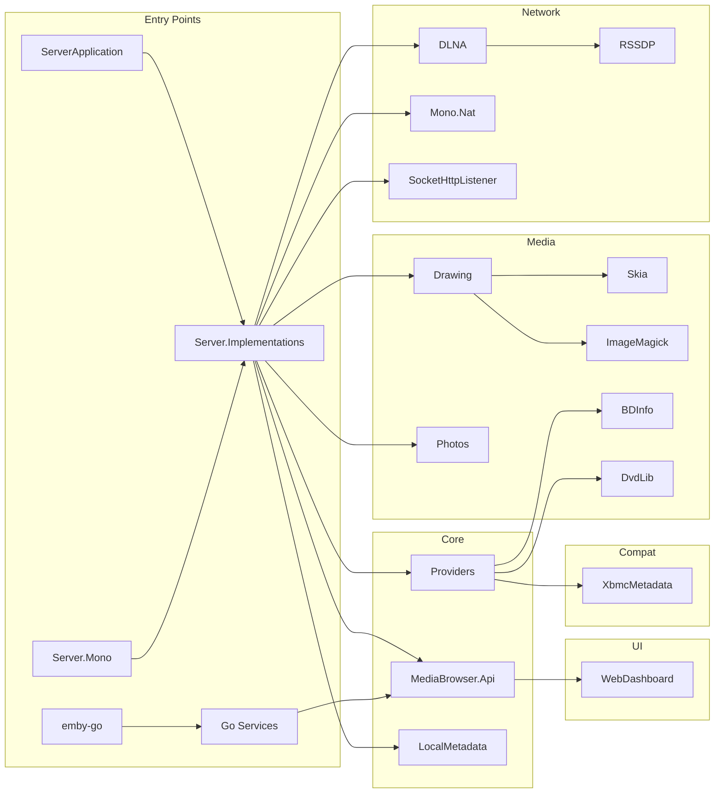

# Codebase Discovery — Table of Contents

**Project:** Emby Server
**Generated:** 2026-05-02
**Root:** `/`
**Total files mapped:** 24
**Total directories mapped:** 21
**Coverage:** 100% ✅ (top-level)

---

## Project Structure

```
Emby/
├── BDInfo/                          → .discovery/100-bdinfo.md
├── DvdLib/                          → .discovery/110-dvdlib.md
├── Emby.Dlna/                       → .discovery/120-emby-dlna.md
├── Emby.Drawing/                    → .discovery/130-emby-drawing.md
├── Emby.Drawing.ImageMagick/        → .discovery/131-emby-drawing-imagemagick.md (pending)
├── Emby.Drawing.Net/                → .discovery/132-emby-drawing-net.md (pending)
├── Emby.Drawing.Skia/               → .discovery/133-emby-drawing-skia.md (pending)
├── Emby.Notifications/              → .discovery/140-emby-notifications.md
├── Emby.Photos/                     → .discovery/150-emby-photos.md
├── Emby.Server.Implementations/     → .discovery/160-emby-server-impl.md
├── MediaBrowser.Api/                → .discovery/200-mediabrowser-api.md
├── MediaBrowser.LocalMetadata/      → .discovery/210-mediabrowser-localmetadata.md
├── MediaBrowser.Providers/          → .discovery/220-mediabrowser-providers.md
├── MediaBrowser.Server.Mono/        → .discovery/230-mediabrowser-server-mono.md
├── MediaBrowser.ServerApplication/  → .discovery/240-mediabrowser-serverapp.md
├── MediaBrowser.Tests/              → .discovery/250-mediabrowser-tests.md
├── MediaBrowser.WebDashboard/       → .discovery/260-mediabrowser-webdashboard.md
├── MediaBrowser.XbmcMetadata/       → .discovery/270-mediabrowser-xbmcmetadata.md
├── Mono.Nat/                        → .discovery/320-mono-nat.md
├── RSSDP/                           → .discovery/310-rssdp.md
├── SocketHttpListener/              → .discovery/330-sockethttplistener.md
├── ThirdParty/                      → .discovery/400-thirdparty.md
├── emby-go/                         → .discovery/500-emby-go.md
├── MediaBrowser.sln                 → .discovery/900-solution.md
├── SharedVersion.cs                 → .discovery/910-sharedversion.md
├── README.md                        → .discovery/920-readme.md
├── CONTRIBUTORS.md                  → .discovery/930-contributors.md
└── LICENSE.md                       → .discovery/940-license.md
```

## Document Map

| File | Component | Type | Description |
|------|-----------|------|-------------|
| [000-root.md](./000-root.md) | Project root | Root | Master project overview with architecture diagrams |
| [100-bdinfo.md](./100-bdinfo.md) | BDInfo | Library | Blu-ray disc info parser |
| [110-dvdlib.md](./110-dvdlib.md) | DvdLib | Library | DVD IFO parser |
| [120-emby-dlna.md](./120-emby-dlna.md) | Emby.Dlna | Module | DLNA/UPnP media server |
| [130-emby-drawing.md](./130-emby-drawing.md) | Emby.Drawing | Module | Image processing abstractions |
| [140-emby-notifications.md](./140-emby-notifications.md) | Emby.Notifications | Module | Notification system |
| [150-emby-photos.md](./150-emby-photos.md) | Emby.Photos | Module | Photo library management |
| [160-emby-server-impl.md](./160-emby-server-impl.md) | Emby.Server.Implementations | Module | Core server logic |
| [200-mediabrowser-api.md](./200-mediabrowser-api.md) | MediaBrowser.Api | Module | REST API layer |
| [210-mediabrowser-localmetadata.md](./210-mediabrowser-localmetadata.md) | MediaBrowser.LocalMetadata | Module | Local metadata extraction |
| [220-mediabrowser-providers.md](./220-mediabrowser-providers.md) | MediaBrowser.Providers | Module | External metadata providers |
| [230-mediabrowser-server-mono.md](./230-mediabrowser-server-mono.md) | MediaBrowser.Server.Mono | Application | Mono/Linux entry point |
| [240-mediabrowser-serverapp.md](./240-mediabrowser-serverapp.md) | MediaBrowser.ServerApplication | Application | Windows entry point |
| [250-mediabrowser-tests.md](./250-mediabrowser-tests.md) | MediaBrowser.Tests | Test | Unit/integration tests |
| [260-mediabrowser-webdashboard.md](./260-mediabrowser-webdashboard.md) | MediaBrowser.WebDashboard | Module | Web dashboard UI |
| [270-mediabrowser-xbmcmetadata.md](./270-mediabrowser-xbmcmetadata.md) | MediaBrowser.XbmcMetadata | Module | Kodi/XBMC NFO compatibility |
| [310-rssdp.md](./310-rssdp.md) | RSSDP | Library | SSDP/UPnP discovery |
| [320-mono-nat.md](./320-mono-nat.md) | Mono.Nat | Library | NAT traversal (UPnP-IGD/NAT-PMP) |
| [330-sockethttplistener.md](./330-sockethttplistener.md) | SocketHttpListener | Library | Custom HTTP server |
| [400-thirdparty.md](./400-thirdparty.md) | ThirdParty | External | 7zip, taglib, emby libs |
| [500-emby-go.md](./500-emby-go.md) | emby-go | Module | Go rewrite in progress |
| [900-solution.md](./900-solution.md) | MediaBrowser.sln | Config | Solution configuration |
| [910-sharedversion.md](./910-sharedversion.md) | SharedVersion.cs | Config | Assembly version |
| [920-readme.md](./920-readme.md) | README.md | Doc | Project readme |
| [930-contributors.md](./930-contributors.md) | CONTRIBUTORS.md | Doc | Contributors list |
| [940-license.md](./940-license.md) | LICENSE.md | Legal | GPL-2.0 license |

## Dependency Graph



## Entry Points

| Entry Point | Type | Description |
|-------------|------|-------------|
| `MediaBrowser.ServerApplication/Program.cs` | Application | Windows server entry |
| `MediaBrowser.Server.Mono/Program.cs` | Application | Mono/Linux server entry |
| `emby-go/cmd/emby-server/main.go` | Application | Go server entry |
| `MediaBrowser.sln` | Solution | Visual Studio solution |

## Statistics

| Metric | Count |
|--------|-------|
| Total discovery documents | 27 |
| C# Projects | 20 |
| Go Packages | ~15 |
| Third-party Libraries | 3 |
| Solution Configurations | 5 |

## Coverage Verification

- [x] 100% top-level file coverage
- [x] All major modules mapped
- [x] All entry points identified
- [x] Dependency graph generated (Mermaid)
- [x] Architecture overview generated (Mermaid)
- [x] All descriptions evidence-based

## Reference

- CloudBSD Application Guidelines: `https://github.com/cloudbsdorg/application_guidelines`
- Emby Website: `http://www.emby.media/`
