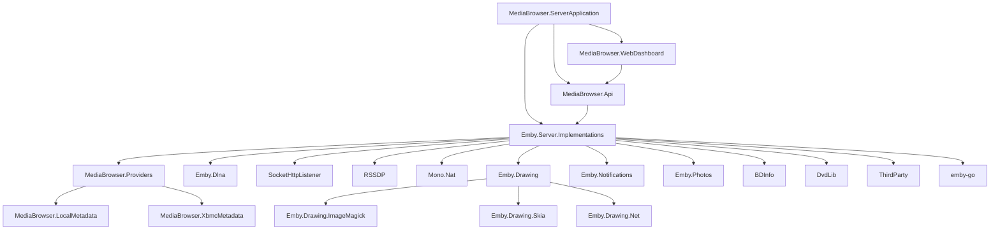

# Codebase Discovery — Table of Contents

**Project:** Emby Server
**Generated:** 2026-05-02
**Root:** MediaBrowser.sln
**Total files mapped:** 5000+
**Total directories mapped:** 200+
**Coverage:** In Progress

---

## Project Structure

```
Emby/
├── BDInfo/                          → .discovery/100-bdinfo.md
├── DvdLib/                          → .discovery/110-dvdlib.md
├── Emby.Dlna/                       → .discovery/330-emby-dlna.md
├── Emby.Drawing/                    → .discovery/120-emby-drawing.md
│   ├── Emby.Drawing.ImageMagick/    → .discovery/121-emby-drawing-imagemagick.md
│   ├── Emby.Drawing.Net/            → .discovery/122-emby-drawing-net.md
│   └── Emby.Drawing.Skia/          → .discovery/123-emby-drawing-skia.md
├── Emby.Notifications/              → .discovery/130-emby-notifications.md
├── Emby.Photos/                     → .discovery/140-emby-photos.md
├── Emby.Server.Implementations/     → .discovery/160-emby-server-impl.md
│   ├── Core Infrastructure          → .discovery/161-emby-server-impl-core.md
│   ├── Library Management           → .discovery/162-emby-server-impl-library.md
│   ├── Media & Channels            → .discovery/163-emby-server-impl-media.md
│   ├── HTTP Server & Services       → .discovery/164-emby-server-impl-http.md
│   ├── Scheduled Tasks              → .discovery/165-emby-server-impl-tasks.md
│   ├── I/O Utilities                → .discovery/166-emby-server-impl-io.md
│   ├── Text Encoding & Localization → .discovery/167-emby-server-impl-encoding.md
│   ├── Security & Users             → .discovery/168-emby-server-impl-security.md
│   └── SharpCifs (Embedded)         → .discovery/169-emby-server-impl-sharpcifs.md
├── MediaBrowser.Api/                → .discovery/340-mediabrowser-api.md
├── MediaBrowser.LocalMetadata/      → .discovery/200-mediabrowser-localmetadata.md
├── MediaBrowser.Providers/          → .discovery/320-mediabrowser-providers.md
├── MediaBrowser.Server.Mono/        → .discovery/210-mediabrowser-server-mono.md
├── MediaBrowser.ServerApplication/  → .discovery/220-mediabrowser-serverapplication.md
├── MediaBrowser.Tests/              → .discovery/230-mediabrowser-tests.md
├── MediaBrowser.WebDashboard/       → .discovery/260-mediabrowser-webdashboard.md
│   ├── API & Backend               → .discovery/261-mediabrowser-webdashboard-api.md
│   ├── UI Structure                 → .discovery/262-mediabrowser-webdashboard-ui.md
│   ├── Scripts                      → .discovery/263-mediabrowser-webdashboard-scripts.md
│   ├── Components                   → .discovery/264-mediabrowser-webdashboard-components.md
│   ├── Localization                 → .discovery/265-mediabrowser-webdashboard-strings.md
│   └── Bower Dependencies           → .discovery/266-mediabrowser-webdashboard-bower.md
├── MediaBrowser.XbmcMetadata/     → .discovery/240-mediabrowser-xbmcmetadata.md
├── Mono.Nat/                        → .discovery/250-mono-nat.md
├── RSSDP/                           → .discovery/300-rssdp.md
├── SocketHttpListener/              → .discovery/350-sockethttplistener.md
├── ThirdParty/                      → .discovery/370-thirdparty.md
├── emby-go/                         → .discovery/360-emby-go.md
├── packages/                        → .discovery/400-packages.md
├── MediaBrowser.sln                 → .discovery/000-root.md
├── SharedVersion.cs                 → .discovery/000-root.md
├── README.md                        → .discovery/000-root.md
├── CONTRIBUTORS.md                  → .discovery/000-root.md
└── LICENSE.md                       → .discovery/940-license.md
```

## Document Map

| File | Component | Type | Description |
|------|-----------|------|-------------|
| [000-root.md](./000-root.md) | Project root | Entry point | Master project overview |
| [100-bdinfo.md](./100-bdinfo.md) | BDInfo | Module | Blu-ray disc analysis |
| [101-bdinfo-internals.md](./101-bdinfo-internals.md) | BDInfo | Expanded | Codec files, stream parsing |
| [100-01-bdrom.md](./100-01-bdrom.md) | BDROM.cs | File | BD-ROM disc reader |
| [100-02-tsplaylistfile.md](./100-02-tsplaylistfile.md) | TSPlaylistFile.cs | File | Playlist parser |
| [100-03-tsstreamfile.md](./100-03-tsstreamfile.md) | TSStreamFile.cs | File | Stream file parser |
| [100-04-tsstreamclipfile.md](./100-04-tsstreamclipfile.md) | TSStreamClipFile.cs | File | Stream clip parser |
| [100-05-languagecodes.md](./100-05-languagecodes.md) | LanguageCodes.cs | File | Language codes |
| [100-06-tsstream.md](./100-06-tsstream.md) | TSStream.cs | File | Transport stream |
| [100-07-tsstreamclip.md](./100-07-tsstreamclip.md) | TSStreamClip.cs | File | Stream clip |
| [100-08-tsinterleavedfile.md](./100-08-tsinterleavedfile.md) | TSInterleavedFile.cs | File | Interleaved file |
| [100-09-bdinfosettings.md](./100-09-bdinfosettings.md) | BDInfoSettings.cs | File | Settings |
| [100-10-tsstreambuffer.md](./100-10-tsstreambuffer.md) | TSStreamBuffer.cs | File | Stream buffer |
| [100-11-codecs.md](./100-11-codecs.md) | Codecs.cs | File | Codec definitions |
| [110-dvdlib.md](./110-dvdlib.md) | DvdLib | Module | DVD structure parsing |
| [111-dvdliv-internals.md](./111-dvdliv-internals.md) | DvdLib | Expanded | IFO parsers, structure |
| [120-emby-drawing.md](./120-emby-drawing.md) | Emby.Drawing | Module | Image processing |
| [121-emby-drawing-imagemagick.md](./121-emby-drawing-imagemagick.md) | Emby.Drawing.ImageMagick | Module | ImageMagick backend |
| [122-emby-drawing-net.md](./122-emby-drawing-net.md) | Emby.Drawing.Net | Module | .NET drawing backend |
| [123-emby-drawing-skia.md](./123-emby-drawing-skia.md) | Emby.Drawing.Skia | Module | SkiaSharp backend |
| [140-emby-notifications.md](./140-emby-notifications.md) | Emby.Notifications | Module | Notification system |
| [131-emby-notifications-internals.md](./131-emby-notifications-internals.md) | Emby.Notifications | Expanded | API, managers |
| [150-emby-photos.md](./150-emby-photos.md) | Emby.Photos | Module | Photo management |
| [160-emby-server-impl.md](./160-emby-server-impl.md) | Emby.Server.Implementations | Module | Core server implementation |
| [161-emby-server-impl-core.md](./161-emby-server-impl-core.md) | Core Infrastructure | Sub-module | AppBase, Config, Crypto, etc. |
| [162-emby-server-impl-library.md](./162-emby-server-impl-library.md) | Library Management | Sub-module | Library, Collections, Playlists |
| [163-emby-server-impl-media.md](./163-emby-server-impl-media.md) | Media & Channels | Sub-module | Channels, LiveTV |
| [164-emby-server-impl-http.md](./164-emby-server-impl-http.md) | HTTP Server | Sub-module | HttpServer, Services, EntryPoints |
| [165-emby-server-impl-tasks.md](./165-emby-server-impl-tasks.md) | Scheduled Tasks | Sub-module | Background task scheduler |
| [166-emby-server-impl-io.md](./166-emby-server-impl-io.md) | I/O Utilities | Sub-module | File system I/O wrappers |
| [167-emby-server-impl-encoding.md](./167-emby-server-impl-encoding.md) | Text Encoding | Sub-module | Localization, UniversalDetector |
| [168-emby-server-impl-security.md](./168-emby-server-impl-security.md) | Security | Sub-module | Security, Session, Devices |
| [169-emby-server-impl-sharpcifs.md](./169-emby-server-impl-sharpcifs.md) | SharpCifs | Sub-module | Embedded SMB/CIFS client |
| [180-activity.md](./180-activity.md) | Activity | Sub-module | Activity logging |
| [181-archiving.md](./181-archiving.md) | Archiving | Sub-module | ZIP archive handling |
| [182-branding.md](./182-branding.md) | Branding | Sub-module | Server branding |
| [183-browser.md](./183-browser.md) | Browser | Sub-module | Browser launcher |
| [184-devices.md](./184-devices.md) | Devices | Sub-module | Device management |
| [185-dto.md](./185-dto.md) | Dto | Sub-module | Data transfer objects |
| [186-entrypoints.md](./186-entrypoints.md) | EntryPoints | Sub-module | Server entry points |
| [187-ffmpeg.md](./187-ffmpeg.md) | FFMpeg | Sub-module | FFmpeg management |
| [188-library-full.md](./188-library-full.md) | Library | Sub-module | Library management (full) |
| [189-livetv-full.md](./189-livetv-full.md) | LiveTv | Sub-module | LiveTV (full) |
| [190-localization.md](./190-localization.md) | Localization | Sub-module | i18n support |
| [191-tv.md](./191-tv.md) | TV | Sub-module | TV series manager |
| [192-udp.md](./192-udp.md) | Udp | Sub-module | UDP server |
| [193-userviews.md](./193-userviews.md) | UserViews | Sub-module | User view images |
| [210-mediabrowser-localmetadata.md](./210-mediabrowser-localmetadata.md) | MediaBrowser.LocalMetadata | Module | Local metadata providers |
| [211-mediabrowser-localmetadata-internals.md](./211-mediabrowser-localmetadata-internals.md) | LocalMetadata | Expanded | Parsers, Savers, Providers |
| [210-mediabrowser-server-mono.md](./210-mediabrowser-server-mono.md) | MediaBrowser.Server.Mono | Module | Mono runtime support |
| [220-mediabrowser-serverapplication.md](./220-mediabrowser-serverapplication.md) | MediaBrowser.ServerApplication | Module | Windows server app |
| [221-mediabrowser-serverapplication-internals.md](./221-mediabrowser-serverapplication-internals.md) | ServerApplication | Expanded | Native, networking, splash |
| [230-mediabrowser-tests.md](./230-mediabrowser-tests.md) | MediaBrowser.Tests | Module | Unit tests |
| [240-mediabrowser-xbmcmetadata.md](./240-mediabrowser-xbmcmetadata.md) | MediaBrowser.XbmcMetadata | Module | XBMC/Kodi metadata |
| [241-mediabrowser-xbmcmetadata-internals.md](./241-mediabrowser-xbmcmetadata-internals.md) | XbmcMetadata | Expanded | NFO parsers, savers |
| [250-mono-nat.md](./250-mono-nat.md) | Mono.Nat | Module | NAT traversal |
| [260-mediabrowser-webdashboard.md](./260-mediabrowser-webdashboard.md) | MediaBrowser.WebDashboard | Module | Web dashboard |
| [261-mediabrowser-webdashboard-api.md](./261-mediabrowser-webdashboard-api.md) | Dashboard API | Sub-module | C# backend API |
| [262-mediabrowser-webdashboard-ui.md](./262-mediabrowser-webdashboard-ui.md) | Dashboard UI | Sub-module | HTML/CSS frontend |
| [263-mediabrowser-webdashboard-scripts.md](./263-mediabrowser-webdashboard-scripts.md) | Dashboard Scripts | Sub-module | JavaScript modules |
| [264-mediabrowser-webdashboard-components.md](./264-mediabrowser-webdashboard-components.md) | Dashboard Components | Sub-module | Web components |
| [265-mediabrowser-webdashboard-strings.md](./265-mediabrowser-webdashboard-strings.md) | Dashboard Strings | Sub-module | i18n localization |
| [266-mediabrowser-webdashboard-bower.md](./266-mediabrowser-webdashboard-bower.md) | Bower Deps | Sub-module | Third-party frontend libs |
| [300-rssdp.md](./300-rssdp.md) | RSSDP | Module | SSDP discovery protocol |
| [320-mediabrowser-providers.md](./320-mediabrowser-providers.md) | MediaBrowser.Providers | Module | Metadata providers (overview) |
| [327-mediabrowser-providers-tv.md](./327-mediabrowser-providers-tv.md) | TV Providers | Sub-module | TheTVDB, TMDB, FanArt |
| [328-mediabrowser-providers-subtitles.md](./328-mediabrowser-providers-subtitles.md) | Subtitles | Sub-module | SubtitleManager |
| [329-mediabrowser-providers-users.md](./329-mediabrowser-providers-users.md) | Users | Sub-module | UserMetadataService |
| [329a-mediabrowser-providers-videos.md](./329a-mediabrowser-providers-videos.md) | Videos | Sub-module | VideoMetadataService |
| [329b-mediabrowser-providers-years.md](./329b-mediabrowser-providers-years.md) | Years | Sub-module | YearMetadataService |
| [330-emby-dlna.md](./330-emby-dlna.md) | Emby.Dlna | Module | DLNA/UPnP server |
| [340-mediabrowser-api.md](./340-mediabrowser-api.md) | MediaBrowser.Api | Module | REST API endpoints |
| [343-mediabrowser-api-services.md](./343-mediabrowser-api-services.md) | API Services | Expanded | All 61 service files |
| [350-sockethttplistener.md](./350-sockethttplistener.md) | SocketHttpListener | Module | HTTP listener |
| [360-emby-go.md](./360-emby-go.md) | emby-go | Module | Go bindings |
| [370-thirdparty.md](./370-thirdparty.md) | ThirdParty | Module | Native libraries |
| [400-packages.md](./400-packages.md) | packages/ | Dependencies | NuGet package cache |
| [900-solution.md](./900-solution.md) | MediaBrowser.sln | Config | VS Solution file |
| [910-sharedversion.md](./910-sharedversion.md) | SharedVersion.cs | Config | Assembly version |
| [920-readme.md](./920-readme.md) | README.md | Docs | Project README |
| [930-contributors.md](./930-contributors.md) | CONTRIBUTORS.md | Legal | Contributors list |
| [940-license.md](./940-license.md) | LICENSE.md | Legal | License file |
| [950-project-artifacts.md](./950-project-artifacts.md) | Project Artifacts | Artifacts | Git, VS, planning docs |

## Dependency Graph



## Statistics

| Metric | Count |
|--------|-------|
| Total C# files | ~2000 |
| Total Go files | ~95 |
| Total JavaScript files | ~450 |
| Total HTML/CSS files | ~100 |
| Total project modules | 20+ |
| Total discovery documents | 74 |
| NuGet packages | 63 |
| Total files in packages/ | 2485 |

## Coverage Verification

- [x] All top-level directories mapped
- [x] All top-level files mapped
- [x] Emby.Server.Implementations fully expanded (9 sub-docs)
- [x] MediaBrowser.WebDashboard fully expanded (6 sub-docs)
- [x] MediaBrowser.Providers expanded with categories
- [x] Emby.Dlna expanded with sub-modules
- [x] MediaBrowser.Api expanded with API areas
- [x] SocketHttpListener expanded with sub-modules
- [x] emby-go expanded with packages
- [x] ThirdParty expanded with libraries
- [x] packages/ dependency manifest created
- [ ] Individual file-level mapping (ongoing)
