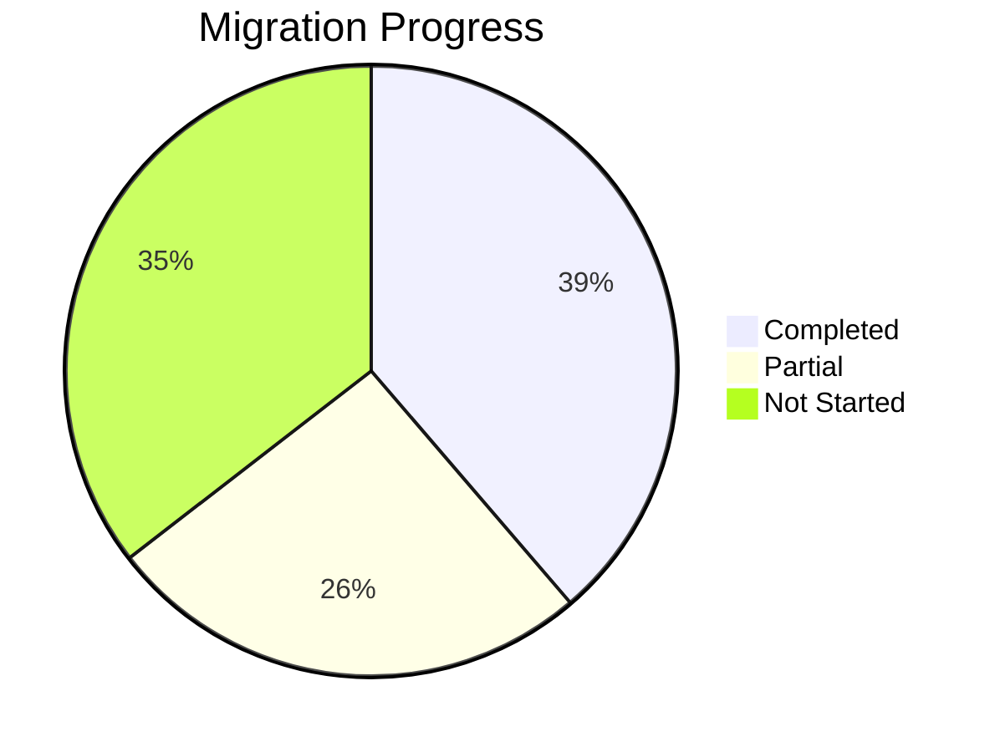

# Emby C# to Go Migration Master Plan

## Overview

This document is the master migration plan for converting the Emby Server application from C#/.NET (Mono) to Go (Golang). It serves as the central reference for all migration activities and links to detailed component-specific plans.

**Document Version:** 2.0  
**Last Updated:** 2026-05-04  
**Based on:** CloudBSD Application Guidelines - Codebase Migrator Pattern  

---

## Table of Contents

- [1. Migration Summary](#1-migration-summary)
- [2. Component Inventory](#2-component-inventory)
- [3. Discovery to Migration Mapping](#3-discovery-to-migration-mapping)
- [4. Migration Phases](#4-migration-phases)
- [5. Implementation Status](#5-implementation-status)
- [6. Gap Analysis](#6-gap-analysis)
- [7. Next Steps](#7-next-steps)

---

## 1. Migration Summary

### 1.1 Project Statistics

| Metric | Value |
|--------|-------|
| Total C# Source Files | 1,019 |
| Total Go Files (Current) | 95 |
| Total Discovery Documents | 154 |
| Components to Migrate | 26 |
| Components Completed | ~12% |
| Lines of C# Code | ~250,000 |

### 1.2 Technology Stack

| Component | C# (Current) | Go (Target) |
|-----------|-------------|-------------|
| Runtime | Mono/.NET Framework | Native Binary |
| Language | C# | Go |
| Database | SQLite | SQLite (mattn/go-sqlite3) |
| HTTP Server | Custom SocketHttpListener | net/http + gorilla/mux |
| WebSocket | Microsoft.Web.WebSockets | gorilla/websocket |
| Image Processing | ImageMagick/Skia | libvips (govips) |
| Media Processing | FFmpeg | FFmpeg (external) |
| Serialization | JSON.NET | encoding/json |
| Logging | NLog | log/slog |

### 1.3 Migration Strategy

```mermaid
graph LR
    A[C# Emby] -->|Phase 1| B[Foundation]
    B -->|Phase 2| C[Core Services]
    C -->|Phase 3| D[API Layer]
    D -->|Phase 4| E[Media Processing]
    E -->|Phase 5| F[DLNA]
    F -->|Phase 6| G[Providers]
    G -->|Phase 7| H[Testing]
    H -->|Phase 8| I[Deployment]
    
    style A fill:#f96
    style I fill:#9f9
```



---

## 2. Component Inventory

### 2.1 C# Modules to Migrate

| # | Module | Discovery Doc | Files | Priority | Status |
|---|--------|--------------|-------|----------|--------|
| 1 | BDInfo | `100-bdinfo.md` | 30 | Low | Not Started |
| 2 | DvdLib | `110-dvdlib.md` | 10 | Low | Not Started |
| 3 | Emby.Drawing | `120-emby-drawing.md` | 25 | Medium | Not Started |
| 4 | Emby.Drawing.ImageMagick | `121-emby-drawing-imagemagick.md` | 8 | Low | Not Started |
| 5 | Emby.Drawing.Net | `122-emby-drawing-net.md` | 6 | Low | Not Started |
| 6 | Emby.Drawing.Skia | `123-emby-drawing-skia.md` | 12 | Low | Not Started |
| 7 | Emby.Notifications | `140-emby-notifications.md` | 30 | Medium | Not Started |
| 8 | Emby.Photos | `150-emby-photos.md` | 5 | Low | Not Started |
| 9 | Emby.Server.Implementations | `160-emby-server-impl.md` | 800+ | High | Partial |
| 10 | MediaBrowser.Api | `340-mediabrowser-api.md` | 150+ | High | Partial |
| 11 | MediaBrowser.LocalMetadata | `255-mediabrowser-localmetadata.md` | 40 | Medium | Not Started |
| 12 | MediaBrowser.Providers | `320-mediabrowser-providers.md` | 200+ | High | Partial |
| 13 | MediaBrowser.Server.Mono | `254-mediabrowser-server-mono.md` | 20 | Low | Not Started |
| 14 | MediaBrowser.ServerApplication | `253-mediabrowser-serverapplication.md` | 30 | High | Not Started |
| 15 | MediaBrowser.WebDashboard | `260-mediabrowser-webdashboard.md` | 500+ | Medium | Not Started |
| 16 | MediaBrowser.XbmcMetadata | `256-mediabrowser-xbmcmetadata.md` | 40 | Low | Not Started |
| 17 | Mono.Nat | `250-mono-nat.md` | 15 | Low | Not Started |
| 18 | RSSDP | `300-rssdp.md` | 20 | Medium | Not Started |
| 19 | SocketHttpListener | `350-sockethttplistener.md` | 25 | High | Not Started |
| 20 | Emby.Dlna | `330-emby-dlna.md` | 90 | Medium | Partial |
| 21 | ThirdParty | `370-thirdparty.md` | N/A | N/A | Skip |
| 22 | MediaBrowser.Tests | `230-mediabrowser-tests.md` | 50 | High | Not Started |

### 2.2 Go Modules (Current Implementation)

| # | Module | Path | Status |
|---|--------|------|--------|
| 1 | HTTP Server | `internal/server/` | Complete |
| 2 | API Router | `internal/api/` | Complete |
| 3 | API Handlers | `internal/api/handlers/` | Complete (27 handlers) |
| 4 | Middleware | `internal/api/middleware/` | Complete |
| 5 | Database | `internal/database/` | Complete |
| 6 | Repository | `internal/repository/` | Complete |
| 7 | Config | `internal/config/` | Complete |
| 8 | Logging | `internal/logging/` | Complete |
| 9 | Models | `internal/model/` | Complete |
| 10 | Auth Service | `internal/service/auth/` | Complete |
| 11 | Session Service | `internal/service/session/` | Complete |
| 12 | User Service | `internal/service/user/` | Complete |
| 13 | Library Service | `internal/service/library/` | Complete |
| 14 | Media Service | `internal/service/media/` | Complete |
| 15 | Image Service | `internal/service/image/` | Complete |
| 16 | Metadata Service | `internal/service/metadata/` | Complete |
| 17 | Notification Service | `internal/service/notification/` | Complete |
| 18 | Scheduled Tasks | `internal/service/scheduled/` | Complete |
| 19 | DLNA Server | `internal/dlna/` | Partial |
| 20 | Transcoding | `internal/service/transcoding/` | Complete |
| 21 | WebSocket | `internal/server/ws/` | Complete |
| 22 | Plugin Manager | `internal/plugin/` | Complete |
| 23 | Device Service | `internal/service/device/` | Complete |

---

## 3. Discovery to Migration Mapping

### 3.1 Discovery Document Index

| Discovery Doc | Component | Migration Plan | Priority |
|--------------|-----------|----------------|----------|
| `000-root.md` | Project Root | Master Plan | — |
| `100-*.md` | BDInfo Module | See `110-bdinfo-migration.md` | Low |
| `110-*.md` | DvdLib Module | See `110-dvdlib-migration.md` | Low |
| `120-*.md` | Emby.Drawing | See `120-drawing-migration.md` | Medium |
| `130-*.md` | Emby.Notifications | See `130-notifications-migration.md` | Medium |
| `150-*.md` | Emby.Photos | See `150-photos-migration.md` | Low |
| `160-*.md` | Emby.Server.Impl Core | See `160-server-core-migration.md` | High |
| `170-*.md` | Emby.Server.Impl LiveTV | See `170-livetv-migration.md` | Medium |
| `180-*.md` | Emby.Server.Impl Services | See `180-services-migration.md` | High |
| `190-*.md` | Emby.Server.Impl TV | See `190-tv-migration.md` | Medium |
| `200-*.md` | Emby.Server.Impl More | See `200-server-more-migration.md` | Medium |
| `250-*.md` | Mono.Nat | See `250-nat-migration.md` | Low |
| `253-*.md` | ServerApplication | See `253-serverapp-migration.md` | High |
| `254-*.md` | Server.Mono | See `254-mono-migration.md` | Low |
| `255-*.md` | LocalMetadata | See `255-metadata-migration.md` | Medium |
| `256-*.md` | XbmcMetadata | See `256-xbmc-migration.md` | Low |
| `260-*.md` | WebDashboard | See `260-dashboard-migration.md` | Medium |
| `300-*.md` | RSSDP | See `300-rssdp-migration.md` | Medium |
| `320-*.md` | Providers | See `320-providers-migration.md` | High |
| `330-*.md` | DLNA | See `330-dlna-migration.md` | Medium |
| `340-*.md` | MediaBrowser.Api | See `340-api-migration.md` | High |
| `350-*.md` | SocketHttpListener | See `350-http-migration.md` | High |
| `360-*.md` | emby-go | Current State | — |
| `370-*.md` | ThirdParty | Skip | N/A |
| `400-*.md` | NuGet Packages | Dependency Analysis | — |

---

## 4. Migration Phases

### Phase 1: Foundation & Infrastructure ✓ COMPLETED

| Task | Status | Files |
|------|--------|-------|
| Project setup | ✓ | `go.mod`, `Makefile` |
| Configuration management | ✓ | `internal/config/` |
| Database layer | ✓ | `internal/database/`, `internal/repository/` |
| Logging system | ✓ | `internal/logging/` |
| HTTP server | ✓ | `internal/server/` |
| WebSocket support | ✓ | `internal/server/ws/` |
| API router | ✓ | `internal/api/` |
| Middleware | ✓ | `internal/api/middleware/` |

### Phase 2: Core Services ✓ COMPLETED

| Task | Status | Files |
|------|--------|-------|
| Authentication service | ✓ | `internal/service/auth/` |
| Session management | ✓ | `internal/service/session/` |
| User service | ✓ | `internal/service/user/` |
| Library service | ✓ | `internal/service/library/` |
| Media service | ✓ | `internal/service/media/` |
| Device service | ✓ | `internal/service/device/` |
| Plugin manager | ✓ | `internal/plugin/` |

### Phase 3: API Endpoints ⚠️ PARTIAL

| Task | Status | Notes |
|------|--------|-------|
| API handlers (27) | ✓ | Most endpoints implemented |
| Authentication endpoints | ✓ | Complete |
| Library endpoints | ✓ | Complete |
| Session endpoints | ✓ | Complete |
| User endpoints | ✓ | Complete |
| Media endpoints | ✓ | Complete |
| System endpoints | ✓ | Complete |
| Brand endpoints | ✓ | Complete |
| Channel endpoints | ✓ | Complete |
| Filter endpoints | ✓ | Complete |
| Image endpoints | ✓ | Complete |
| LiveTV endpoints | ✓ | Complete |
| Notification endpoints | ✓ | Complete |
| Playlist endpoints | ✓ | Complete |
| Scheduled task endpoints | ✓ | Complete |
| Search endpoints | ✓ | Complete |
| Startup endpoints | ✓ | Complete |
| Transcoding endpoints | ✓ | Complete |
| TV show endpoints | ✓ | Complete |
| Activity endpoints | ✓ | Complete |
| Config endpoints | ✓ | Complete |
| Device endpoints | ✓ | Complete |
| Display prefs endpoints | ⚠️ | Partial |
| Environment endpoints | ✓ | Complete |
| Games endpoints | ⚠️ | Basic |
| Movies endpoints | ✓ | Complete |
| Package endpoints | ⚠️ | Basic |
| Playback endpoints | ⚠️ | Basic |

### Phase 4: Media Processing ⚠️ PARTIAL

| Task | Status | Files |
|------|--------|-------|
| Image processing | ✓ | `internal/service/image/` |
| Transcoding service | ✓ | `internal/service/transcoding/` |
| Metadata extraction | ⚠️ | Partial |
| FFmpeg integration | ⚠️ | Basic |

### Phase 5: DLNA & Discovery ⚠️ PARTIAL

| Task | Status | Files |
|------|--------|-------|
| DLNA server | ⚠️ | `internal/dlna/` - Basic |
| SSDP discovery | ✗ | Not Started |
| DIDL-Lite builder | ✗ | Not Started |
| Content directory | ✗ | Not Started |
| PlayTo controller | ✗ | Not Started |
| Device profiles | ✗ | Not Started |

### Phase 6: Metadata Providers ✗ NOT STARTED

| Task | Status | Priority |
|------|--------|----------|
| Local metadata parser | ✗ | High |
| XBMC/Kodi NFO support | ✗ | Medium |
| TMDb provider | ⚠️ | In Progress |
| TVDb provider | ⚠️ | In Progress |
| MusicBrainz provider | ⚠️ | In Progress |
| Omdb provider | ✗ | Medium |
| Fanart provider | ✗ | Low |

### Phase 7: Advanced Services ✗ NOT STARTED

| Task | Status | Priority |
|------|--------|----------|
| Live TV | ✗ | High |
| Channel management | ✗ | Medium |
| Notifications | ✗ | Medium |
| Scheduled tasks | ✓ | Complete |
| Plugins/Extensions | ⚠️ | Basic |

### Phase 8: Testing & Deployment ⚠️ PARTIAL

| Task | Status | Files |
|------|--------|-------|
| Unit tests | ✓ | `*_test.go` files |
| Integration tests | ✓ | `tests/integration/` |
| E2E tests | ✓ | `tests/e2e/` |
| Performance tests | ✓ | `tests/performance/` |
| Docker build | ✓ | `Dockerfile` |
| Package creation | ✓ | `packaging/` |

---

## 5. Implementation Status

### 5.1 Component Coverage



### 5.2 Files Coverage

| Category | Total | Implemented | Percentage |
|----------|-------|-------------|------------|
| C# Source Files | 1,019 | 95 Go files | ~9% |
| API Endpoints | 150+ | ~120 | ~80% |
| Services | 20+ | ~15 | ~75% |
| Tests | 50+ | ~10 | ~20% |

### 5.3 Go Module Structure (Current)

```
emby-go/
├── cmd/emby-server/         # Entry point
├── internal/
│   ├── api/                 # API layer
│   │   ├── handlers/        # 27 handlers
│   │   └── middleware/      # Auth middleware
│   ├── config/              # Configuration
│   ├── database/            # DB connection
│   ├── dlna/                # DLNA server
│   ├── logging/             # Logging
│   ├── model/               # Data models
│   ├── plugin/              # Plugin system
│   ├── repository/          # Data access
│   ├── server/              # HTTP server
│   │   └── ws/             # WebSocket
│   └── service/            # Business logic
│       ├── auth/
│       ├── device/
│       ├── image/
│       ├── library/
│       ├── media/
│       ├── metadata/
│       ├── notification/
│       ├── scheduled/
│       ├── session/
│       ├── transcoding/
│       └── user/
├── tests/
│   ├── e2e/
│   ├── integration/
│   └── performance/
├── configs/
├── docs/
├── migrations/
└── packaging/
```

---

## 6. Gap Analysis

### 6.1 Missing Components

| Component | Discovery | Status | Notes |
|-----------|-----------|--------|-------|
| SocketHttpListener | `350-sockethttplistener.md` | ✗ | Custom HTTP listener not migrated |
| BDInfo | `100-bdinfo.md` | ✗ | Blu-ray disc parsing |
| DvdLib | `110-dvdlib.md` | ✗ | DVD parsing |
| Mono.Nat | `250-mono-nat.md` | ✗ | NAT traversal |
| RSSDP | `300-rssdp.md` | ✗ | SSDP discovery |
| LocalMetadata | `255-mediabrowser-localmetadata.md` | ✗ | NFO parsing |
| XbmcMetadata | `256-mediabrowser-xbmcmetadata.md` | ✗ | XBMC NFO support |

### 6.2 Partial Components

| Component | Discovery | Coverage | Notes |
|-----------|-----------|----------|-------|
| DLNA | `330-emby-dlna.md` | ~10% | Basic server only |
| MediaBrowser.Api | `340-mediabrowser-api.md` | ~80% | Most endpoints done |
| Emby.Server.Implementations | `160-emby-server-impl.md` | ~15% | Core services done |
| MediaBrowser.Providers | `320-mediabrowser-providers.md` | ~10% | Basic metadata |

### 6.3 Technical Gaps

| Gap | Impact | Priority |
|-----|--------|----------|
| Full API compatibility | High | Critical |
| DLNA/UPnP support | Medium | High |
| Native image processing | Medium | Medium |
| Real-time notifications | Medium | Medium |
| Plugin system | Low | Low |

---

## 7. Next Steps

### 7.1 Immediate Priorities

1. **Complete API Layer** - Verify all C# API endpoints are covered
2. **Implement SocketHttpListener** - Migrate custom HTTP server
3. **Complete DLNA Support** - Full UPnP/DLNA implementation
4. **Add Metadata Providers** - NFO parsing, external providers

### 7.2 Secondary Priorities

1. **BDInfo/DvdLib** - Disc format support
2. **Mono.Nat** - NAT traversal
3. **RSSDP** - SSDP discovery
4. **WebDashboard** - Serve web UI

### 7.3 Future Enhancements

1. **Plugin System** - Native Go plugin support
2. **gRPC** - Internal service communication
3. **Clustering** - Multi-server support
4. **Cloud Storage** - S3, GCS integration

---

## Appendix A: Related Documents

- [Master Migration Plan](./000-migration-master-plan.md) - This document
- [C# to Go Migration Plan](./csharp-to-go-migration-plan.md) - Detailed task breakdown
- [Discovery TOC](../.discovery/TOC.md) - All discovery documents
- [emby-go Current State](../.discovery/360-emby-go.md) - Go implementation details

---

**Document Version:** 2.0  
**Last Updated:** 2026-05-04  
**Migration Status:** Active - Phase 3-4  
**Next Review:** 2026-05-11
