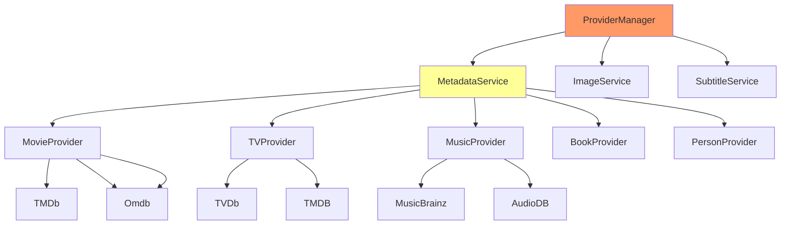

# MediaBrowser.Providers - Metadata Providers Migration Plan

## Overview

This document covers the migration of the MediaBrowser.Providers module from C# to Go.

**Discovery Document:** `.discovery/320-mediabrowser-providers.md`  
**Priority:** HIGH  
**Status:** PARTIAL (~10% complete)  

---

## 1. Module Overview

### 1.1 Provider Categories

| Category | Providers | Status | Priority |
|----------|-----------|--------|----------|
| Movies | 15 | ⚠️ | High |
| TV | 12 | ⚠️ | High |
| Music | 10 | ⚠️ | Medium |
| People | 5 | ✓ | Medium |
| Books | 3 | ✗ | Low |
| Images | 8 | ✓ | Medium |
| Subtitles | 5 | ✗ | High |
| Chapters | 3 | ✗ | Low |
| Folders | 2 | ✓ | Medium |
| Channels | 5 | ✗ | Medium |
| GameGenres | 2 | ✗ | Low |
| Games | 3 | ✗ | Low |
| Genres | 4 | ✓ | Low |
| LiveTV | 5 | ✗ | High |
| Manager | 3 | ✓ | High |
| MediaInfo | 10 | ⚠️ | High |
| MusicGenres | 3 | ✓ | Low |
| Omdb | 2 | ⚠️ | Medium |
| Photos | 2 | ✓ | Low |
| Playlists | 3 | ✓ | Medium |
| Studios | 2 | ✓ | Low |
| Users | 2 | ✓ | Low |
| Videos | 5 | ✓ | Medium |
| Years | 2 | ✓ | Low |
| BoxSets | 3 | ✓ | Medium |

**Total:** 25 subdirectories, 200+ C# files

---

## 2. Architecture

### 2.1 Provider Architecture



### 2.2 Current Go Implementation

**Location:** `emby-go/internal/service/metadata/`

| File | Status | Notes |
|------|--------|-------|
| `metadata.go` | ✓ | Core metadata service |
| `fetcher.go` | ✓ | Metadata fetching |
| `limiter.go` | ✓ | Rate limiting |

---

## 3. Discovery to Implementation Mapping

### 3.1 Core Provider Components

| Discovery Doc | C# Class | Go Package | Status |
|--------------|----------|-----------|--------|
| `338-mediabrowser-providers-manager.md` | ProviderManager | `internal/service/metadata/` | ✓ |
| `338-mediabrowser-providers-manager.md` | RemoteSearchProvider | `internal/service/metadata/` | ⚠️ |
| `338-mediabrowser-providers-manager.md` | DynamicImageProvider | `internal/service/image/` | ✓ |

### 3.2 Movie Providers

| Discovery Doc | C# Provider | Go Equivalent | Status |
|--------------|-------------|--------------|---------|
| `321-mediabrowser-providers-movies.md` | MovieDbProvider | `internal/provider/tmdb/` | ⚠️ |
| `321-mediabrowser-providers-movies.md` | Trailer室 | — | ✗ |
| `321-mediabrowser-providers-movies.md` | FanartProvider | — | ✗ |
| `321-mediabrowser-providers-movies.md` | ExternalIdInterstellar | — | ✗ |

### 3.3 TV Providers

| Discovery Doc | C# Provider | Go Equivalent | Status |
|--------------|-------------|--------------|---------|
| `327-mediabrowser-providers-tv.md` | TvdbSeriesProvider | `internal/provider/tvdb/` | ⚠️ |
| `327-mediabrowser-providers-tv.md` | TvdbSeasonProvider | — | ✗ |
| `327-mediabrowser-providers-tv.md` | TvdbEpisodeProvider | — | ✗ |
| `327-mediabrowser-providers-tv.md` | TmdbTvProvider | — | ✗ |

### 3.4 Music Providers

| Discovery Doc | C# Provider | Go Equivalent | Status |
|--------------|-------------|--------------|---------|
| `323-mediabrowser-providers-music.md` | MusicBrainzAlbumProvider | `internal/provider/musicbrainz/` | ⚠️ |
| `323-mediabrowser-providers-music.md` | AudioDbAlbumProvider | — | ✗ |
| `323-mediabrowser-providers-music.md` | FanArtMusicProvider | — | ✗ |

---

## 4. Key Components

### 4.1 ProviderManager

**C# Source:** `MediaBrowser.Providers/Manager/ProviderManager.cs`

```csharp
public class ProviderManager : IProviderManager {
    Task<IEnumerable<RemoteSearchResult>> GetSearchResults<T>(
        RemoteSearchQuery query, 
        CancellationToken cancellationToken) where T : BaseItem;
    
    Task<MetadataResult<T>> GetSearchResult<T>(
        RemoteSearchQuery query,
        CancellationToken cancellationToken) where T : BaseItem;
    
    Task RefreshAllMetadata(BaseItem item, MetadataRefreshOptions options);
}
```

**Go Target:** `internal/service/metadata/manager.go`

```go
type ProviderManager struct {
    providers []Provider
    limiter   *RateLimiter
}

func (m *ProviderManager) Search(ctx context.Context, query *SearchQuery) (*SearchResult, error)
func (m *ProviderManager) Refresh(ctx context.Context, itemID string, options *RefreshOptions) error
```

### 4.2 Remote Search Provider Interface

**C# Source:** `MediaBrowser.Providers/Manager/IRemoteSearchProvider.cs`

```csharp
public interface IRemoteSearchProvider<TItem, TSearchResult> 
    where TItem : BaseItem
    where TSearchResult : RemoteSearchResult {
    
    Task<IEnumerable<TSearchResult>> GetSearchResults(
        RemoteSearchQuery searchInfo,
        CancellationToken cancellationToken);
    
    Task<TSearchResult> GetSearchResult(
        RemoteSearchQuery searchInfo,
        CancellationToken cancellationToken);
}
```

**Go Target:** `internal/provider/provider.go`

```go
type SearchProvider interface {
    Search(ctx context.Context, query *SearchQuery) ([]*SearchResult, error)
    GetByID(ctx context.Context, id string) (*SearchResult, error)
}
```

---

## 5. External Provider Integration

### 5.1 TMDb (The Movie Database)

**Discovery:** `.discovery/321-mediabrowser-providers-movies.md`

| Endpoint | Status |
|----------|--------|
| Search Movies | ⚠️ |
| Get Movie Details | ⚠️ |
| Get Movie Images | ⚠️ |
| Get Movie Cast | ⚠️ |
| Get Movie Videos | ⚠️ |

**Implementation:** `internal/provider/tmdb/`

```go
type TMDb struct {
    apiKey    string
    baseURL   string
    client    *http.Client
    limiter   *RateLimiter
}

func (t *TMDb) SearchMovies(ctx context.Context, query string) ([]*Movie, error)
func (t *TMDb) GetMovie(ctx context.Context, id string) (*Movie, error)
func (t *TMDb) GetImages(ctx context.Context, movieID string) ([]*Image, error)
```

### 5.2 TVDb (The TV Database)

**Discovery:** `.discovery/327-mediabrowser-providers-tv.md`

| Endpoint | Status |
|----------|--------|
| Search Series | ⚠️ |
| Get Series Details | ⚠️ |
| Get Seasons | ⚠️ |
| Get Episodes | ⚠️ |
| Get Images | ⚠️ |

**Implementation:** `internal/provider/tvdb/`

```go
type TVDb struct {
    apiKey    string
    baseURL   string
    client    *http.Client
    limiter   *RateLimiter
}

func (t *TVDb) SearchSeries(ctx context.Context, query string) ([]*Series, error)
func (t *TVDb) GetSeries(ctx context.Context, id string) (*Series, error)
func (t *TVDb) GetEpisodes(ctx context.Context, seriesID string) ([]*Episode, error)
```

### 5.3 MusicBrainz

**Discovery:** `.discovery/323-mediabrowser-providers-music.md`

| Endpoint | Status |
|----------|--------|
| Search Artists | ⚠️ |
| Get Artist Details | ⚠️ |
| Search Releases | ⚠️ |
| Get Release Details | ⚠️ |
| Get Recordings | ⚠️ |

**Implementation:** `internal/provider/musicbrainz/`

```go
type MusicBrainz struct {
    baseURL string
    client  *http.Client
    limiter *RateLimiter
    userAgent string
}

func (m *MusicBrainz) SearchArtists(ctx context.Context, query string) ([]*Artist, error)
func (m *MusicBrainz) GetArtist(ctx context.Context, id string) (*Artist, error)
func (m *MusicBrainz) GetReleases(ctx context.Context, artistID string) ([]*Release, error)
```

---

## 6. Local Metadata

### 6.1 NFO Parsing

**Discovery:** `.discovery/255-mediabrowser-localmetadata.md`

| Parser | Status |
|--------|--------|
| MovieNfoParser | ✗ |
| SeriesNfoParser | ✗ |
| ArtistNfoParser | ✗ |
| AlbumNfoParser | ✗ |
| EpisodeNfoParser | ✗ |

### 6.2 XBMC/Kodi Metadata

**Discovery:** `.discovery/256-mediabrowser-xbmcmetadata.md`

| Parser | Status |
|--------|--------|
| XbmcMovieParser | ✗ |
| XbmcSeriesParser | ✗ |
| XbmcEpisodeParser | ✗ |
| XbmcVideoParser | ✗ |

### 6.3 Implementation

```go
// internal/metadata/local/
type NfoParser struct{}

func (p *NfoParser) ParseMovie(filename string) (*Movie, error)
func (p *NfoParser) ParseSeries(filename string) (*Series, error)
func (p *NfoParser) ParseEpisode(filename string) (*Episode, error)
func (p *NfoParser) ParseArtist(filename string) (*Artist, error)
func (p *NfoParser) ParseAlbum(filename string) (*Album, error)
```

---

## 7. Subtitle Providers

### 7.1 Subtitle Sources

| Provider | Status | Discovery |
|----------|--------|-----------|
| OpenSubtitles | ✗ | `328-mediabrowser-providers-subtitles.md` |
| Podnapisi | ✗ | — |
| Subdivx | ✗ | — |
| TVSubtitles | ✗ | — |

### 7.2 Implementation

```go
// internal/provider/subtitles/
type SubtitleProvider interface {
    Search(ctx context.Context, req *SubtitleSearchRequest) ([]*Subtitle, error)
    Download(ctx context.Context, id string) ([]byte, error)
}

type OpenSubtitles struct {
    client  *http.Client
    apiKey  string
    userAgent string
}
```

---

## 8. Migration Tasks

### 8.1 Priority 1 (Critical)

| # | Task | Status | Files |
|---|------|--------|-------|
| 1.1 | Complete TMDb provider | ⚠️ | `internal/provider/tmdb/` |
| 1.2 | Complete TVDb provider | ⚠️ | `internal/provider/tvdb/` |
| 1.3 | Complete MusicBrainz provider | ⚠️ | `internal/provider/musicbrainz/` |
| 1.4 | Implement subtitle providers | ✗ | `internal/provider/subtitles/` |

### 8.2 Priority 2 (High)

| # | Task | Status | Files |
|---|------|--------|-------|
| 2.1 | Implement NFO parsers | ✗ | `internal/metadata/local/` |
| 2.2 | Implement XBMC metadata | ✗ | `internal/metadata/xbmc/` |
| 2.3 | Implement OpenSubtitles | ✗ | `internal/provider/subtitles/opensubtitles.go` |
| 2.4 | Implement Omdb provider | ⚠️ | `internal/provider/omdb/` |

### 8.3 Priority 3 (Medium)

| # | Task | Status | Files |
|---|------|--------|-------|
| 3.1 | Implement AudioDB | ✗ | `internal/provider/audiodb/` |
| 3.2 | Implement Fanart providers | ✗ | `internal/provider/fanart/` |
| 3.3 | Implement trailer provider | ✗ | `internal/provider/trailers/` |
| 3.4 | Implement external ID providers | ✗ | `internal/provider/ids/` |

---

## 9. Verification Checklist

### 9.1 Provider Coverage

| Provider | Status | Test Status |
|----------|--------|--------------|
| TMDb | ⚠️ | ✗ |
| TVDb | ⚠️ | ✗ |
| MusicBrainz | ⚠️ | ✗ |
| Omdb | ⚠️ | ✗ |
| OpenSubtitles | ✗ | ✗ |
| NFO Parser | ✗ | ✗ |
| XBMC Metadata | ✗ | ✗ |

### 9.2 Feature Coverage

- [ ] Movie metadata fetching
- [ ] TV series metadata fetching
- [ ] Episode metadata fetching
- [ ] Artist metadata fetching
- [ ] Album metadata fetching
- [ ] Person metadata fetching
- [ ] Subtitle searching
- [ ] Subtitle downloading
- [ ] Local NFO parsing
- [ ] Image fetching

---

## Appendix: Related Documents

- [Master Migration Plan](./000-migration-master-plan.md)
- [Discovery: Providers](./.discovery/320-mediabrowser-providers.md)
- [Discovery: Manager](./.discovery/338-mediabrowser-providers-manager.md)
- [Discovery: Movies](./.discovery/321-mediabrowser-providers-movies.md)
- [Discovery: TV](./.discovery/327-mediabrowser-providers-tv.md)
- [Discovery: Music](./.discovery/323-mediabrowser-providers-music.md)
- [Go Implementation](./.discovery/360-emby-go.md)

---

**Document Version:** 1.0  
**Last Updated:** 2026-05-04  
**Status:** In Progress - External Providers Partial
