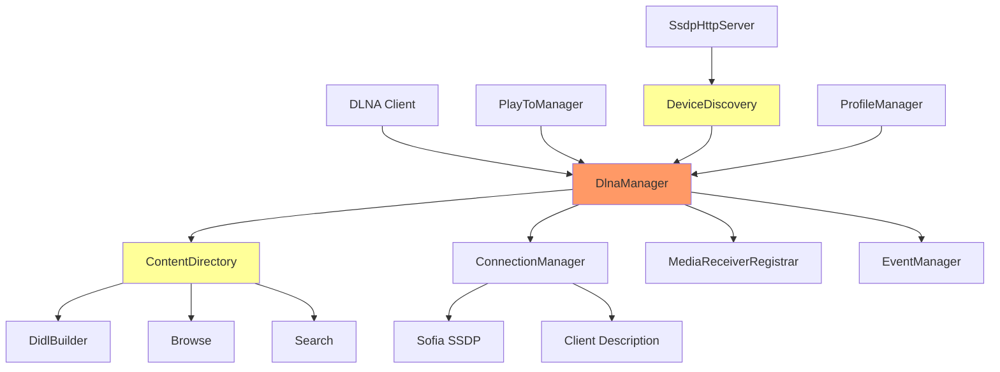

# Emby.Dlna - DLNA/UPnP Migration Plan

## Overview

This document covers the migration of the Emby.Dlna module from C# to Go.

**Discovery Document:** `.discovery/330-emby-dlna.md`  
**Priority:** MEDIUM  
**Status:** PARTIAL (~10% complete)  

---

## 1. Module Overview

### 1.1 Component Summary

| Component | Files | Status | Notes |
|-----------|-------|--------|-------|
| DlnaManager | 1 | ⚠️ | Basic |
| ContentDirectory | 1 | ✗ | Not started |
| ConnectionManager | 1 | ✗ | Not started |
| MediaReceiverRegistrar | 1 | ✗ | Not started |
| EventManager | 1 | ✗ | Not started |
| PlayToController | 1 | ✗ | Not started |
| DeviceDiscovery | 1 | ✗ | Not started |
| Profiles | 28 | ✗ | Not started |
| DidlBuilder | 1 | ✗ | Not started |
| Ssdp | 5 | ✗ | Not started |

**Total Files:** 90+ C# files

---

## 2. Architecture

### 2.1 Component Diagram



### 2.2 Current Go Implementation

**Location:** `emby-go/internal/dlna/`

| File | Status | Notes |
|------|--------|-------|
| `server.go` | ⚠️ | Basic DLNA server |
| `xml/descriptors.go` | ⚠️ | Basic XML |

---

## 3. Discovery to Implementation Mapping

### 3.1 Core Components

| Discovery Doc | C# Class | Go Equivalent | Status |
|--------------|----------|--------------|---------|
| `330-emby-dlna.md` | DlnaManager | `internal/dlna/server.go` | ⚠️ |
| `330-emby-dlna.md` | ContentDirectory | — | ✗ |
| `330-emby-dlna.md` | ConnectionManager | — | ✗ |
| `330-emby-dlna.md` | PlayToController | — | ✗ |
| `330-emby-dlna.md` | DeviceDiscovery | — | ✗ |
| `330-emby-dlna.md` | DidlBuilder | — | ✗ |
| `330-emby-dlna.md` | EventManager | — | ✗ |
| `330-emby-dlna.md` | MediaReceiverRegistrar | — | ✗ |

### 3.2 Profiles

| Profile | Files | Status |
|---------|-------|--------|
| Samsung | 5 | ✗ |
| Sony | 4 | ✗ |
| LG | 3 | ✗ |
| Xbox | 2 | ✗ |
| Windows | 2 | ✗ |
| Generic | 12 | ✗ |

---

## 4. Key Components to Implement

### 4.1 DlnaManager

**C# Source:** `Emby.Dlna/DlnaManager.cs`

```csharp
public class DlnaManager : IDlnaManager {
    IDeviceDiscovery CreateDeviceDiscovery(DlnaOptions options);
    IContentDirectory GetContentDirectory(string serverUuid);
    IConnectionManager GetConnectionManager(string serverUuid);
    Task<DeviceProfile> GetProfile(DeviceInfo deviceInfo);
    IEnumerable<DeviceProfile> GetProfiles();
    void ClearProfiles();
}
```

**Go Target:** `internal/dlna/manager.go`

```go
type Manager struct {
    profiles  map[string]*Profile
    server    *Server
    discovery *Discovery
}

func (m *Manager) CreateDeviceDiscovery() error
func (m *Manager) GetContentDirectory() *ContentDirectory
func (m *Manager) GetConnectionManager() *ConnectionManager
func (m *Manager) GetProfile(device *DeviceInfo) *Profile
```

### 4.2 ContentDirectory

**C# Source:** `Emby.Dlna/ContentDirectory.cs`

```csharp
public class ContentDirectory : BaseService, IContentDirectory {
    Task<ControlResponse> Browse(ControlRequest request);
    Task<ControlResponse> Search(ControlRequest request);
    Task<ControlResponse> GetSearchCapabilities(ControlRequest request);
    Task<ControlResponse> GetSortCapabilities(ControlRequest request);
    Task<ControlResponse> GetSystemUpdateID(ControlRequest request);
}
```

**Go Target:** `internal/dlna/content_directory.go`

```go
type ContentDirectory struct {
    manager *Manager
    library *library.Service
}

func (c *ContentDirectory) Browse(ctx context.Context, req *ControlRequest) (*ControlResponse, error)
func (c *ContentDirectory) Search(ctx context.Context, req *ControlRequest) (*ControlResponse, error)
func (c *ContentDirectory) GetSearchCapabilities(ctx context.Context) (*ControlResponse, error)
func (c *ContentDirectory) GetSortCapabilities(ctx context.Context) (*ControlResponse, error)
func (c *ContentDirectory) GetSystemUpdateID(ctx context.Context) (*ControlResponse, error)
```

### 4.3 DidlBuilder

**C# Source:** `Emby.Dlna/DidlBuilder.cs`

```csharp
public class DidlBuilder {
    string GetDidl(IEnumerable<BaseItem> items, string filter, string sort);
    string GetSingleItem(BaseItem item, string filter);
    string GetItemXml(BaseItem item);
}
```

**Go Target:** `internal/dlna/didl_builder.go`

```go
type DidlBuilder struct {
    baseURL string
    serverID string
}

func (b *DidlBuilder) GetDidl(items []*model.Item, filter, sort string) string
func (b *DidlBuilder) GetSingleItem(item *model.Item, filter string) string
func (b *DidlBuilder) GetItemXml(item *model.Item) string
```

### 4.4 DeviceDiscovery

**C# Source:** `Emby.Dlna/DeviceDiscovery.cs`

```csharp
public class DeviceDiscovery : IDeviceDiscovery {
    event EventHandler<DeviceInfo> DeviceAdded;
    event EventHandler<DeviceInfo> DeviceRemoved;
    void Start();
    void Stop();
    void Dispose();
}
```

**Go Target:** `internal/dlna/discovery.go`

```go
type DeviceDiscovery struct {
    devices    map[string]*DeviceInfo
    mu         sync.RWMutex
    onAdded    []func(*DeviceInfo)
    onRemoved  []func(*DeviceInfo)
}

func (d *DeviceDiscovery) Start(ctx context.Context) error
func (d *DeviceDiscovery) Stop() error
func (d *DeviceDiscovery) OnAdded(f func(*DeviceInfo))
func (d *DeviceDiscovery) OnRemoved(f func(*DeviceInfo))
```

---

## 5. RSSDP Dependency

### 5.1 RSSDP Components

**Discovery:** `.discovery/300-rssdp.md`

| Component | C# Files | Status |
|-----------|----------|--------|
| SsdpDeviceLocator | 5 | ✗ |
| SsdpDevicePublisher | 3 | ✗ |
| SsdpCommunicationsServer | 2 | ✗ |
| DiscoveredSsdpDevice | 1 | ✗ |

### 5.2 Implementation

```go
// internal/dlna/ssdp/
type DeviceLocator struct {
    multicastAddr string
    port         int
    socket       *net.UDPConn
}

func (l *DeviceLocator) Search(ctx context.Context, searchType string) ([]*Device, error)
func (l *DeviceLocator) Announce(device *Device) error
```

---

## 6. Device Profiles

### 6.1 Profile Structure

**C# Source:** `Emby.Dlna/Profiles/`

| Profile | Manufacturer | Priority |
|---------|--------------|----------|
| Samsung SmartTV | Samsung | High |
| LG SmartTV | LG | High |
| Sony Bravia | Sony | High |
| Xbox One | Microsoft | Medium |
| Windows Media Player | Microsoft | Medium |
| Generic | All | Low |

### 6.2 Profile Features

| Feature | Description |
|---------|-------------|
| Codec Support | Supported audio/video codecs |
| Transcoding | Required transcoding formats |
| Streaming | Streaming protocol support |
| Subtitle | Subtitle format support |
| Image | Image format support |

---

## 7. Migration Tasks

### 7.1 Priority 1 (Critical)

| # | Task | Status | Files |
|---|------|--------|-------|
| 1.1 | Implement DlnaManager | ⚠️ | `internal/dlna/manager.go` |
| 1.2 | Implement ContentDirectory | ✗ | `internal/dlna/content_directory.go` |
| 1.3 | Implement DidlBuilder | ✗ | `internal/dlna/didl_builder.go` |
| 1.4 | Implement ConnectionManager | ✗ | `internal/dlna/connection_manager.go` |

### 7.2 Priority 2 (High)

| # | Task | Status | Files |
|---|------|--------|-------|
| 2.1 | Implement DeviceDiscovery | ✗ | `internal/dlna/discovery.go` |
| 2.2 | Implement SSDP/RSSDP | ✗ | `internal/dlna/ssdp/` |
| 2.3 | Implement PlayToController | ✗ | `internal/dlna/playto.go` |
| 2.4 | Implement EventManager | ✗ | `internal/dlna/events.go` |

### 7.3 Priority 3 (Medium)

| # | Task | Status | Files |
|---|------|--------|-------|
| 3.1 | Implement device profiles | ✗ | `internal/dlna/profiles/` |
| 3.2 | Implement MediaReceiverRegistrar | ✗ | `internal/dlna/registrar.go` |
| 3.3 | Add profile loading system | ✗ | `internal/dlna/profile_manager.go` |
| 3.4 | Test with DLNA clients | ✗ | Integration tests |

---

## 8. Testing

### 8.1 Test Cases

| Test | Description | Status |
|------|-------------|--------|
| DLNA Discovery | Discover DLNA devices | ✗ |
| Browse Content | Browse media library | ✗ |
| Search Content | Search for media | ✗ |
| Play Media | Stream media to DLNA device | ✗ |
| Remote Control | Control playback remotely | ✗ |
| Profile Matching | Match device to profile | ✗ |

### 8.2 Client Compatibility

| Client | Support Level |
|--------|---------------|
| Samsung SmartTV | Target |
| LG SmartTV | Target |
| Sony Bravia | Target |
| Xbox One | Target |
| Windows Media Player | Target |
| VLC | Target |
| Kodi | Target |

---

## 9. Verification Checklist

- [ ] DlnaManager implemented
- [ ] ContentDirectory implemented
- [ ] ConnectionManager implemented
- [ ] DidlBuilder implemented
- [ ] DeviceDiscovery implemented
- [ ] SSDP/RSSDP implemented
- [ ] PlayToController implemented
- [ ] EventManager implemented
- [ ] MediaReceiverRegistrar implemented
- [ ] Device profiles implemented
- [ ] Integration tests pass
- [ ] Compatible with Samsung TVs
- [ ] Compatible with LG TVs
- [ ] Compatible with Sony TVs

---

## Appendix: Related Documents

- [Master Migration Plan](./000-migration-master-plan.md)
- [Discovery: DLNA](./.discovery/330-emby-dlna.md)
- [Discovery: Profiles](./.discovery/334-emby-dlna-profiles.md)
- [Discovery: RSSDP](./.discovery/300-rssdp.md)
- [Go Implementation](./.discovery/360-emby-go.md)

---

**Document Version:** 1.0  
**Last Updated:** 2026-05-04  
**Status:** Not Started - Critical Components Missing
