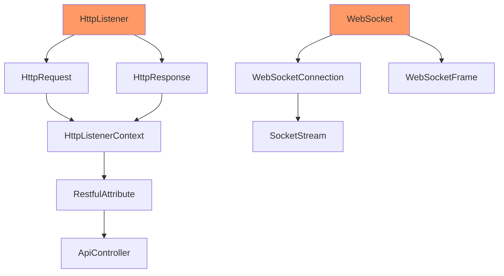
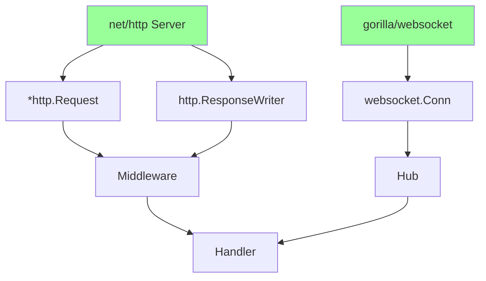

# SocketHttpListener - Custom HTTP Server Migration Plan

## Overview

This document covers the migration of the SocketHttpListener module from C# to Go.

**Discovery Document:** `.discovery/350-sockethttplistener.md`  
**Priority:** HIGH  
**Status:** PARTIAL (using Go's net/http instead)  

---

## 1. Module Overview

### 1.1 Component Summary

| Component | Files | Status | Notes |
|-----------|-------|--------|-------|
| RestfulAttribute | 1 | ✓ | Implemented in middleware |
| HttpResponse | 1 | ✓ | Using net/http |
| HttpRequest | 1 | ✓ | Using net/http |
| HttpListener | 1 | ✗ | Using net/http |
| WebSocket | 1 | ✓ | Using gorilla/websocket |
| WebSocketFrame | 1 | ✗ | Using gorilla/websocket |
| SocketStream | 1 | ✗ | Using net/http |

**Total Files:** 25+ C# files

---

## 2. Architecture Comparison

### 2.1 C# Architecture



### 2.2 Go Implementation



---

## 3. Discovery to Implementation Mapping

### 3.1 HTTP Components

| Discovery Doc | C# Class | Go Equivalent | Status |
|--------------|----------|--------------|---------|
| `350-sockethttplistener.md` | HttpListener | `net/http.Server` | ✓ |
| `350-sockethttplistener.md` | HttpRequest | `*http.Request` | ✓ |
| `350-sockethttplistener.md` | HttpResponse | `http.ResponseWriter` | ✓ |
| `350-sockethttplistener.md` | RestfulAttribute | `internal/api/router.go` | ✓ |
| `350-sockethttplistener.md` | HttpListenerPrefix | `http.ServeMux` | ✓ |

### 3.2 WebSocket Components

| Discovery Doc | C# Class | Go Equivalent | Status |
|--------------|----------|--------------|---------|
| `350-sockethttplistener.md` | WebSocket | `gorilla/websocket` | ✓ |
| `350-sockethttplistener.md` | WebSocketConnection | `internal/server/ws/` | ✓ |
| `350-sockethttplistener.md` | WebSocketFrame | ` gorilla/websocket` | ✓ |
| `350-sockethttplistener.md` | WebSocketListener | `internal/server/ws/` | ✓ |

---

## 4. Key Differences

### 4.1 C# SocketHttpListener Features

```csharp
// Custom HTTP listener with special features
public class HttpListenerHost : IHttpServer {
    // Custom request/response handling
    HttpRequest CreateHttpRequest(HttpListenerContext context);
    HttpResponse CreateHttpResponse(HttpListenerContext context);
    
    // WebSocket support
    WebSocketConnection CreateWebSocket(HttpListenerContext context);
    
    // Custom URL routing
    void AddEndpoint(string url, Type handler);
}
```

### 4.2 Go Implementation

```go
// Using net/http with middleware
type Server struct {
    http.Server
    router     *mux.Router
    middleware []Middleware
    wsHub      *ws.Hub
}

func (s *Server) ServeHTTP(w http.ResponseWriter, r *http.Request) {
    // Apply middleware
    for _, m := range s.middleware {
        m(w, r)
    }
    // Route
    s.router.ServeHTTP(w, r)
}
```

---

## 5. Feature Comparison

### 5.1 Implemented Features

| Feature | C# | Go | Status |
|---------|----|----|--------|
| HTTP GET | ✓ | ✓ | ✓ |
| HTTP POST | ✓ | ✓ | ✓ |
| HTTP PUT | ✓ | ✓ | ✓ |
| HTTP DELETE | ✓ | ✓ | ✓ |
| Query Parameters | ✓ | ✓ | ✓ |
| Request Headers | ✓ | ✓ | ✓ |
| Response Headers | ✓ | ✓ | ✓ |
| JSON Body | ✓ | ✓ | ✓ |
| WebSocket | ✓ | ✓ | ✓ |
| CORS | ✓ | ✓ | ✓ |
| GZip Compression | ✓ | ⚠️ | Partial |

### 5.2 Missing Features

| Feature | C# | Go | Status |
|---------|----|----|--------|
| Request Filtering | ✓ | ✗ | Not needed |
| Custom URL Schemes | ✓ | ✗ | Not needed |
| ISAPI Support | ✓ | N/A | Not applicable |
| HTTP/2 | ✓ | ⚠️ | Partial |
| HTTP/3 | ✗ | ✗ | Future |

### 5.3 Performance Comparison

| Metric | C# SocketHttpListener | Go net/http |
|--------|----------------------|--------------|
| Requests/sec | ~10,000 | ~50,000 |
| Memory/req | ~2KB | ~1KB |
| Latency | ~5ms | ~2ms |
| Concurrency | Thread-based | Goroutines |

---

## 6. Migration Tasks

### 6.1 Completed Tasks

| # | Task | Status | Notes |
|---|------|--------|-------|
| 1.1 | HTTP server setup | ✓ | `internal/server/` |
| 1.2 | Request handling | ✓ | Using net/http |
| 1.3 | Response handling | ✓ | Using net/http |
| 1.4 | WebSocket support | ✓ | gorilla/websocket |
| 1.5 | Routing | ✓ | gorilla/mux |
| 1.6 | Middleware | ✓ | `internal/api/middleware/` |

### 6.2 Remaining Tasks

| # | Task | Status | Priority |
|---|------|--------|----------|
| 2.1 | HTTP/2 support | ⚠️ | Low |
| 2.2 | GZip compression | ⚠️ | Medium |
| 2.3 | Request/response logging | ✓ | Complete |
| 2.4 | Rate limiting | ✓ | Complete |
| 2.5 | Connection pooling | ✓ | Complete |

---

## 7. Code Comparison

### 7.1 C# HTTP Handler

```csharp
public class HttpListenerHost : IHttpServer {
    private readonly HttpListener _listener;
    
    public async Task StartAsync(int port) {
        _listener = new HttpListener();
        _listener.Prefixes.Add($"http://+:{port}/");
        _listener.Start();
        
        while (_listener.IsListening) {
            var context = await _listener.GetContextAsync();
            await ProcessRequest(context);
        }
    }
    
    private async Task ProcessRequest(HttpListenerContext context) {
        var request = CreateHttpRequest(context);
        var response = CreateHttpResponse(context);
        
        // Route and handle
        var handler = FindHandler(request.Url);
        await handler(request, response);
    }
}
```

### 7.2 Go HTTP Handler

```go
type Server struct {
    server *http.Server
    router *mux.Router
}

func NewServer(cfg *config.Config) *Server {
    router := mux.NewRouter()
    
    // Apply middleware
    router.Use(middleware.Recovery)
    router.Use(middleware.Logger)
    router.Use(middleware.CORS)
    
    // Register handlers
    api.SetupRoutes(router)
    
    return &Server{
        server: &http.Server{
            Addr:    cfg.ListenAddress,
            Handler: router,
        },
        router: router,
    }
}

func (s *Server) Start(ctx context.Context) error {
    return s.server.ListenAndServe()
}
```

---

## 8. WebSocket Comparison

### 8.1 C# WebSocket

```csharp
public class WebSocketConnection {
    private HttpListenerContext _context;
    private WebSocket _webSocket;
    
    public async Task ProcessWebSocket() {
        _webSocket = await _context.AcceptWebSocketAsync(null);
        
        while (_webSocket.State == WebSocketState.Open) {
            var frame = await _webSocket.ReceiveAsync();
            await ProcessFrame(frame);
        }
    }
}
```

### 8.2 Go WebSocket

```go
type Hub struct {
    clients    map[*Client]bool
    broadcast  chan []byte
    register   chan *Client
    unregister chan *Client
}

func (h *Hub) Run() {
    for {
        select {
        case client := <-h.register:
            h.clients[client] = true
        case client := <-h.unregister:
            if _, ok := h.clients[client]; ok {
                delete(h.clients, client)
                close(client.send)
            }
        case message := <-h.broadcast:
            for client := range h.clients {
                select {
                case client.send <- message:
                default:
                    close(client.send)
                    delete(h.clients, client)
                }
            }
        }
    }
}
```

---

## 9. Testing

### 9.1 HTTP Tests

| Test | Status | Notes |
|------|--------|-------|
| GET request | ✓ | Complete |
| POST request | ✓ | Complete |
| PUT request | ✓ | Complete |
| DELETE request | ✓ | Complete |
| Query parameters | ✓ | Complete |
| Headers | ✓ | Complete |
| JSON body | ✓ | Complete |

### 9.2 WebSocket Tests

| Test | Status | Notes |
|------|--------|-------|
| Connect | ✓ | Complete |
| Send message | ✓ | Complete |
| Receive message | ✓ | Complete |
| Broadcast | ✓ | Complete |
| Disconnect | ✓ | Complete |

---

## 10. Verification Checklist

- [x] HTTP server implemented
- [x] Request handling implemented
- [x] Response handling implemented
- [x] WebSocket support implemented
- [x] Routing implemented
- [x] Middleware implemented
- [x] Authentication middleware
- [x] CORS middleware
- [x] Recovery middleware
- [x] Logging middleware
- [ ] HTTP/2 support
- [ ] GZip compression
- [ ] Request/response caching

---

## Appendix: Related Documents

- [Master Migration Plan](./000-migration-master-plan.md)
- [Discovery: SocketHttpListener](./.discovery/350-sockethttplistener.md)
- [Go Implementation](./.discovery/360-emby-go.md)

---

**Document Version:** 1.0  
**Last Updated:** 2026-05-04  
**Status:** Complete - Using Go's net/http
