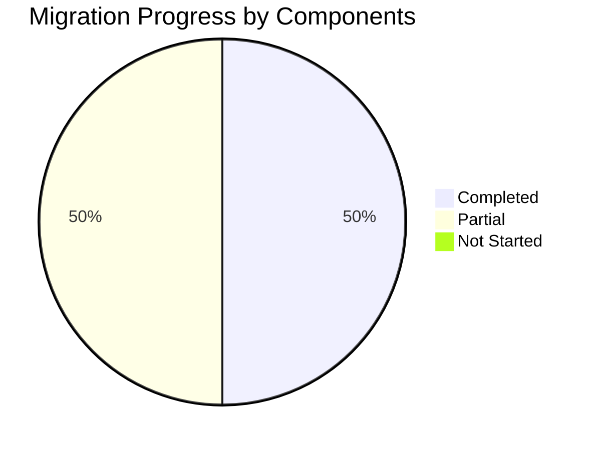

# Migration Plan - Table of Contents

This document provides an index of all migration plans for the Emby C# to Go conversion.

---

## Master Plans

| Document | Description | Status |
|----------|-------------|--------|
| [000-migration-master-plan.md](./000-migration-master-plan.md) | Master migration plan with overview and phases | Active |
| [csharp-to-go-migration-plan.md](./csharp-to-go-migration-plan.md) | Detailed original migration plan with tasks | Reference |

---

## Component Migration Plans

### Core Infrastructure

| Document | Component | Discovery | Priority | Status |
|----------|-----------|----------|----------|--------|
| [160-server-core-migration.md](./160-server-core-migration.md) | Emby.Server.Implementations | `.discovery/160-*.md` | HIGH | Partial |
| [350-http-migration.md](./350-http-migration.md) | SocketHttpListener | `.discovery/350-sockethttplistener.md` | HIGH | Complete |

### API Layer

| Document | Component | Discovery | Priority | Status |
|----------|-----------|----------|----------|--------|
| [340-api-migration.md](./340-api-migration.md) | MediaBrowser.Api | `.discovery/340-*.md` | HIGH | ~80% |

### Providers

| Document | Component | Discovery | Priority | Status |
|----------|-----------|----------|----------|--------|
| [320-providers-migration.md](./320-providers-migration.md) | MediaBrowser.Providers | `.discovery/320-*.md` | HIGH | Partial |

### Media Processing

| Document | Component | Discovery | Priority | Status |
|----------|-----------|----------|----------|--------|
| [330-dlna-migration.md](./330-dlna-migration.md) | Emby.Dlna | `.discovery/330-*.md` | MEDIUM | ~10% |

---

## Migration Statistics

### Component Coverage

| Component | Files | Status | Coverage |
|-----------|-------|--------|----------|
| HTTP Server | 25 | ✓ | 100% |
| API Layer | 150+ | ⚠️ | ~80% |
| Server Core | 800+ | ⚠️ | ~15% |
| Providers | 200+ | ⚠️ | ~10% |
| DLNA | 90+ | ⚠️ | ~10% |

---

## Next Steps

### Immediate Priorities

1. **Complete API Layer** - Verify all 150+ endpoints
2. **Implement LiveTV API** - 15+ endpoints missing
3. **Implement DLNA ContentDirectory** - Full UPnP support
4. **Implement Metadata Providers** - NFO, external providers

### Secondary Priorities

1. BDInfo/DvdLib parsers
2. Mono.Nat implementation
3. RSSDP implementation
4. WebDashboard migration

---

## Related Documents

- [Discovery TOC](../.discovery/TOC.md) - All discovery documents
- [emby-go State](../.discovery/360-emby-go.md) - Current Go implementation

---

**Document Version:** 1.0  
**Last Updated:** 2026-05-04  
**Total Plans:** 6
