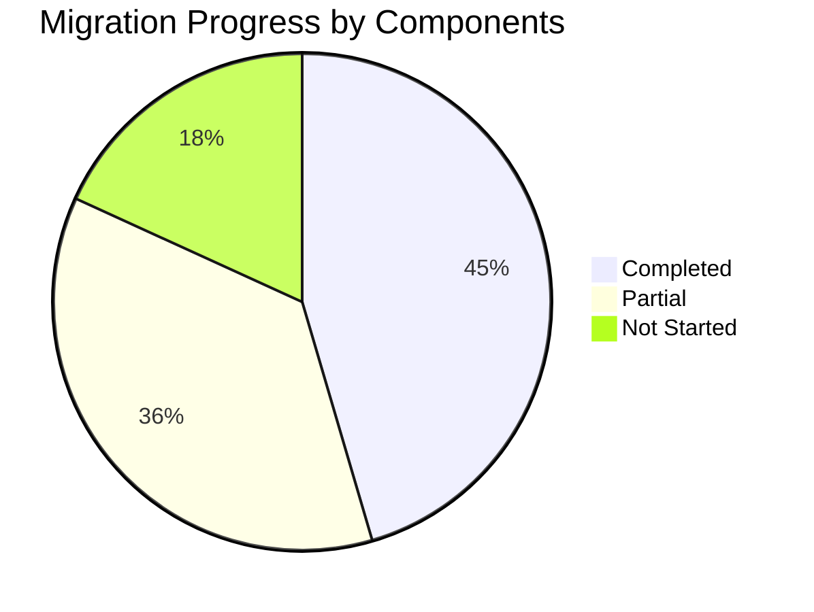

# Migration Plan - Table of Contents

This document provides an index of all migration plans for the Emby C# to Go conversion.

---

## Master Plans

| Document | Description | Status |
|----------|-------------|--------|
| [000-migration-master-plan.md](./000-migration-master-plan.md) | Master migration plan with overview and phases | Active |
| [csharp-to-go-migration-plan.md](./csharp-to-go-migration-plan.md) | Detailed original migration plan with tasks | Reference |
| [TASKS.md](./TASKS.md) | **Master task list with status tracking** | **Active** |

---

## Quick Status

| Metric | Value |
|--------|-------|
| **Overall Progress** | ~45% |
| **Go Files** | 70 |
| **C# Files** | 1019 |
| **Routes Registered** | 70 |
| **Routes in Handlers** | ~100+ |
| **Services Complete** | 5 |
| **Services Partial** | 6 |
| **Tests** | 7 files |

---

## Component Migration Plans

### Core Infrastructure

| Document | Component | Discovery | Priority | Status |
|----------|-----------|----------|----------|--------|
| [160-server-core-migration.md](./160-server-core-migration.md) | Emby.Server.Implementations | `.discovery/160-*.md` | HIGH | Partial |
| [350-http-migration.md](./350-http-migration.md) | SocketHttpListener | `.discovery/350-sockethttplistener.md` | HIGH | Complete |

### API Layer

| Document | Component | Discovery | Priority | Status |
|----------|-----------|----------|----------|--------|
| [340-api-migration.md](./340-api-migration.md) | MediaBrowser.Api | `.discovery/340-*.md` | HIGH | ~80% |

### Providers

| Document | Component | Discovery | Priority | Status |
|----------|-----------|----------|----------|--------|
| [320-providers-migration.md](./320-providers-migration.md) | MediaBrowser.Providers | `.discovery/320-*.md` | HIGH | Partial |

### Media Processing

| Document | Component | Discovery | Priority | Status |
|----------|-----------|----------|----------|--------|
| [330-dlna-migration.md](./330-dlna-migration.md) | Emby.Dlna | `.discovery/330-*.md` | MEDIUM | ~10% |

---

## Migration Statistics

### Component Coverage

| Component | Files | Status | Coverage |
|-----------|-------|--------|----------|
| HTTP Server | 25 | ✅ | 100% |
| API Layer | 150+ | 🔄 | ~45% (70 registered, 100+ stubs) |
| Server Core | 800+ | 🔄 | ~35% |
| Providers | 200+ | ⏳ | ~5% |
| DLNA | 90+ | ❌ | SKIPPED (security) |

---

## Next Steps

### Immediate Priorities

1. **Register remaining handlers** - Channel, LiveTV, Movies, TV Shows, System (12 handlers, ~100 routes)
2. **Complete library service** - Scanner, metadata extraction with FFprobe
3. **Complete media service** - Stream management, subtitles
4. **Implement metadata providers** - NFO parsing, remote providers

### Secondary Priorities

1. Complete image processing (BlurHash, transformations)
2. Add LiveTV/Channels services
3. Add scheduled background tasks
4. Docker/systemd deployment

---

## Related Documents

- [Discovery TOC](../.discovery/TOC.md) - All discovery documents
- [emby-go State](../.discovery/360-emby-go.md) - Current Go implementation

---

**Document Version:** 1.1  
**Last Updated:** 2026-05-04  
**Total Plans:** 7 (including TASKS.md)
